# Unity 3D 游戏场景设计实例

> 原文：[`c.biancheng.net/view/2746.html`](http://c.biancheng.net/view/2746.html)

目前 Unity 3D 在游戏开发方面常用的游戏地形制作元素，接下来我们通过一个实践案例制作一个完整的三维游戏场景。

## 综合案例：3D 游戏场景设计

#### 案例构思

在 Unity 3D 设置中最重要的部分就是游戏场景设计，3D 游戏场景设计的主要内容包括游戏场景的规划、地形设计、山脉设计、河流山谷设计、森林设计等。

针对不同的游戏采用不同的策略，根据游戏的每一个故事情节设计游戏的每个游戏场景以及场景内的各种物体造型。

本案例旨在通过 3D 游戏场景设计将 Unity 3D 引擎中地形资源整合利用，开发出完整的游戏场景。

#### 案例设计

本案例在 Unity 内创建一个 3D 游戏场景，场景内包括 Unity 3D 提供的各种地形资源，如树木、山地、草原、风域、地形纹理、水以及天空等，效果如下图所示。

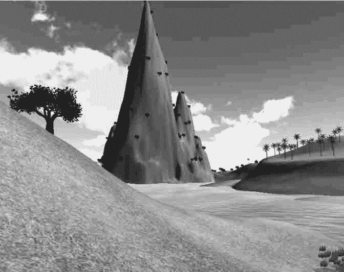
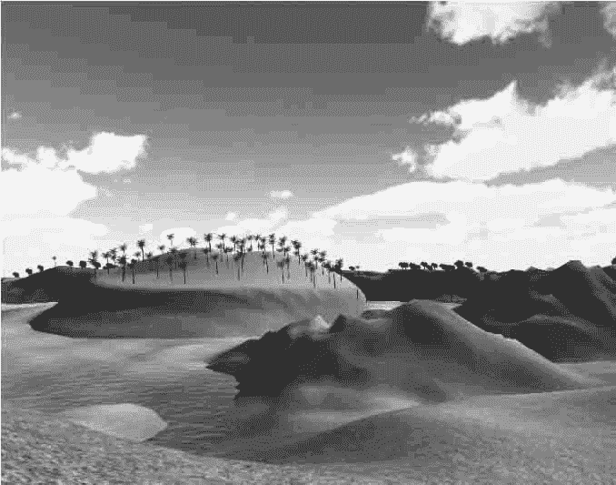

#### 案例实施

步骤 1)：选择资源加载到项目中。

打开 Unity 3D，执行 Create→New Project 命令，在 Project Location 中输入创建项目的文件夹地址，或者单击后面的 Browse 按钮，然后在 Import the following packages：中选择要导入的项目文件包，每个文件包都带有一些插件功能。

如果将所有的复选框都选中，会使得 Unity 3D 在开始加载的时候速度很慢，所以大多数情况下，在创建 Unity 3D 项目文件的时候，只选择需要用到的包就可以了，在这里选择 Environment 选项，如下图所示。

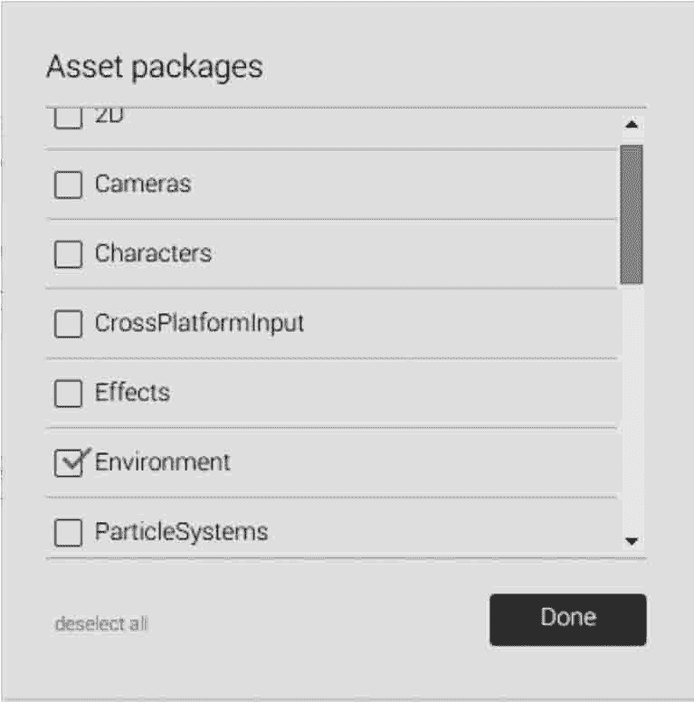
步骤 2)：创建项目。全部设置好之后，单击 Create 按钮创建项目。

此时 Unity 3D 开始加载资源，屏幕上显示加载进度条，需要耐心等待一会儿。

在创建一个新项目之后，新项目的各个面板中只有 Project（项目文件栏）包含了两个文件夹，这两个文件夹里面是之前导入的项目文件包里的所有文件，如下图所示。

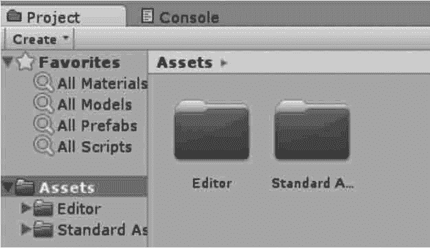
步骤 3)：创建地形。新建项目后，在主菜单中执行 GameObject→3D Object→Terrain 选项。

此时就可以看到屏幕的正中央已经出现了一个平整的片状 3D 图形，如下图所示。

步骤 4)：设置地形信息。单击 Terrain 中的 Set Resolution 按钮，选择设置地形大小、高度等相关信息（在每一个地形参数的右侧直接输入数值即可修改它），地形参数包括地形的高度、长度、宽度、分辨率和高度图等，如下图所示。

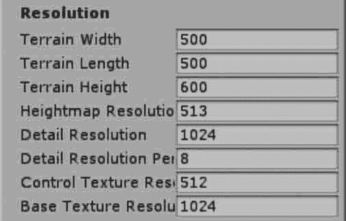
步骤 5)：更改地形属性。在场景面板中选中刚才创建的地面对象 Terrain，也可以在 Hierarchy 视图中选中 Terrain。

然后，在 Inspector 属性面板中会马上发现与之对应的属性，包含 Position（坐标）、Rotation（旋转量）、Scale（缩放尺寸）以及地面对象固有的 Terrain（Script）和 Terrain Collider，如下图所示。

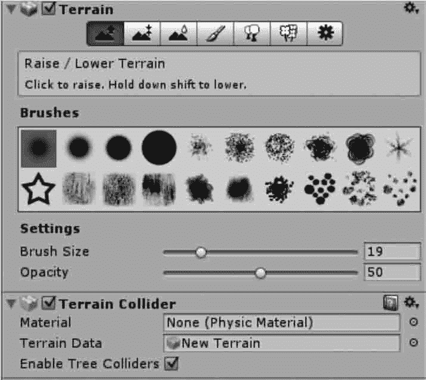
步骤 6)：绘制凸起地形。通过设置地形参数就可以对地形上的地貌进行编辑，单击平整的地形，之后在右侧的 Inspector 中的 Terrain（Script）中就可以对地貌进行编辑。

在下图中可以看到，左边 3 个按钮——Raise/Lower Terrain（提高和降低高度）、Paint Target Height（绘制目标高度）以及 Smooth Height（平滑高度）可以用来修改地形的大体形状。

游戏开发中主要使用属性面板中的前 3 个按钮来设置地形起伏。

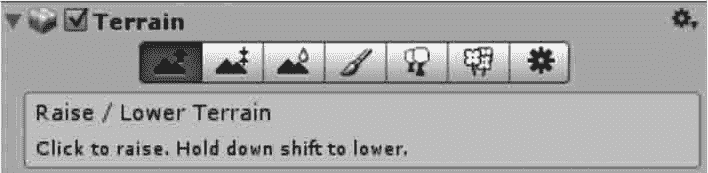
步骤 7)：笔刷调节。在设计山脉的过程中可能涉及不同高度、不同大小以及不同形态的高山，Unity 3D 提供了各种不同类型的笔刷，如下图所示。

在每一种笔刷的下方也可以对笔刷的大小等属性进行调节。

其中，笔刷面积的大小决定了笔刷所能够覆盖的区域，小的数字将会绘制较小的地形，大的数字（最大 100）将绘制较大的地形。透明度决定了笔刷绘制的地形的透明程度。

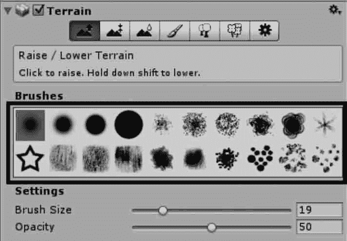
选择笔刷后，就可以在 Scene 视图中使用笔刷在地形上刷出凹陷与凸起效果，使用不同笔刷绘制的效果图如下图所示。

> 注：选择笔刷工具，按住 Shift 键加鼠标左键是降低地形高度。

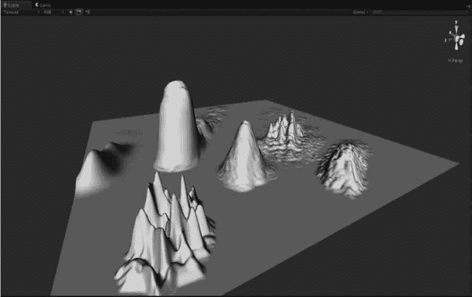
步骤 8)：第一种笔刷。在首选项中可以对地形进行山脉的设计，单击此按钮，激活提高和降低地形高度的工具。

在 Scene 视图中，如果在地形上移动鼠标，会有一个蓝色的圆圈，这是笔刷的作用区域。

在设计的过程中可能涉及不同高度、不同大小、不同形态的高山以及凸起。

下面的各类笔刷功能将会很简单地实现这一不同的需求，同时在 Brushes 下方可以对笔刷的大小等属性进行调节，如下图所示。

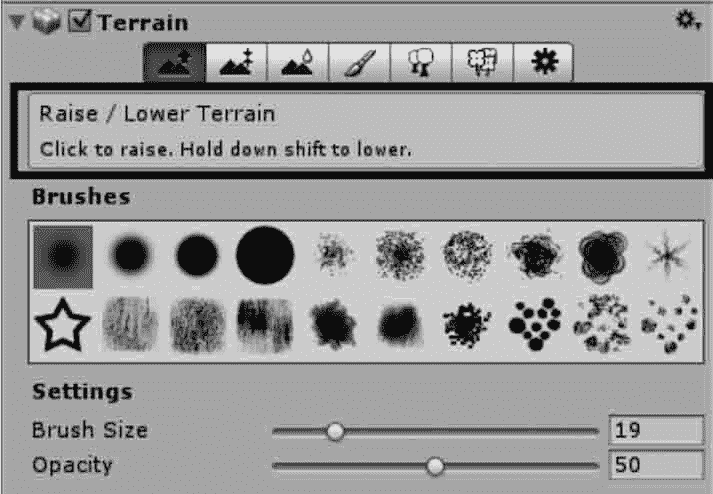
步骤 9)：第二种笔刷。地形编辑器中的第二个按钮可以对地形高度进行设计，此时可以打开设置地形特定高度页面，如下图所示，

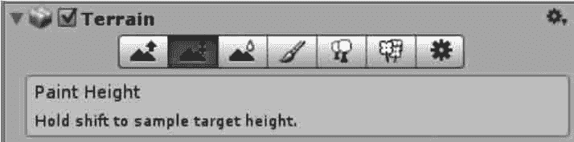
其中的 Height 参数用于设置地形的最大高度（注意：此时用 Height 而不是 Opacity 设置最大高度），地形设置效果如下图所示。

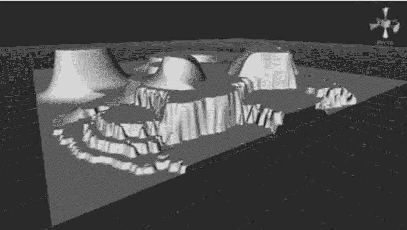
步骤 10)：第三种笔刷。地形编辑器中的第三个按钮是平滑过渡地形工具。选择一个合适画笔，如下图所示。

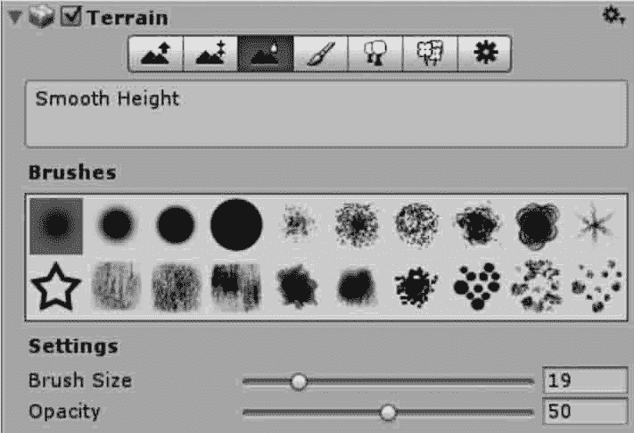
在 Scene 视图中拖动鼠标即可平滑过渡地形，可以对已经设计好的，看起来嶙峋的山脉地形进行平滑过渡处理，更加符合山脉的特征，如下图所示。

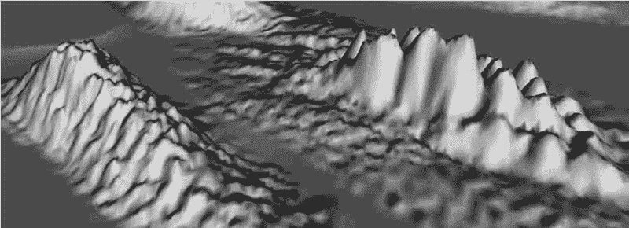
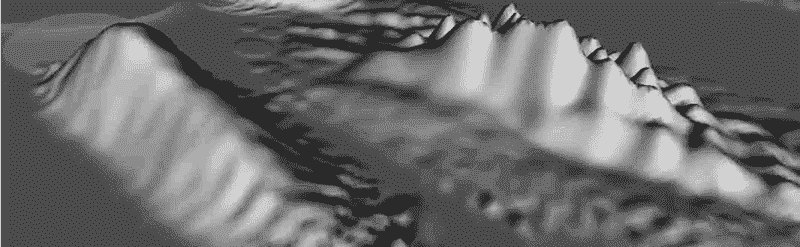
从上图中可以看出，平滑的效果还是相当明显的，在进行了前 3 个选项的编辑之后，初始的地貌已经出现了，接下来就进行地貌材质贴图并布置一定量的花草树木。

步骤 11)：凹陷地形的制作。想要制作凹陷地形，首先需要在 Paint Height 工具中抬高地形，单击 Paint Height 工具，选择 Height（Flatten），如下图所示。

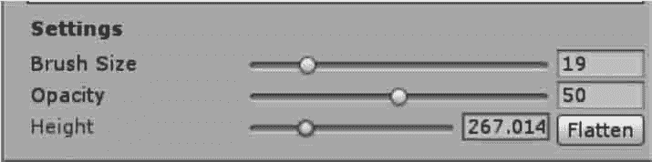
此时，按住 Shift 键，使用前 3 个地形工具即可刷出凹陷地形，如下图所示。

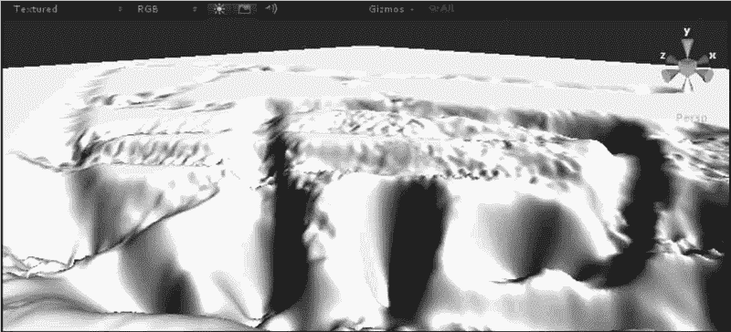
步骤 12)：对地形进行相关材质的贴图。到目前为止，地形已经建好了，但是十分粗糙，默认的地形贴图是灰色的，接下来给地形添加贴图，让地形看起来更为美观。

Unity 3D 提供了很多地形贴图，如果在之前创建项目时没有导入资源，此时可以在 Project 视图中右击，执行 Import Package→Environment 命令将环境资源导入项目。

最后，为地形添加导入的地形贴图，单击地形贴图按钮（从左数第 4 个按钮），在界面右下角点击 Edit Textures 中的 add Texture 选项，具体参数如下表所示。

| 参 数 | 功 能 |
| Add Texture | 添加地形贴图 |
| Edit Texture | 编辑地形贴图 |
| Remove Texture | 删除地形贴图 |

选择 Add Texture，此时弹出 Add Terrain Texture 界面，选择 Select 选项，将预先载入的纹理作为地形贴图纹理，然后单击 Add 按钮，右侧的 Inspector 属性面板选择就会出现材质的缩略图，如下图所示。

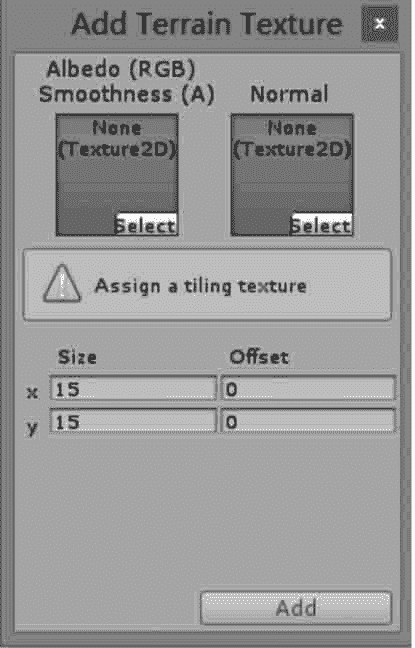
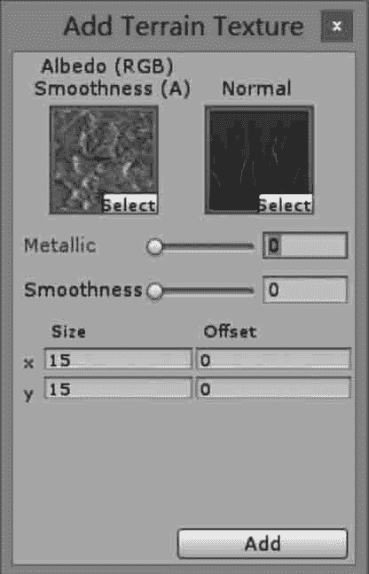
贴图后地形就会被纹理自动全部覆盖，如下图所示。

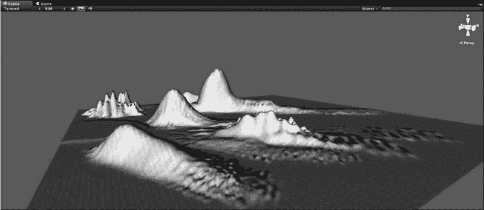
为了模拟更加真实的效果，在场景中可以选择继续添加纹理图片，此时可以选择不同的笔刷对场景中不同的地点进行纹理变换，如下图所示。

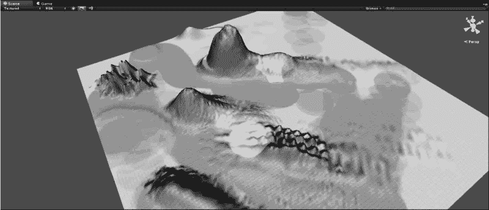
步骤 13)：添加树木。在地形编辑器中单击第五个按钮，执行 Edit→Remove tree types→Add tree 命令，即可完成树木的添加，如下图所示，具体参数如下表所示。

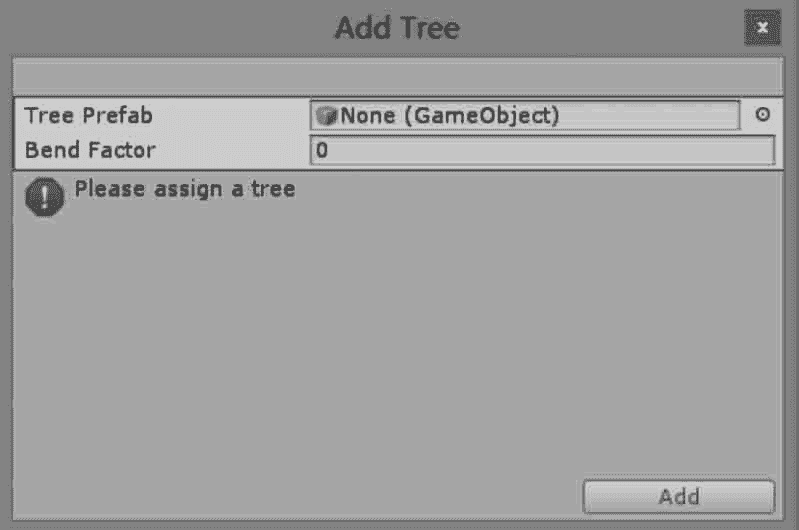

| 参 数 | 功 能 |
| Add Tree | 添加树模型 |
| Edit Tree | 编辑树模型 |
| Remove Tree | 删除树模型 |

根据地形环境特点，选择合适的树木种类，单击 Add 按钮完成添加。

右侧的 Inspector 面板中会出现所选树的图形，同时在下方的 Settings 中也会有关于树模型属性的设置，例如笔刷大小、树的密度、树的高度、树的随机颜色变化等，如下图所示。

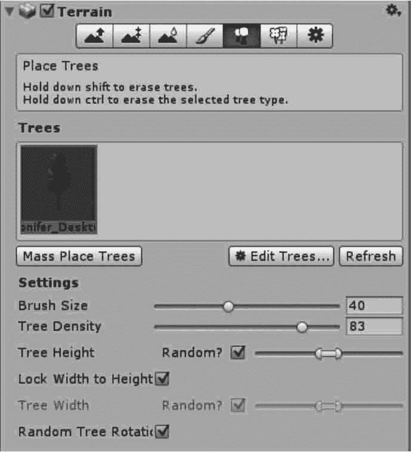
在这里就可以以笔刷形式把树“画”在地形上，如下图所示。

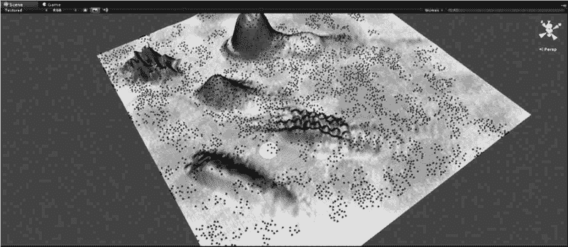
步骤 14)：加入一些花草以及岩石。草和岩石的添加方法与树木非常相似，如下图所示，具体参数如下表所示。

首先在地形编辑器中选择第六个按钮（添加草与网格模型）可以设置草的最大高度、草的最小高度、密度以及间隔颜色等。

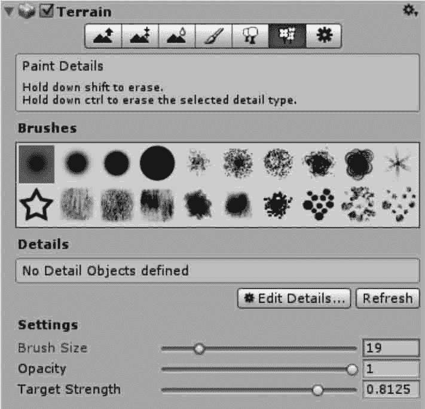

| 参 数 | 功 能 | 参 数 | 功 能 |
| Brush Size | 设置笔刷大小 | Add Detail Mesh | 添加自定义网格模型 |
| Opacity | 设置绘制高度 | Edit | 编辑现有模型 |
| Target Strength | 设置绘制密度 | Remove | 删除模型 |
| Add Grass Texture | 添加草的贴图 |   |   |

选择 Edit→Remove Detail meshes 中的 Add Grass Texture 选项，就可以弹出添加草的对话框，如下图所示。

单击 Add 按钮之后右侧 Inspector 面板中的 Details 就会出现 Grass 选项，在 Brush 中选择合适的笔刷类型，在地形中就可以画出草地。

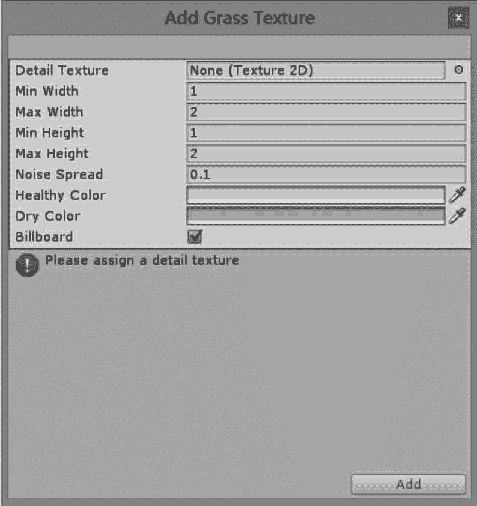
步骤 15)：其他设置，如下图所示。

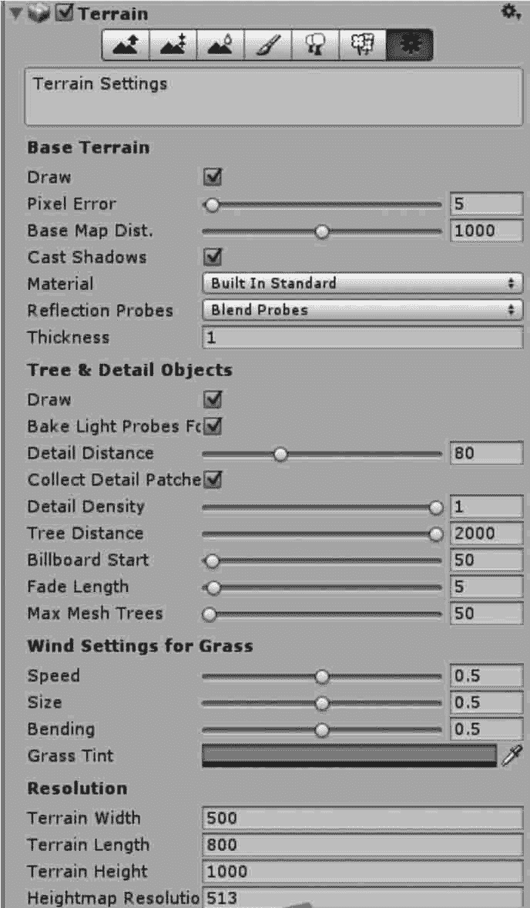
做到这一步，一个简单的地形已经建立起来了，现在模型还是略显单调，为了让地形更加丰富一点，加一个湖也是很重要的，接下来在场景中添加些水资源。

步骤 16)：水的添加。在 Unity 3D 中已经内嵌了水的资源包，所以首先要找到水的资源包。

在 Project 文件夹里找到 Water 文件夹，具体路径为 Assets/Standard Assets/water（pro only/basic/Water/Water4/Water4Example（Advanced））。

有两种添加水资源的方式，第一种方法是直接将 Water4Example（Advanced）文件拖入 Scene 场景中，第二种方法是将水资源拖曳到 Hierarchy 视图中，在 Hierarchy 视图中就可以看到 Water4Example（Advanced），单击就可以找到 Scene 中的水模型，运用快捷键 W（移动）和 R（缩放）在场景中正确地放置水，如下图所示。

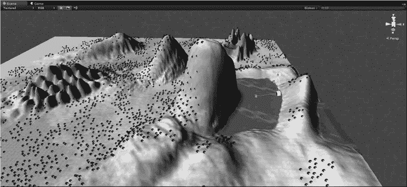
步骤 17)：为场景添加光影效果。为了让场景更加逼真，还可以为场景添加光照阴影效果。

具体的做法如下：选中光照对象 Directional light，在它的属性面板中找到 Shadow Type（阴影模式），默认的是 No Shadows（没有阴影），可以将它改成 Soft Shadows（软渲染阴影）或 Hard Shadows（硬件渲染阴影）。

Soft Shadows 以消耗 CPU 的计算为代价来产生阴影效果，这种模式运行速度较慢，但对于机器配置比较落后的使用者是唯一的选择。

Hard Shadows 可利用新一代 GPU 的显卡加速功能进行阴影效果的渲染处理，其运行速度比较快，渲染效果也比较理想。

无论选择哪一个选项，动画场景的物体都会相对于阳光产生阴影效果。

步骤 18)：单击 Play 按钮测试场景，如下图所示。

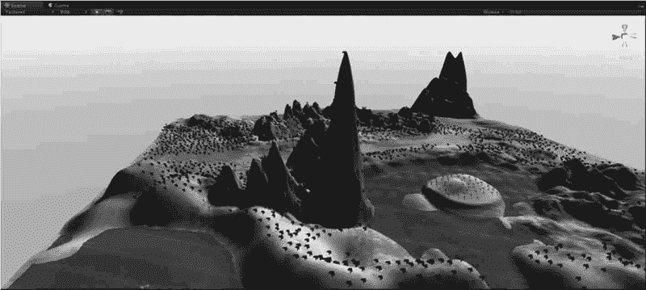
步骤 19)：第一人称漫游操作。到现在为止，游戏场景布置工作已经基本完成了。

接下来需要设计并创建独特的角色来充满世界，这样玩家可以控制一个真实的角色，玩家角色是玩家用和游戏进行交互的化身，增加了游戏的趣味性。

通常角色会分为 3 类：第一人称、第三人称和隐含角色。

Unity 3D 支持这些类型，在 Unity 3D 中，角色是通过 Character Controller 定义的。

为场景中添加第一人称角色非常简单，摄像机就像角色的眼睛一样在世界中漫游。具体步骤如下。

确定建立项目时已载入 Character Controller 资源，如果在创建项目时没有载入资源，执行 Assets→Import Package→Characters 命令即可。

出现如下对话框，单击 Import 按钮，如下图所示。

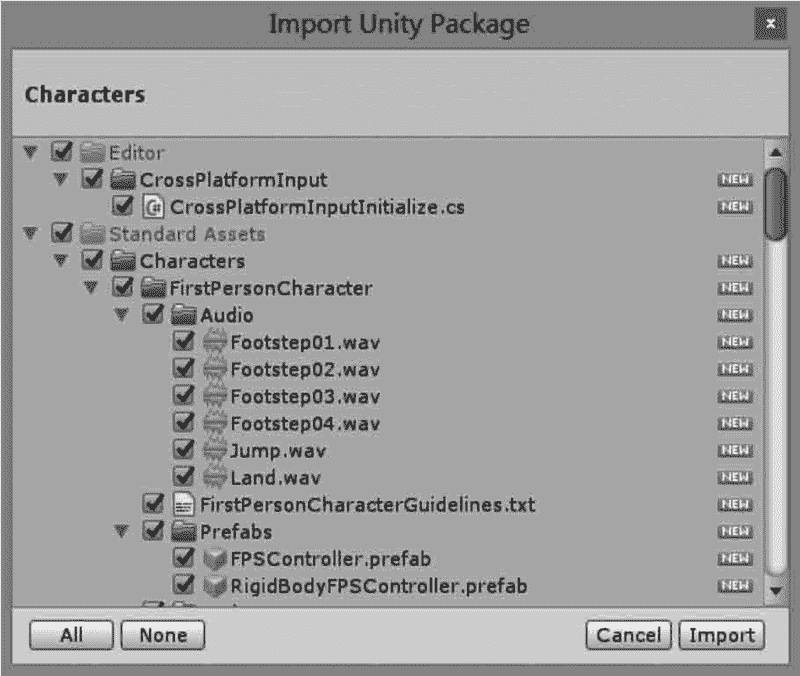
在资源面板中搜索 FPSController，在搜索导航栏中输入 f，此时可以在资源面板中看见预置的 First Person Controller。

将 Project 面板中的 FPSController 拖到 Scene 视图中（FPSController 要高于地面）。

FPSController 自带摄像机，此时可以将场景中的主摄像机（Main Camera）删除。

步骤 20)：单击 Play 按钮，测试效果。可以在平面上通过 W、A、S、D 键以及上下左右方向键控制前进、后退、左右旋转、鼠标也可以通过旋转确定移动方向。

接下来，将第一人称视角应用到已经建立好的游戏场景中，实现第一人称漫游，效果如下图所示。

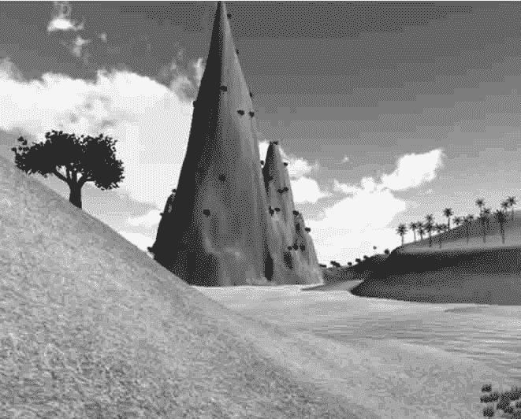
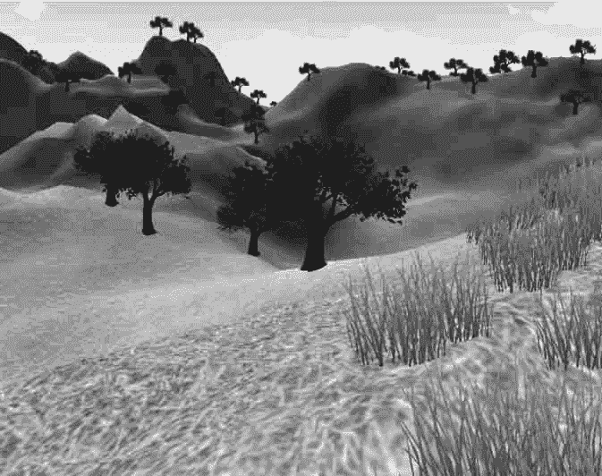
可以看到整个地形已经被包含在一个完整的天空盒子之中，到此整个场景已经完成，如下图所示。

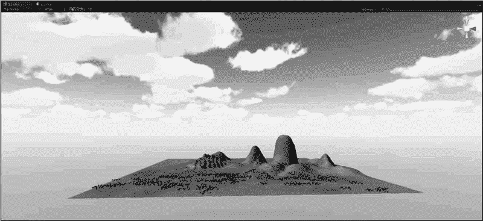
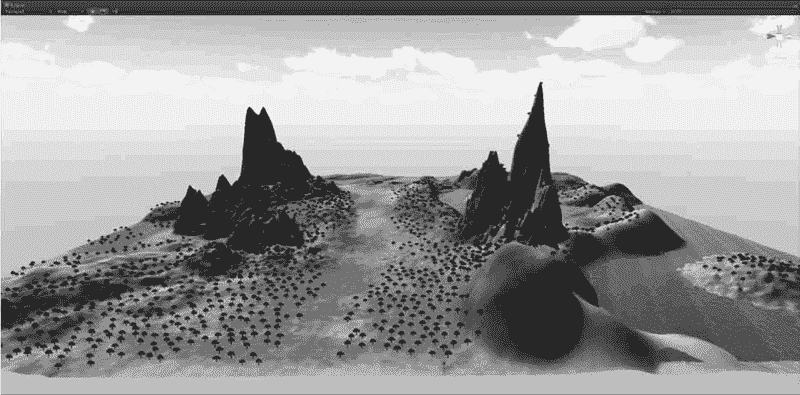