# Unity 3D 刚体（Rigidbody）

> 原文：[`c.biancheng.net/view/2749.html`](http://c.biancheng.net/view/2749.html)

Unity 3D 中的 Rigidbody（刚体）可以为游戏对象赋予物理属性，使游戏对象在物理系统的控制下接受推力与扭力，从而实现现实世界中的运动效果。

在游戏制作过程中，只有为游戏对象添加了刚体组件，才能使其受到重力影响。

刚体是物理引擎中最基本的组件。在物理学中，刚体是一个理想模型。

通常把在外力作用下，物体的形状和大小（尺寸）保持不变，而且内部各部分相对位置保持恒定（没有形变）的理想物理模型称为刚体。

在一个物理引擎中，刚体是非常重要的组件，通过刚体组件可以给物体添加一些常见的物理属性，如质量、摩擦力、碰撞参数等。

通过这些属性可以模拟该物体在 3D 世界内的一切虚拟行为，当物体添加了刚体组件后，它将感应物理引擎中的一切物理效果。

Unity 3D 提供了多个实现接口，开发者可以通过更改这些参数来控制物体的各种物理状态。

刚体在各种物理状态影响下运动，刚体的属性包含 Mass（质量）、Drag（阻力）、Angular Drag（角阻力）、Use Gravity（是否使用重力）、Is Kinematic（是否受物理影响）、Collision Detection（碰撞检测）等。

## 刚体添加方法

如下图所示，在 Unity 3D 中创建并选择一个游戏对象，执行菜单栏中的 Component→Physics→Rigidbody 命令为游戏对象添加刚体组件。

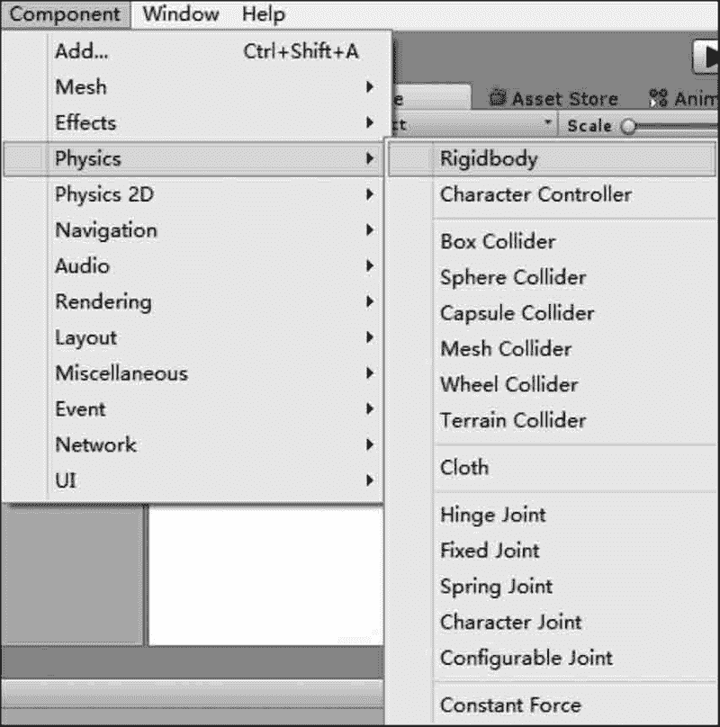

## 刚体选项设置

如下图所示，游戏对象一旦被赋予刚体属性后，其 Inspector 属性面板会显示相应的属性参数与功能选项，具体内容如下表所示。

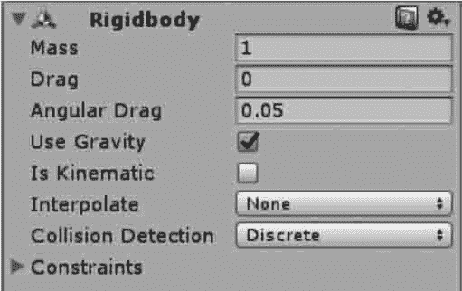

| 参 数 | 含义 | 功 能 |
| Mass | 质量 | 物体的质量（任意单位）。建议一个物体的质量不要与其他物体 相差 100 倍 |
| Drag | 阻力 | 当受力移动时物体受到的空气阻力。0 表示没有空气阻力，极 大时使物体立即停止运动 |
| Angular Drag | 角阻力 | 当受扭力旋转时物体受到的空气阻力。0 表示没有空气阻力， 极大时使物体立即停止旋转 |
| Use Gravity | 使用重力 | 该物体是否受重力影响，若激活，则物体受重力影响 |
| Is Kinematic | 是否是运动学 | 游戏对象是否遵循运动学物理定律，若激活，该物体不再受物理 引擎驱动，而只能通过变换来操作。适用于模拟运动的平台或 者模拟由铰链关节连接的刚体 |
| Interpolate | 插值 | 物体运动插值模式。当发现刚体运动时抖动，可以尝试下面的 选项：None(无），不应用插值；Interpolate(内插值），基于上一巾贞 变换来平滑本帧变换；Extrapolate(外插值），基于下一帧变换来 平滑本帧变换 |
| Collision Detection | 碰撞检测 | 碰撞检测模式。用于避免高速物体穿过其他物体却未触发碰 撞。碰撞模式包括 Discrete (不连续）、Continuous (连续）、 Continuous Dynamic (动态连续〉3 种。其中，Discrete 模式用来 检测与场景中其他碰撞器或其他物体的碰撞；Continuous 模式 用来检测与动态碰撞器（刚体）的碰撞；Continuous Dynamic 模 式用来检测与连续模式和连续动态模式的物体的碰撞，适用于 高速物体 |
| Constraints | 约束 | 对刚体运动的约束。其中，Freeze Position(冻结位置）表 7TC 刚体 在世界中沿所选 HZ 轴的移动将无效，Freeze Rotation(冻结 旋转）表示刚体在世界中沿所选的 X、Y、Z 轴的旋转将无效 |

## 实践案例：刚体测试

#### 案例构思

刚体使物体像现实方式一样运动，任何物体想要受重力影响，都必须包含一个刚体组件。

利用刚体类游戏组件，遵循万有引力定律，在重力作用下，物体会自由落下。

刚体组件还会影响到物体发生碰撞时产生的效果，使物体的运动遵循惯性定律，使其发生碰撞时在运动冲量作用下产生速度。

本案例旨在利用刚体测试重力效果以及碰撞后的交互效果。

#### 案例设计

本案例在 Unity 3D 内创建一个简单的三维场景，场景内放有 Cube 和 Plane，Plane 用于充当地面，Cube 用于刚体重力测试，然后通过 Ctrl+D 键再复制出两个 Cube 以测试刚体间相互碰撞的效果，如下图所示。

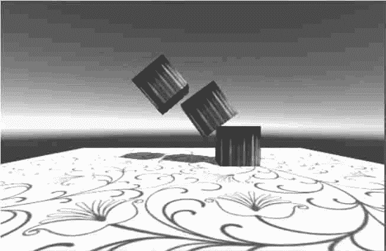

#### 案例实施

步骤 1)：新建项目，将场景命名为 Rigidbody。

步骤 2)：创建游戏对象。执行 GameObject→3D Object→Plane 命令，此时在 Scene 视图中出现了一个平面，在右侧的 Inspector 面板中设置平面位置（0，0，-5），如下图所示。


步骤 3)：创建游戏对象。在菜单栏中执行 GameObject→Create Other→Cube 命令，在右侧的 Inspector 面板中设置立方体的位置（0，5，0），按 F2 键可将其重新命名，如下图所示。

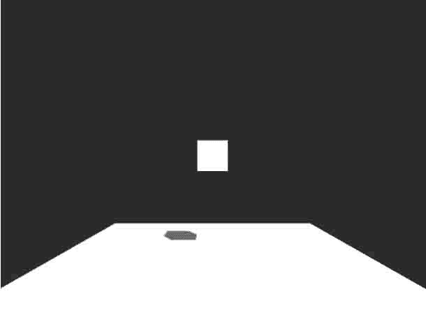
步骤 4)：美化场景。采用纹理贴图的方法将地面和立方体都贴上纹理。

首先，将资源图片放置在项目的根目录 Assets 下，Unity 3D 会自动加载资源。

然后分别选中立方体和平面，将对应的资源图片分别拖到立方体和平面上即可，效果如下图所示。

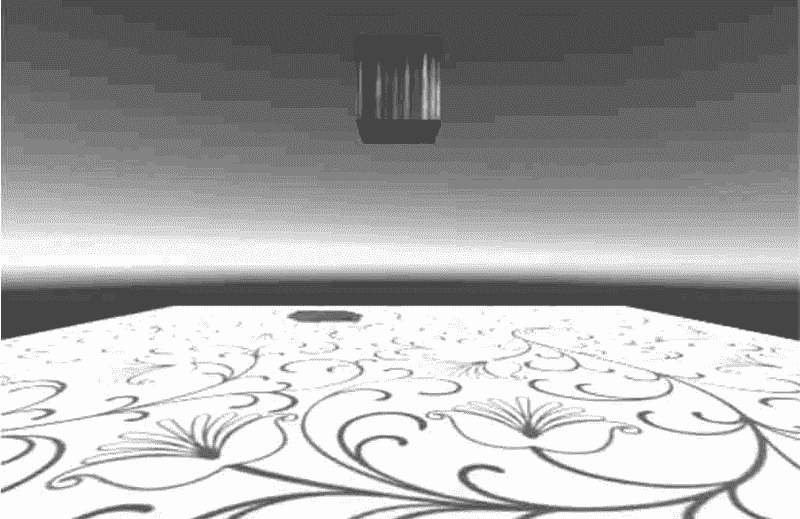
步骤 5)：为立方体添加刚体属性。选中立方体，然后执行菜单栏中的 Component→Physics→Rigidbody 命令，当右侧的 Inspector 面板中出现了 Rigidbody 属性面板时，即为立方体添加了刚体属性，如下图所示。

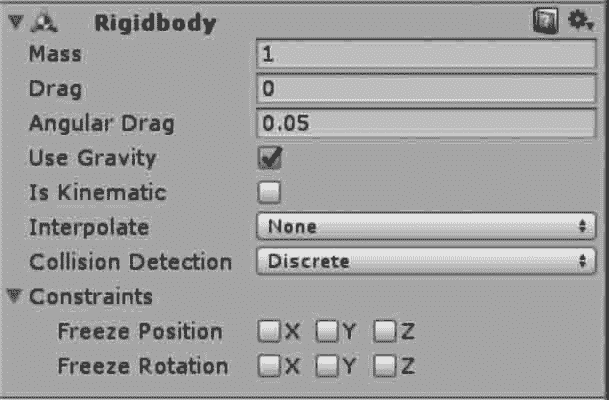
步骤 6)：单击 Play 按钮进行测试，发现置于半空中的立方体由于受到重力作用做自由落体运动，掉落到平面上，效果如下图所示。

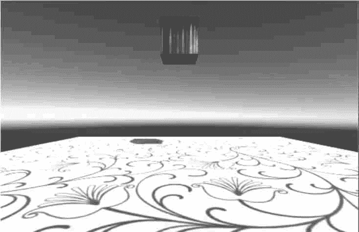
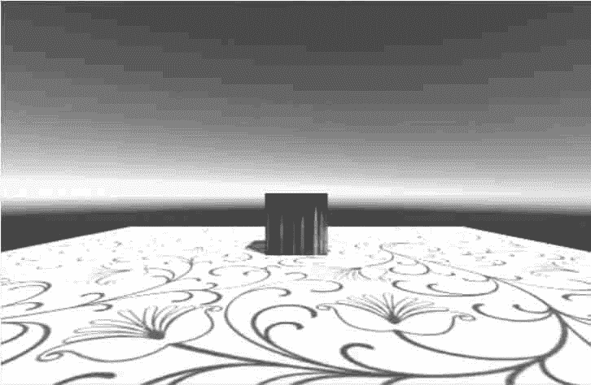
步骤 7)：复制游戏对象。在 Hierarchy 视图中，选中 Cube1 后按 Ctrl+D 键复制立方体 Cube2 并将其摆放于场景中，在 Inspector 面板中设置新复制的立方体的位置属性（0.4，0.5，0），按此方法再复制一个立方体 Cube3 斜放于 Cube2 上，设置 Cube3 的位置为（0，1.5，0）。

步骤 8)：执行菜单栏的 Component→Physics→Rigidbody 命令为每一个立方体添加刚体属性。

步骤 9)：单击 Play 按钮测试一下，发现最上方立方体进行自由落体运动，撞击到地面，盒子发生倒塌，效果如下图所示。

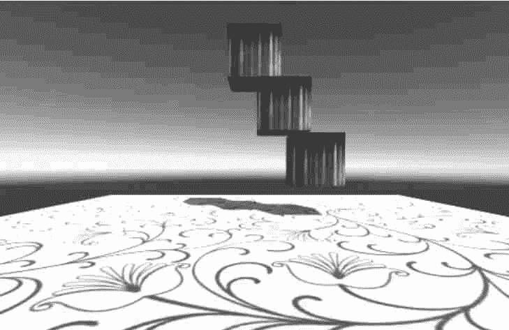
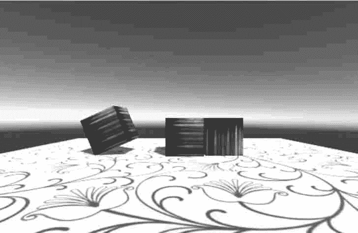
步骤 10)：创建 JavaScript 脚本文件，输入下列代码：

```

var speed=10;
function OnMouseDrag(){
    transform.position+=Vector3.right*Time.deltaTime*Input.GetAxis("MouseX")*speed;
    transform.position+=Vector3.up*Time.deltaTime*Input.GetAxis("Mouse Y")*speed;
}
```

步骤 11)：将脚本分别连接到 3 个立方体上。

步骤 12)：单击 Play 按钮测试，效果如下图所示。

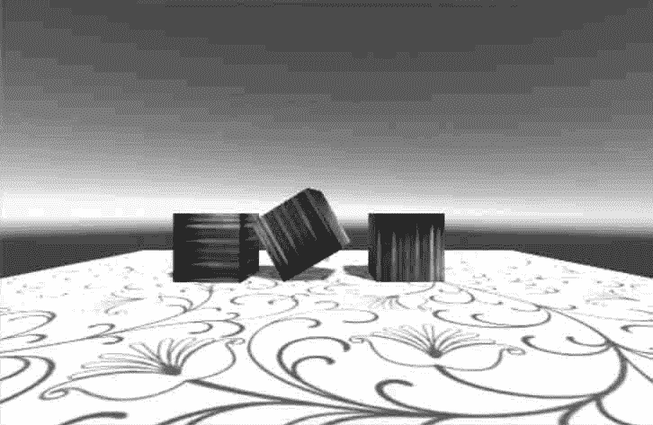
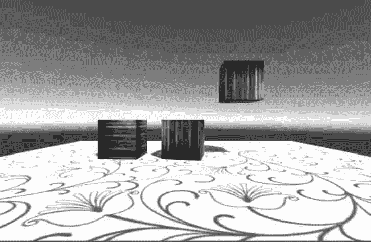