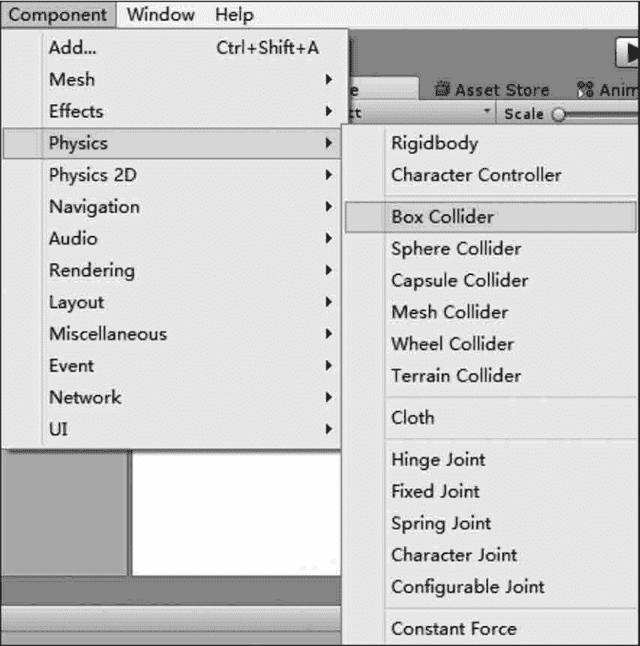
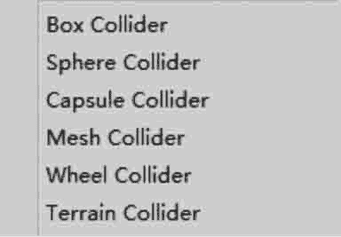
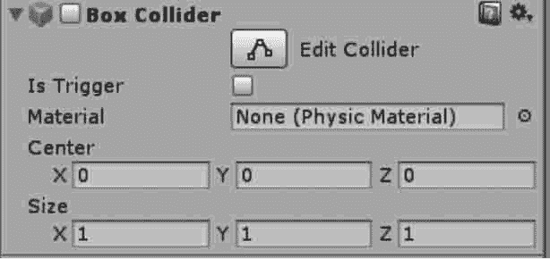
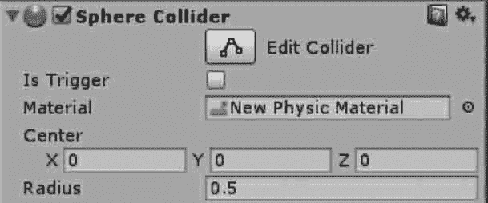
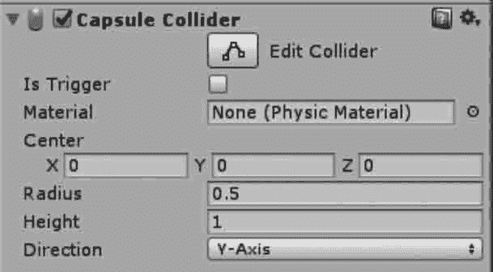
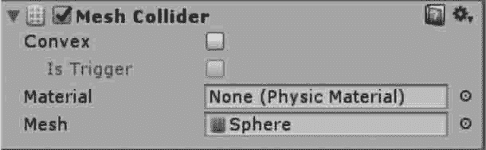
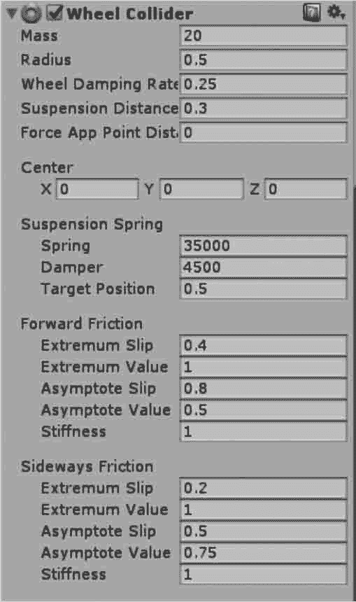

# Unity 3D 碰撞体（Collider）

> 原文：[`c.biancheng.net/view/2752.html`](http://c.biancheng.net/view/2752.html)

在游戏制作过程中，游戏对象要根据游戏的需要进行物理属性的交互。

因此，Unity 3D 的物理组件为游戏开发者提供了碰撞体组件。碰撞体是物理组件的一类，它与刚体一起促使碰撞发生。

碰撞体是简单形状，如方块、球形或者胶囊形，在 Unity 3D 中每当一个 GameObjects 被创建时，它会自动分配一个合适的碰撞器。

一个立方体会得到一个 Box Collider（立方体碰撞体），一个球体会得到一个 Sphere Collider（球体碰撞体），一个胶囊体会得到一个 Capsule Collider（胶囊体碰撞体）等。

## 添加碰撞体

在 Unity 3D 的物理组件使用过程中，碰撞体需要与刚体一起添加到游戏对象上才能触发碰撞。

值得注意的是，刚体一定要绑定在被碰撞的对象上才能产生碰撞效果，而碰撞体则不一定要绑定刚体。

碰撞体的添加方法是：首先选中游戏对象，执行菜单栏中的 Component→Physics 命令，此时可以为游戏对象添加不同类型的碰撞体，如下图所示。

## 碰撞体选项设置

Unity 3D 为游戏开发者提供了多种类型的碰撞体资源，如下图所示。当游戏对象中的 Rigidbody 碰撞体组件被添加后，其属性面板中会显示相应的属性设置选项，每种碰撞体的资源类型稍有不同，具体如下。

#### 1) Box Collider

Box Collider 是最基本的碰撞体，Box Collider 是一个立方体外形的基本碰撞体。

一般游戏对象往往具有 Box Collider 属性，如墙壁、门、墙以及平台等，也可以用于布娃娃的角色躯干或者汽车等交通工具的外壳，当然最适合用在盒子或是箱子上。

下图所示是 Box Collider，游戏对象一旦添加了 Box Collider 属性，则在 Inspector 面板中就会出现对应的 Box Collider 属性参数设置，具体参数如下表所示。

| 参 数 | 含 义 | 功 能 |
| Is Trigger | 触发器 | 勾选该项，则该碰撞体可用于触发事件，并将被物理引擎所忽略 |
| Material | 材质 | 为碰撞体设置不同类型的材质 |
| Center | 中心 | 碰撞体在对象局部坐标中的位置 |
| Size | 大小 | 碰撞体在 X、Y、Z 方向上的大小 |

如果 Is Trigger 选项被勾选，该对象一旦发生碰撞动作，则会产生 3 个碰撞信息并发送给脚本参数，分别是 OnTriggerEnter、OnTriggerExit、OnTriggerStay。

Physics Material 定义了物理材质，包括冰、金属、塑料、木头等。

#### 2) Sphere Collider

Sphere Collider 是球体形状的碰撞体，如下图所示。

Sphere Collider 是一个基于球体的基本碰撞体，Sphere Collider 的三维大小可以按同一比例调节，但不能单独调节某个坐标轴方向的大小，具体参数如下表所示。

当游戏对象的物理形状是球体时，则使用球体碰撞体，如落石、乒乓球等游戏对象。

| 参 数 | 含 义 | 功 能 |
| Is Trigger | 触发器 | 勾选该项，则该碰撞体可用于触发事件，并将被物理引擎所忽略 |
| Material | 材质 | 用于为碰撞体设置不同的材质 |
| Center | 中心 | 设置碰撞体在对象局部坐标中的位置 |
| Radius | 半径 | 设置球形碰撞体的大小 |

#### 3) Capsule Collider

Capsule Collider 由一个圆柱体盒两个半球组合而成，Capsule Collider 的半径和高度都可以单独调节，可用在角色控制器或与其他不规则形状的碰撞结合来使用。

通常添加至 Character 或 NPC 等对象的碰撞属性，如下图所示，具体参数如下表所示。

| 选项英文名称 | 选项中文名称 | 功能详解 |
| Is Trigger | 触发器 | 勾选该项，则该碰撞体可用于触发事件，并将被物理引擎所忽略 |
| Material | 材质 | 用于为碰撞体设置不同的材质 |
| Center | 中心 | 设置碰撞体在对象局部坐标中的位置 |
| Radius | 半径 | 设置碰撞体的大小 |
| Height | 局度 | 控制碰撞体中圆柱的高度 |
| Direction | 方向 | 设置在对象的局部坐标中胶囊体的纵向所对应的坐标轴，默认是 Y 轴 |

#### 4) Mesh Collider

Mesh Collider（网格碰撞体）根据 Mesh 形状产生碰撞体，比起 Box Collider、Sphere Collider 和 Capsule Collider，Mesh Collider 更加精确，但会占用更多的系统资源。

专门用于复杂网格所生成的模型，如下图所示，具体参数如下表所示。

| 参 数 | 含 义 | 功 能 |
| Convex | 凸起 | 勾选该项，则 Mesh Collider 将会与其他的 Mesh Collider 发生碰撞 |
| Material | 材质 | 用于为碰撞体设置不同的材质 |
| Mesh | 网格 | 获取游戏对象的网格并将其作为碰撞体 |

####  5) Wheel Collider

Wheel Collider（车轮碰撞体）是一种针对地面车辆的特殊碰撞体，自带碰撞侦测、轮胎物理现象和轮胎模型，专门用于处理轮胎，如下图所示，具体参数如下表所示。

| 参 数 | 含 义 | 功 能 |
| Mass | 质量 | 用于设置 Wheel Collider 的质量 |
| Radius | 半径 | 用于设置碰撞体的半径大小 |
| Wheel Damping Rate | 车轮减震率 | 用于设置碰撞体的减震率 |
| Suspension Distance | 悬挂距离 | 该项用于设置碰撞体悬挂的最大伸长距离，按照局部坐标来计算， 悬挂总是通过其局部坐标的 Y 轴延伸向下 |
| Center | 中心 | 用于设置碰撞体在对象局部坐标的中心 |
| Suspension Spring | 悬挂弹簧 | 用于设置碰撞体通过添加弹簧和阻尼外力使得悬挂达到目标位置 |
| Forward Friction | 向前摩擦力 | 当轮胎向前滚动时的摩擦力属性 |
| Sideways Friction | 侧向摩擦力 | 当轮胎侧向滚动时的摩擦力属性 |