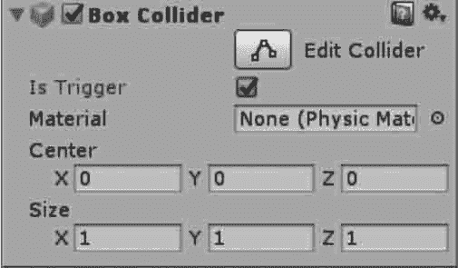
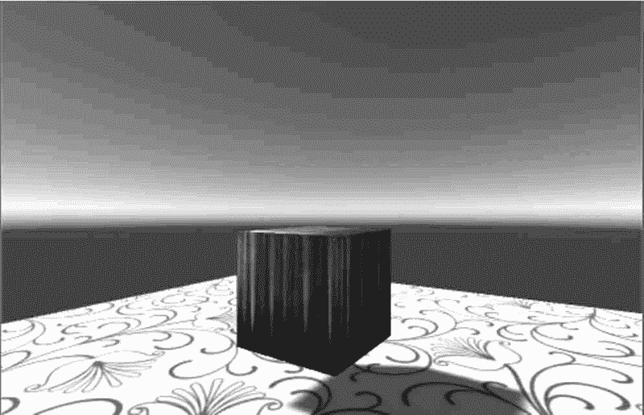
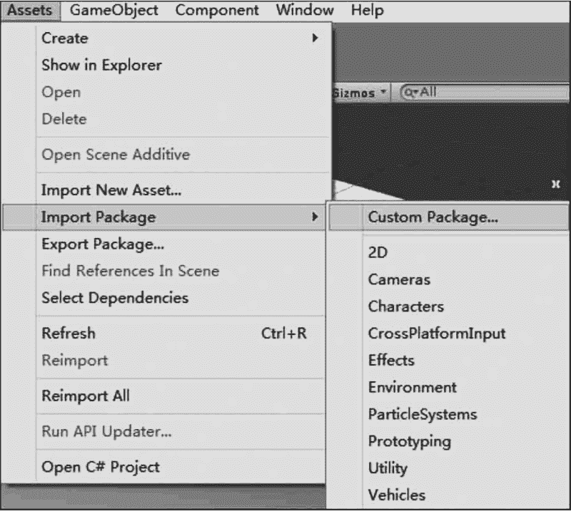
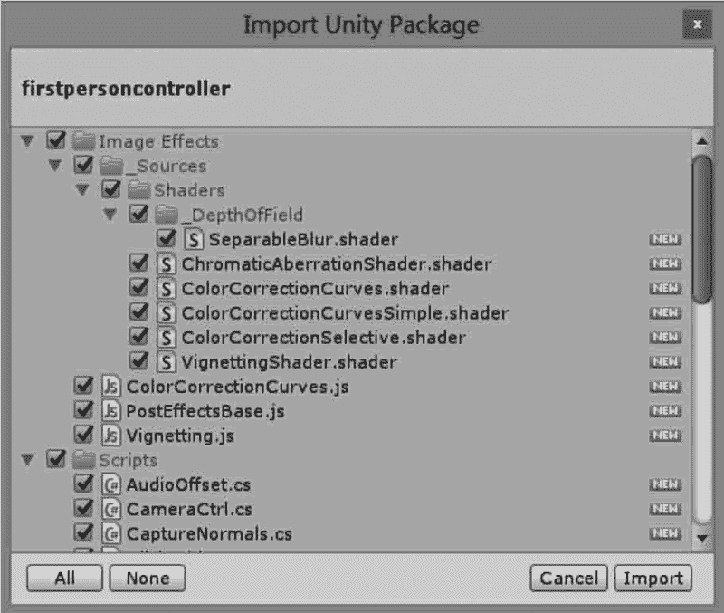
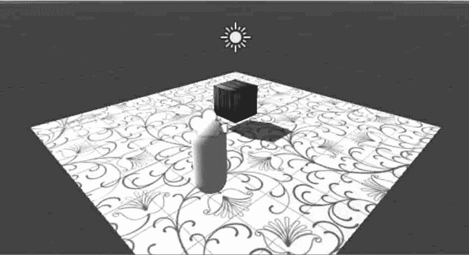
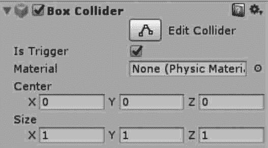
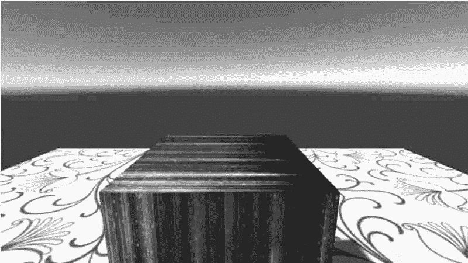
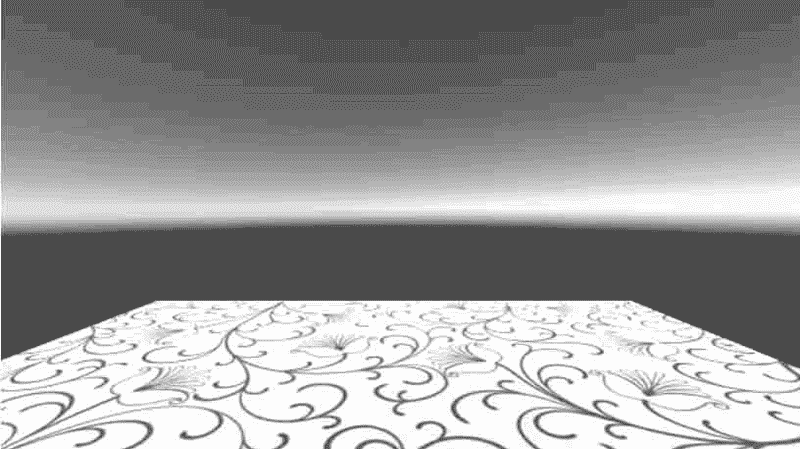

# Unity 3D 触发器（Trigger）

> 原文：[`c.biancheng.net/view/2754.html`](http://c.biancheng.net/view/2754.html)

在 Unity 3D 中，检测碰撞发生的方式有两种，一种是利用碰撞体，另一种则是利用触发器（Trigger）。

触发器用来触发事件。在很多游戏引擎或工具中都有触发器。

例如，在角色扮演游戏里，玩家走到一个地方会发生出现 Boss 的事件，就可以用触发器来实现。

当绑定了碰撞体的游戏对象进入触发器区域时，会运行触发器对象上的 OnTriggerEnter 函数，同时需要在检视面板中的碰撞体组件中勾选 IsTrigger 复选框，如下图所示。


触发信息检测使用以下 3 个函数：

*   MonoBehaviour.OnTriggerEnter（Collider collider），当进入触发器时触发。
*   MonoBehaviour.OnTriggerExit（Collider collider），当退出触发器时触发。
*   MonoBehaviour.OnTriggerStay（Collider collider），当逗留在触发器中时触发。

Unity 3D 中的碰撞体和触发器的区别在于：碰撞体是触发器的载体，而触发器只是碰撞体的一个属性。

如果既要检测到物体的接触又不想让碰撞检测影响物体移动，或者要检测一个物体是否经过空间中的某个区域，这时就可以用到触发器。例如，碰撞体适合模拟汽车被撞飞、皮球掉在地上又弹起的效果，而触发器适合模拟人站在靠近门的位置时门自动打开的效果。

## 实践案例：碰撞消失的立方体

#### 案例构思

碰撞体需要和刚体一起来使碰撞发生，如果两个刚体撞在一起，物理引擎不会计算碰撞，除非它们包含一个碰撞体组件。

没有碰撞体的刚体会在物理模拟中相互穿透。本案例旨在通过小球碰撞后产生消失的动作确认碰撞的发生。

#### 案例设计

本案例在 Unity 3D 内创建一个简单的三维场景，场景内放有 Sphere 和 Plane，Plane 用于充当地面，Sphere 用于做碰撞测试，当人物与 Sphere 距离足够近时发生碰撞，小球消失，如下图所示。



#### 案例实施

步骤 1)：创建一个平面（0，0，0）和一个小球（0，1，0），使小球置于平面上方，如上图所示。

步骤 2)：执行 Assets→Import Package→Customer Package 命令添加第一人称资源，如下图所示。


步骤 3)：选中第一人称资源后单击 Import 按钮导入，如下图所示。


步骤 4)：在 Project 视图中搜索 first person controller，将其添加到 Hierarchy 视图中，并摆放到平面上合适的位置，如下图所示。


步骤 5)：因为第一人称资源自带摄像机，因此需要关掉场景中的摄像机。

步骤 6)：选中 Cube，为 Cube 对象添加 Box Collider，并勾选 Is Trigger 属性，如下图所示。


步骤 7)：编写脚本 Colliders.cs，代码如下。

```

using UnityEngine;
using System.Collections;
public class Colliders:MonoBehaviour{
    void OnTriggerEnter(Collider other){
        if(other.tag=="Pickup"){
            Destroy(other.gameObject);
        }
    }
}
```

步骤 8)：将 Colliders 脚本链接到 first person controller 上。

步骤 9)：为 Cube 添加标签 Pickup。

步骤 10)：单击 Play 按钮运行测试，可以发现，当人物靠近立方体小盒后，小盒即刻消失，运行效果如下图所示。


