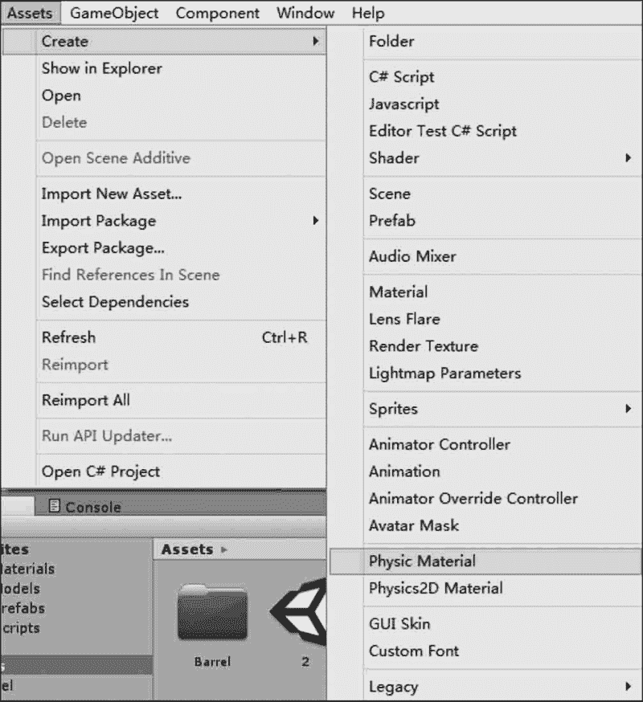
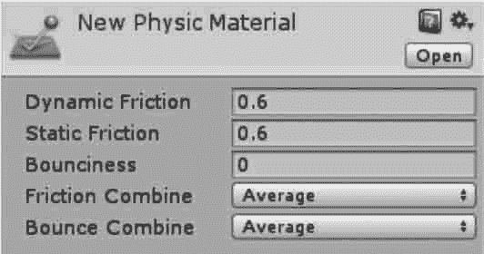
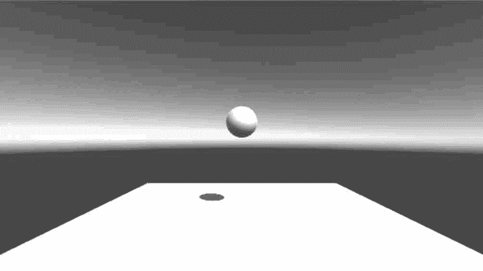
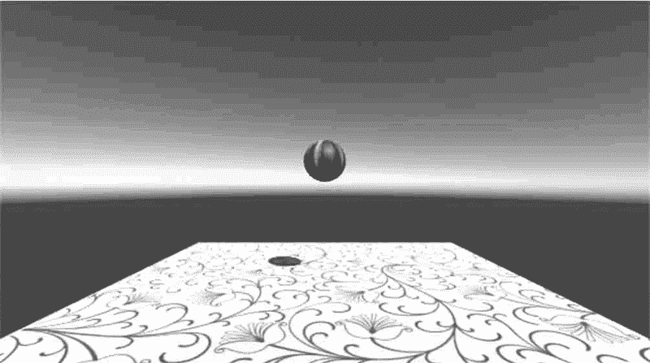
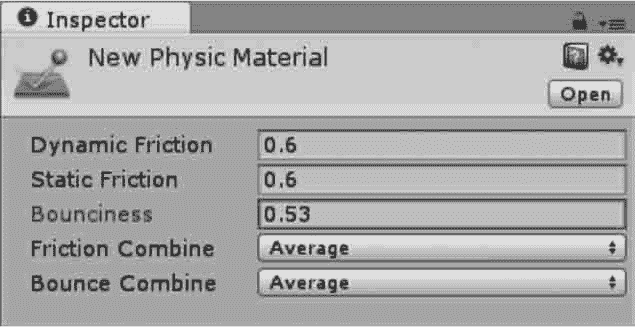
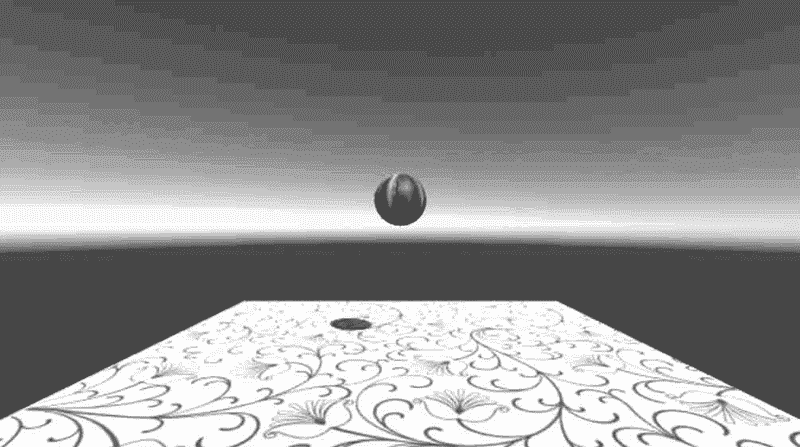
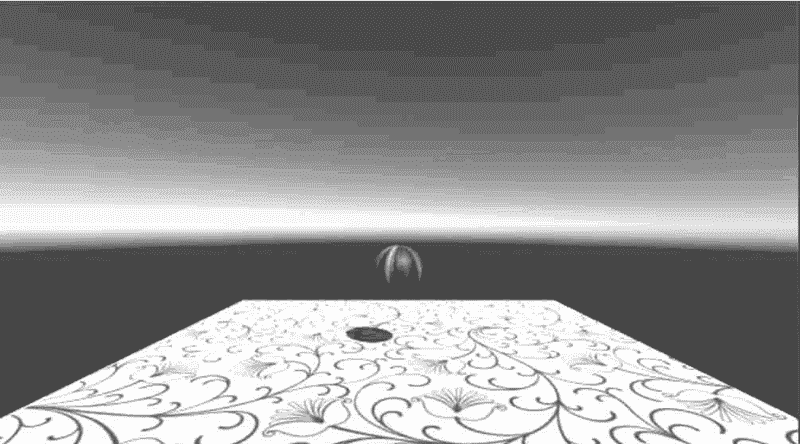

# Unity 3D 物理材质

> 原文：[`c.biancheng.net/view/2756.html`](http://c.biancheng.net/view/2756.html)

Unity 3D 物理材质是指物体表面材质，用于调整碰撞之后的物理效果。

Unity 3D 提供了一些物理材质资源，通过资源添加方法可以添加到当前项目中。

标准资源包提供了 5 种物理材质：弹性材质（Bouncy）、冰材质（Ice）、金属材质（Metal）、橡胶材质（Rubber）和木头材质（Wood）。

在菜单中执行 Assets→Create→Physics Material 便可将物理材质应用在需要的地方，如下图所示。

执行创建物理材质的命令后，在对应的 Inspector 面板上的物理材质设置界面如下图所示，物理材质属性如下表所示。

| 参 数 | 含 义 | 功 能 |
| Dynamic Friction | 动态摩擦力 | 当物体移动时的摩擦力，通常为 0〜1，值为 0 时效果像冰， 而值为 1 时物体运动将很快停止 |
| Static Friction | 静态摩擦力 | 当物体在表面静止时的摩檫力，通常为 0〜1。值为 0 时效 果像冰，值为 1 时使物体移动十分困难 |
| Bounciness | 弹力 | 值为 0 时不发生反弹，值为 1 时反弹不损耗任何能量 |
| Friction Combine Mode | 摩擦力组合方式 | 定义两个碰撞物体的摩擦力如何相互作用 |
| Bounce Combine | 反弹组合 | 定义两个相互碰撞的物体的相互反弹模式 |
| Friction Direction 2 | 摩擦力方向 2 | 方向分为 x 轴、y 轴、z 轴 |
| Dynamic Friction 2 | 动态摩擦力 2 | 动摩擦系数，它的摩擦方向根据 Friction Direction 2 确定 |
| Static Friction 2 | 静态摩擦力 2 | 静摩擦系数，它的摩擦方向根据 Friction Direction 2 确定 |

## 实践案例：弹跳的小球

#### 案例构思

物理材质就是指定了物理特效的一种特殊材质，其中包括物体的弹性和摩擦因数等，本案例旨在通过小球弹跳测试物理材质的效果。

#### 案例设计

本案例在 Unity 3D 内创建一个简单的三维场景，场景内放有 Sphere 和 Plane，Plane 用于充当地面，Sphere 用于物理材质的弹跳测试。

当小球被赋予 bouncy 材质后，即可在平面上反复跳动。

#### 案例实施

步骤 1)：创建一个平面（0，0，0）和一个小球（0，5，0），使小球置于平面上方，如下图所示。

步骤 2)：为平面和小球添加贴图，如下图所示。

步骤 3)：执行菜单栏中的 Component→Physics→Rigidbody 命令为小球添加刚体。

步骤 4)：执行菜单栏中的 Assets→Create→Physic Material 命令，然后将其从 Project 视图中拖到小球上。

步骤 5)：选择新创建的物理材质，为其添加 bounciness（弹跳）属性，并应用到小球上，如下图所示。

步骤 6)：单击 Play 按钮进行测试，小球在地面上可以产生弹跳的效果，如下图所示。

