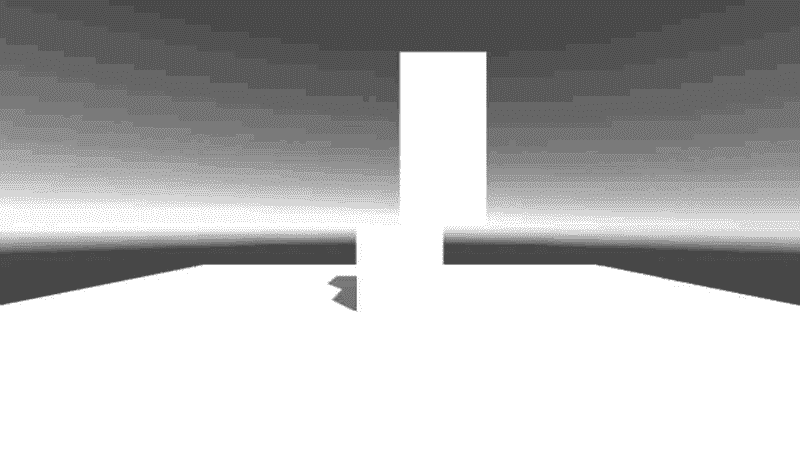
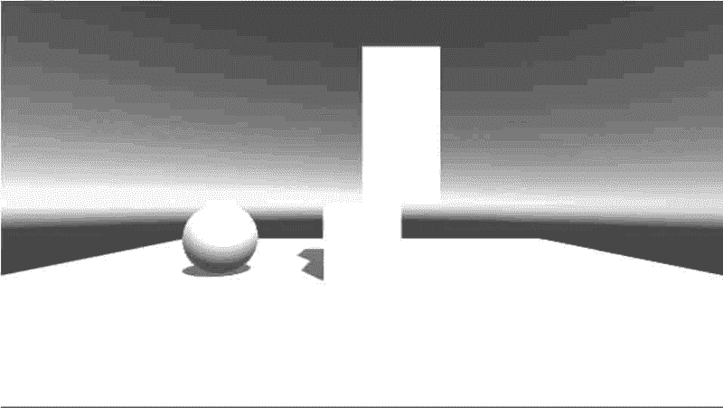
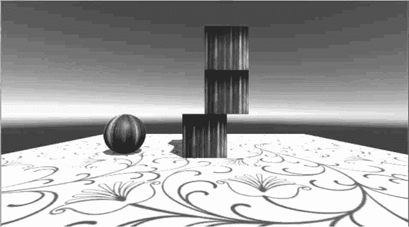
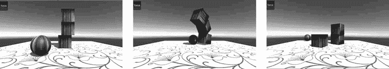

# Unity 3D 力（AddForce）

> 原文：[`c.biancheng.net/view/2757.html`](http://c.biancheng.net/view/2757.html)

力一般是在物体之间的作用过程中表现出来的，在物理学中力是非常重要的元素。

力的种类有很多，刚体组件因为受到力的作用而进行加速或抛物线运动。

Unity 3D 中通过 rigidbody.AddForce（x，y，z）方法添加力的作用，该方法的参数是施加力的方向，参数大小代表了力的大小。

## 实践案例：力的添加

#### 案例构思

现实世界中的物体都受到力的作用，所以才会有千变万化的物理现象。

游戏中物体受力时只是现象的模拟，而不是真的受到力的作用，也就是感觉好像真的受到了力的作用，而实际上只不过是执行力的函数而已。

本案例旨在通过对小球施加力的作用产生与盒子碰撞的效果。

#### 案例设计

本案例在 Unity 3D 内创建一个简单的 3D 场景，场景内放有 1 个 Sphere，1 个 Plane 和 3 个 Cube，Plane 用于充当地面，Sphere 和 Cube 用于做力的测试。

初始场景中 Cube 处于静止状态，通过 Sphere 瞬间施加一个力，使 Cube 运动。

#### 案例实施

步骤 1)：创建游戏对象。执行 GameObject→3D Object→Plane 命令，此时在 Scene 视图中出现了一个平面，在右侧的 Inspector 面板中设置平面位置（0，0，-5）。

步骤 2)：创建游戏对象。执行菜单栏中的 GameObject→3D Object→Cube 命令，创建 3 个立方体盒子，在右侧的 Inspector 面板中分别设置 3 个立方体盒子的位置（0，0.5，-5），（0.5，1.5，-5）（0.5，2.5，-5），如下图所示。


步骤 3)：创建游戏对象。执行菜单栏中的 GameObject→3D Object→Sphere 命令，在 Inspector 面板中设置球体位置属性（-1，0.5，-7），如下图所示。


步骤 4)：美化场景。为球体、立方体及地面贴材质，如下图所示。


步骤 5)：选中球体，执行菜单栏中的 Component→Physics→Rigidbody 命令，为球体和立方体添加刚体属性。

步骤 6)：创建 JavaScript 脚本，双击将其打开，输入下列代码。

```

var addForceObj:GameObject;
function Start(){
    addForceObj=GameObject.Find("Sphere");
}
function OnGUI(){
    if(GUILayout.Button("force", GUILayout.Height(50))) addForceObj.rigidbody.AddForce(500, 0, 1000);
}
```

步骤 7)：保存脚本并将其链接到球体上。

步骤 8)：单击 Play 按钮进行测试，当点击 force 按钮时，小球会受到力的作用向前运动，并与立方体发生碰撞，效果如下图所示。

