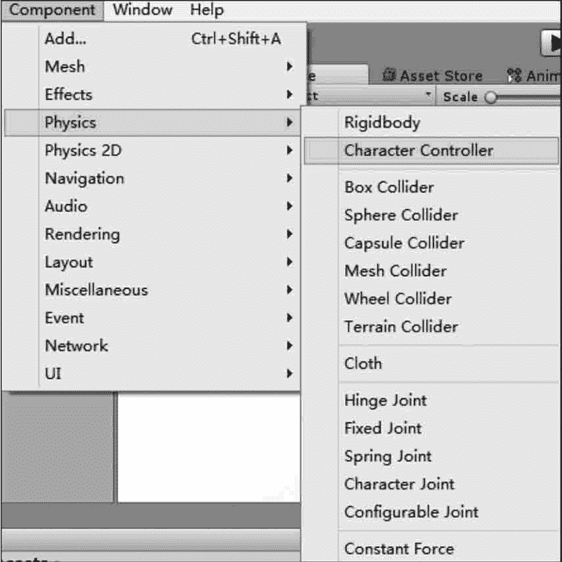
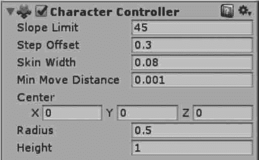

# Unity 3D 角色控制器

> 原文：[`c.biancheng.net/view/2758.html`](http://c.biancheng.net/view/2758.html)

在 Unity 3D 中，游戏开发者可以通过角色控制器来控制角色的移动，角色控制器允许游戏开发者在受制于碰撞的情况下发生移动，而不用处理刚体。

角色控制器不会受到力的影响，在游戏制作过程中，游戏开发者通常在任务模型上添加角色控制器组件进行模型的模拟运动。

## 添加角色控制器

Unity 3D 中的角色控制器用于第一人称以及第三人称游戏主角的控制操作，角色控制器的添加方法如下图所示。

选择要实现控制的游戏对象，执行菜单栏中的 Component→Physics→Character Controller 命令，即可为该游戏对象添加角色控制器组件。

## 角色控制器选项设置

Unity 3D 中的角色控制器组件被添加到角色上之后，其属性面板会显示相应的属性参数，如下图所示，其参数如下表所示。

| 参 数 | 含 义 | 功 能 |
| Slope Limit | 坡度限制 | 设置被控制的角色对象爬坡的高度 |
| Step Offset | 台阶高度 | 设置所控制角色对象可以迈上的最大台阶高度值 |
| Skin Width | 皮肤厚度 | 决定两个碰撞体碰撞后相互渗透的程度 |
| Min Move Distance | 最小移动距离 | 设置角色对象最小移动值 |
| Center | 中心 | 设置胶囊碰撞体在世界坐标中的位置 |
| Radius | 半径 | 设置胶囊碰撞体的横截面半径 |
| Height | 高度 | 设置胶囊碰撞体的高度 |