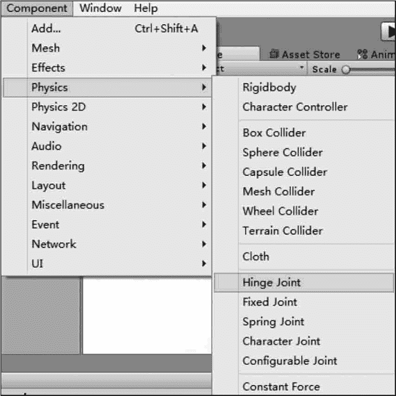

# Unity 3D 关节

> 原文：[`c.biancheng.net/view/2759.html`](http://c.biancheng.net/view/2759.html)

在 Unity 3D 中，物理引擎内置的关节组件能够使游戏对象模拟具有关节形式的连带运动。

关节对象可以添加至多个游戏对象中，添加了关节的游戏对象将通过关节连接在一起并具有连带的物理效果。

需要注意的是，关节组件的使用必须依赖刚体组件。

## 铰链关节

Unity 3D 中的两个刚体能够组成一个铰链关节，并且铰链关节能够对刚体进行约束。

具体使用时，首先执行菜单栏中的 Component→Physics→Hinge Joint 命令，为指定的游戏对象添加铰链关节组件，如下图所示。

然后，在相应的 Inspector 属性面板中设置属性，如下表所示。

| 参 数 | 含 义 | 功 能 |
| Connected Body | 连接刚体 | 指定关节要连接的刚体 |
| Anchor | 锚点 | 设置应用于局部坐标的刚体所围绕的摆动点 |
| Axis | 轴 | 定义应用于局部坐标的刚体摆动的方向 |
| Use Spring | 使用弹簧 | 使刚体与其连接的主体物形成特定高度 |
| Spring | 弹簧 | 用于勾选使用弹簧选项后的参数设定 |
| Use Motor | 使用马达 | 使对象发生旋转运动 |
| Motor | 马达 | 用于勾选使用马达选项后的参数设定 |
| Use Limits | 使用限制 | 限制铰链的角度 |
| Limits | 限制 | 用于勾选使用限制选项后的参数设定 |
| Break Force | 断开力 | 设置断开铰链关节所需的力 |
| Break Torque | 断开转矩 | 设置断开铰链关节所需的转矩 |

## 固定关节

在 Unity 3D 中，用于约束指定游戏对象对另一个游戏对象运动的组件叫作固定关节组件，其类似于父子级的关系。

具体使用时，首先执行菜单栏中的 Component→Physics→Fixed Joint 命令，为指定游戏对象添加固定关节组件。

当固定关节组件被添加到游戏对象后，在相应的 Inspector 属性面板中设置相关属性，如下表所示。

| 参 数 | 含 义 | 功 能 |
| Connected Body | 连接刚体 | 为指定关节设定要连接的刚体 |
| Break Force | 断开力 | 设置断开固定关节所需的力 |
| Break Torque | 断开力矩 | 设置断开固定关节所需的转矩 |

## 弹簧关节

在 Unity 3D 中，将两个刚体连接在一起并使其如同弹簧一般运动的关节组件叫弹簧关节。

具体使用时，首先执行菜单栏中的 Component→Physics→Spring Joint 命令，为指定的游戏对象添加弹簧关节组件。

然后，在相应的 Inspector 属性面板中设置相关属性，如下表所示。

| 参 数 | 含 义 | 功 能 |
| Connected Body | 连接刚体 | 为指定关节设定要连接的刚体 |
| Anchor | 错点 | 设置应用于局部坐标的刚体所围绕的摆动点 |
| Spring | 弹簧 | 设置弹簧的强度 |
| Damper | 阻尼 | 设置弹簧的阻尼值 |
| Min Distance | 最小距离 | 设置弹簧启用的最小距离数值 |
| Max Distance | 最大距离 | 设置弹簧启用的最大距离数值 |
| Break Force | 断开力 | 设置断开弹簧关节所需的力度 |
| Break Torque | 断开转矩 | 设置断开弹簧关节所需的转矩 |

## 角色关节

在 Unity 3D 中，主要用于表现布偶效果的关节组件叫作角色关节。

具体使用时，首先执行菜单栏中的 Component→Physics→Character Joint 命令，为指定的游戏对象添加角色关节组件。

然后，在相应的 Inspector 属性面板中设置相关属性，如下表所示。

| 参 数 | 含 义 | 功 能 |
| Connected Body | 连接刚体 | 为指定关节设定要连接的刚体 |
| Anchor | 锚点 | 设置应用于局部坐标的刚体所围绕的摆动点 |
| Axis | 扭动轴 | 角色关节的扭动轴 |
| Swing Axis | 摆动轴 | 角色关节的摆动轴 |
| Low Twist Limit | 扭曲下限 | 设置角色关节扭曲的下限 |
| High Twist Limit | 扭曲上限 | 设置角色关节扭曲的上限 |
| Swing 1 Limit | 摆动限制 1 | 设置摆动限制 |
| Swing 2 Limit | 摆动限制 2 | 设置摆动限制 |
| Break Force | 断开力 | 设置断开角色关节所需的力 |
| Break Torque | 断开转矩 | 设置断开角色关节所需的转矩 |

## 可配置关节

Unity 3D 为游戏开发者提供了一种用户自定义的关节形式，其使用方法较其他关节组件烦琐和复杂，可调节的参数很多。

具体使用时，首先执行菜单栏中的 Component→Physics→Configurable Joint 命令，为指定游戏对象添加可配置关节组件。

然后，在相应的 Inspector 属性面板中设置相关属性，如下表所示。

| 参 数 | 含 义 | 功 能 |
| Connected Body | 连接刚体 | 为指定关节设定要连接的刚体 |
| Anchor | 锚点 | 设置关节的中心点 |
| Axis | 主轴 | 设置关节的局部旋转轴 |
| Secondary Axis | 副轴 | 设置角色关节的摆动轴 |
| X Motion | X 轴移动 | 设置游戏对象基于 X 轴的移动方式 |
| Y Motion | Y 轴移动 | 设置游戏对象基于 Y 轴的移动方式 |
| Z Motion | Z 轴移动 | 设置游戏对象基于 Z 轴的移动方式 |
| Angular X Motion | X 轴旋转 | 设置游戏对象基于 X 轴的旋转方式 |
| Angular Y Motion | Y 轴旋转 | 设置游戏对象基于 Y 轴的旋转方式 |
| Angular Z Motion | Z 轴旋转 | 设置游戏对象基于 Z 轴的旋转方式 |
| Linear Limit | 线性限制 | 以其关节原点为起点的距离对齐运动边界进行限制的 设置 |
| Low Angular X Limit | X 轴旋转下限 | 设置基于 X 轴关节初始旋转差值的旋转约束下限 |
| High Angular X Limit | X 轴旋转上限 | 设置基于 X 轴关节初始旋转差值的旋转约束上限 |
| Angular Y Limit | Y 轴旋转限制 | 设置基于 Y 轴关节初始旋转差值的旋转约束 |
| Angular Z Limit | Z 轴旋转限制 | 设置基于 Z 轴关节初始旋转差值的旋转约束 |
| Target Position | 目标位置 | 设置关节应达到的目标位置 |
| Target Velocity | 目标速度 | 设置关节应达到的目标速度 |
| X Drive | X 轴驱动 | 设置对象沿局部坐标系 X 轴的运动形式 |
| Y Drive | Y 轴驱动 | 设置对象沿局部坐标系 Y 轴的运动形式 |
| Z Drive | Z 轴驱动 | 设置对象沿局部坐标系 Z 轴的运动形式 |
| Target Rotation | 目标旋转 | 设置关节旋转到目标的角度值 |
| Target Angular Velocity | 目标旋转角速度 | 设置关节旋转到目标的角速度值 |
| Rotation Drive Mode X&YZ | 旋转驱动模式 | 通过 X&YZ 轴驱动或插值驱动对对象自身的旋转进 行控制 |
| Angular X Drive | X 轴角驱动 | 设置关节围绕 X 轴进行旋转的方式 |
| Angular YZ Drive | YZ 轴角驱动 | 设置关节绕 Y、Z 轴进行旋转的方式 |
| Slerp Drive | 球面线性插值驱动 | 设定关节围绕局部所有的坐标轴进行旋转的方式 |
| Projection Mode | 投影模式 | 设置对象远离其限制位置时使其返回的模式 |
| Projection Distance | 投影距离 | 在对象与其刚体链接的角度差超过投影距离时使其回 到适当的位置 |
| Projection Angle | 投影角度 | 在对象与其刚体链接的角度差超过投影角度时使其回 到适当的位置 |
| Configured In World Space | 在世界坐标系中 配置 | 将目标相关数值都置于世界坐标中进行计算 |
| Swap Bodies | 交换刚体功能 | 将两个刚体进行交换 |
| Break Force | 断开力 | 设置断开关节所需的作用力 |
| Break Torque | 断开转矩 | 设置断开关节所需的转矩 |
| Enable Collision | 激活碰撞 | 激活碰撞属性 |