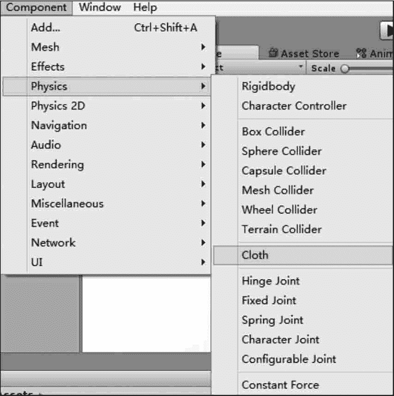

# Unity 3D 布料

> 原文：[`c.biancheng.net/view/2761.html`](http://c.biancheng.net/view/2761.html)

布料是 Unity 3D 中的一种特殊组件，它可以随意变换成各种形状，例如桌布、旗帜、窗帘等。

布料系统包括交互布料与蒙皮布料两种形式。

## 添加布料系统

Unity 3D 中的布料系统为游戏开发者提供了强大的交互功能。

在 Unity 5.x 中，布料系统为游戏开发者提供了一个更快、更稳定的角色布料解决方法。

具体使用时，执行菜单栏中的 Component→Physics→Cloth 命令，为指定游戏对象添加布料组件，如下图所示。

## 布料系统属性设置

当布料组件被添加到游戏对象后，在相应的 Inspector 属性面板中设置相关属性，如下表所示。

| 参 数 | 含 义 | 功 能 |
| Stretching Stiffness | 拉伸刚度 | 设定布料的抗拉伸程度 |
| Bending Stiffness | 弯曲刚度 | 设定布料的抗弯曲程度 |
| Use Tethers | 使用约束 | 开启约束功能 |
| Use Gravity | 使用重力 | 开启重力对布料的影响 |
| Damping | 阻尼 | 设置布料运动时的阻尼 |
| External Acceleration | 外部加速度 | 设置布料上的外部加速度（常数） |
| Random Acceleration | 随机加速度 | 设置布料上的外部加速度（随机数） |
| World Velocity Scale | 世界速度比例 | 设置角色在世界空间的运动速度对于布料顶点的影响程度， 数值越大的布料对角色在世界空间运动的反应就越 剧烈，
此参数也决定了蒙皮布料的空气阻力 |
| World Acceleration Scale | 世界加速度比例 | 设置角色在世界空间的运动加速度对于布料顶点的影响程度， 数值越大的布料对角色在世界空间运动的反应就 越剧烈。
如果布料显得比较生硬，可以尝试增大此值；
如果布料显得不稳定，可以减小此值 |
| Friction | 摩擦力 | 设置布料的摩擦力值 |
| Collision Mass Scale | 大规模碰撞 | 设置增加的碰撞粒子质量的多少 |
| Use Continuous Collision | 使用持续碰撞 | 减少直接穿透碰撞的概率 |
| Use Virtual Particles | 使用虚拟粒子 | 为提高稳定性而增加虚拟粒子 |
| Solver Frequency | 求解频率 | 设置每秒的求解频率 |