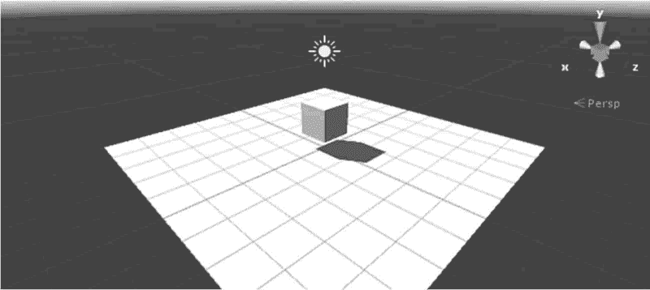
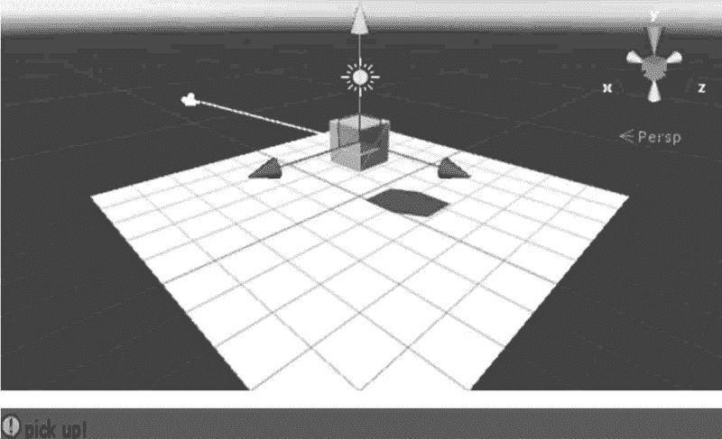

# Unity 3D 射线

> 原文：[`c.biancheng.net/view/2763.html`](http://c.biancheng.net/view/2763.html)

射线是三维世界中一个点向一个方向发射的一条无终点的线，在发射轨迹中与其他物体发生碰撞时，它将停止发射。

射线应用范围比较广，广泛应用于路径搜寻、AI 逻辑和命令判断中。

例如，自动巡逻的敌人在视野前方发现玩家的时候会向玩家发起攻击，这时候就需要使用射线了。

接下来我们通过一个案例来了解射线在游戏开发中的应用。

## 实践案例：拾取物体

#### 案例构思

本案例旨在通过在场景中拾取 Cube 对象，实现射线功能。

#### 案例设计

本案例在 Unity 3D 内创建一个简单的三维场景，场景内放有 Cube 和 Plane，Plane 用于充当地面，Cube 用于做拾取物体测试。

当单击 Cube 时，它会发出一条射线，同时在 Console 面板中出现 pick up 字样。

#### 案例实施

步骤 1)：创建一个平面（0，0，0）和一个小球（0，1，0），使小球置于平面上方，如下图所示。


步骤 2)：创建 C# 脚本，将其命名为 RayTest，输入如下代码。

```

using UnityEngine;
using System.Collections;
public class RayTest:MonoBehaviour{
    void Update(){
        if(Input.GetMouseButton(0)){
            //从摄像机到单击处发出射线
            Ray ray=Camera.main.ScreenPointToRay(Input.mousePosition);
            RaycastHit hitInfo;
            if(Physics.Raycast(ray, out hitInfo)){
                //画出射线, 只有在 Scene 视图中才能看到
                Debug.DrawLine(ray.origin, hitInfo.point);
                GameObject gameObj=hitInfo.collider.gameObject;
                Debug.Log("click object name is"+gameObj.name);
                //当射线碰撞目标的标签是 Pickup 时, 执行拾取操作
                if(gameObj.tag=="Pickup"){
                    Debug.Log("pick up!");
                }
            }
        }
    }
}
```

上述代码中，首先创建一个 Ray 对象，从摄像机发出到单击处的射线。

Debug.DrawLine 函数将射线可视化。接下来进行判断，如果鼠标单击的物体标签是 Pickup，则在控制面板中输出 pick up 字样。

步骤 3)：将脚本链接到主摄像机上。

步骤 4)：为 Cube 添加 Pickup 标签。

步骤 5)：运行测试，效果如下图所示。

