# Unity 3D 物理管理器（Physics Manager）

> 原文：[`c.biancheng.net/view/2765.html`](http://c.biancheng.net/view/2765.html)

Unity 3D 集成开发环境作为一个优秀的游戏开发平台，提供了出色的管理模式，即物理管理器（Physics Manager）。

物理管理器管理项目中物理效果的参数，如物体的重力、反弹力、速度和角速度等。

在 Unity 3D 中执行 Edit→Project Settings→Physics 命令可以打开物理管理器，如下图所示。

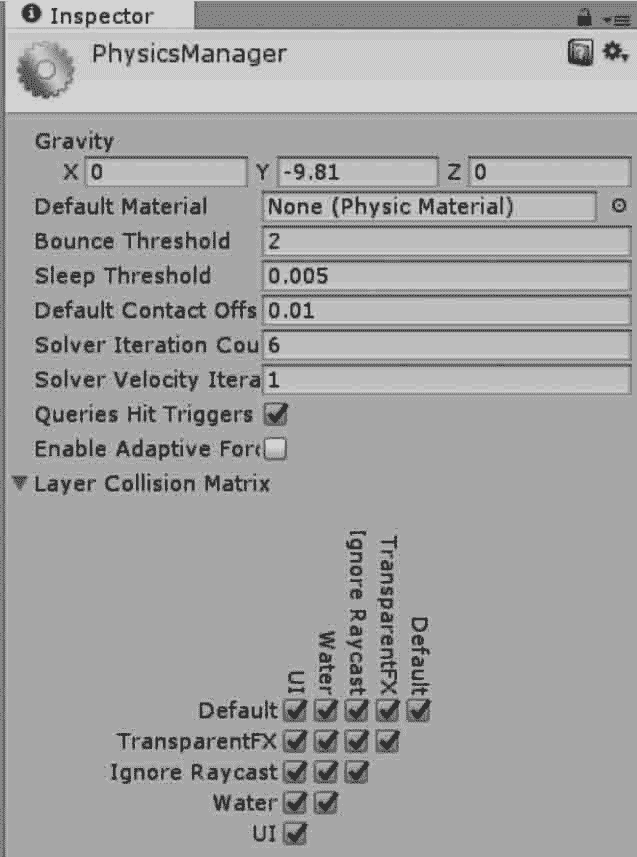
可以根据需要通过调整物理管理器中的参数来改变游戏中的物理效果，具体参数如下表所示。

| 参 数 | 含 义 | 功 能 |
| Gravity | 重力 | 应用于所有刚体，一般仅在 Y 轴起作用 |
| Default Material | 默认物理材质 | 如果一个碰撞体没有设置物理材质，将采用默认材质 |
| Bounce Threshold | 反弹阈值 | 如果两个碰撞体的相对速度低于该值，则不会反弹 |
| Sleep Velocity | 休眠速度 | 低于该速度的物体将进人休眠 |
| Sleep Angular Velocity | 休眠角速度 | 低于该角速度的物体将进人休眠 |
| Max Angular Velocity | 最大角速度 | 用于限制刚体角速度，避免旋转时数值不稳定 |
| Min Penetration For Penalty | 最小穿透力 | 设置在碰撞检测器将两个物体分开前，它们可以穿透 多少距离 |
| Solver Iteration Count | 迭代次数 | 决定了关节和连接的计算精度 |
| Raycasts Hit Triggers | 射线检测命中 触发器 | 如果启用此功能，在射线检测时命中碰撞体会返回一 个命中消息；如果关闭此功能，则不返回命中消息 |
| Layer Collision Matrix | 层碰撞矩阵 | 定义层碰撞检测系统的行为 |

## 综合案例：迷宫夺宝

### 案例构思

迷宫夺宝类游戏是常见的游戏类型，玩家在限定的时间内，在迷宫中寻找宝箱从而达到通关的目的。

本项目旨在通过场景虚拟漫游，寻找迷宫中潜藏的宝箱，当靠近宝箱时收集它，实现碰撞检测功能。

### 案例设计

本案例在 Unity 3D 内创建一个三维迷宫场景，场景内分散着若干个宝箱，游戏玩家需要在规定的时间内找到宝箱，靠近并收集它，最终通关。

### 项目实施

#### 1) 搭建迷宫场景

步骤 1)：创建新项目，并将场景命名为 migong。

步骤 2)：创建游戏对象。执行菜单栏中的 GameObject→3D Object→Plane 命令，创建平面，并赋予材质。

执行 GameObject→3D Object→Cube 命令创建若干个盒子，构成迷宫场景，如下图所示。

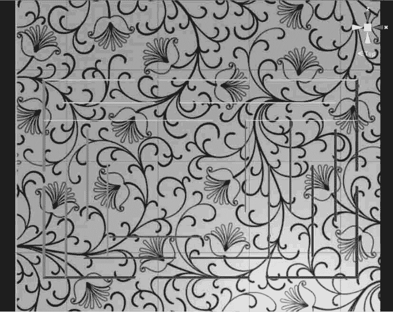
步骤 3)：导入模型资源。从 Unity 3D 商店中选择 3D 模型资源并加载到场景中，将其命名为 treasure，如下图所示。

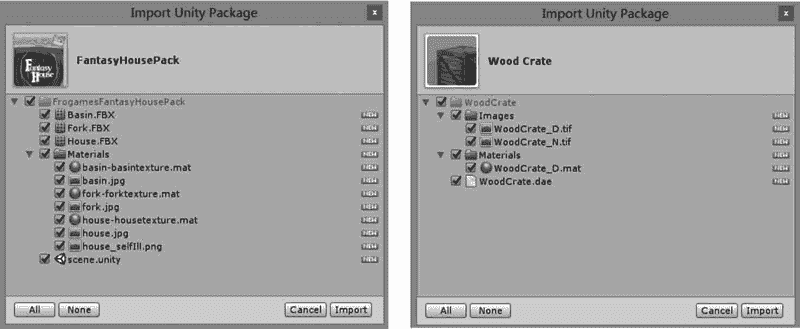
步骤 4)：将模型资源导入到 Hierarchy 视图中，如下图所示。

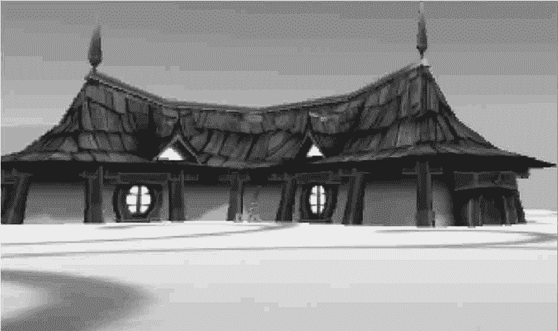
步骤 5)：执行 Assets→Import Package→Custom Package 命令添加第一人称资源，如下图所示。

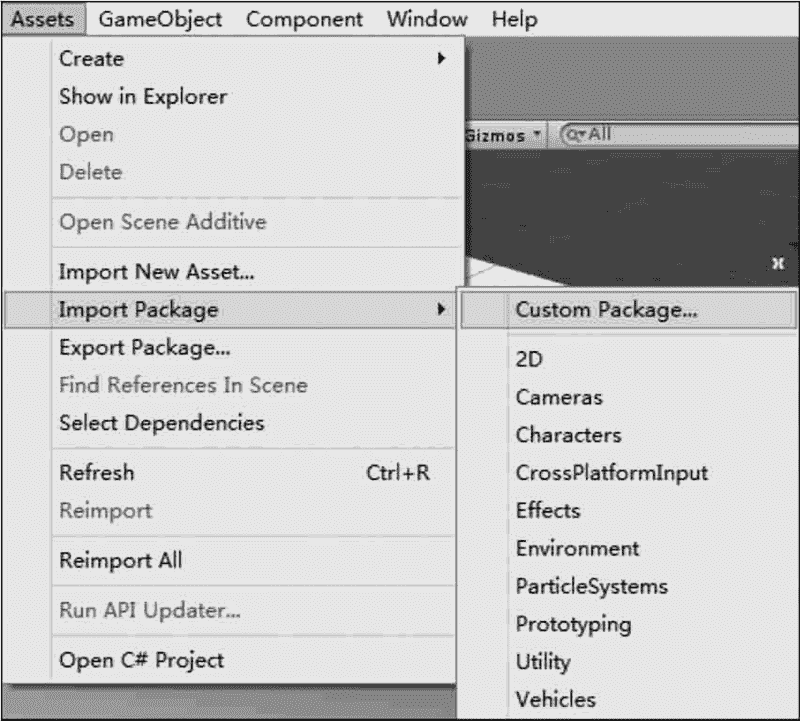
步骤 6)：选中第一人称资源后单击 Import 按钮导入该资源，如下图所示。

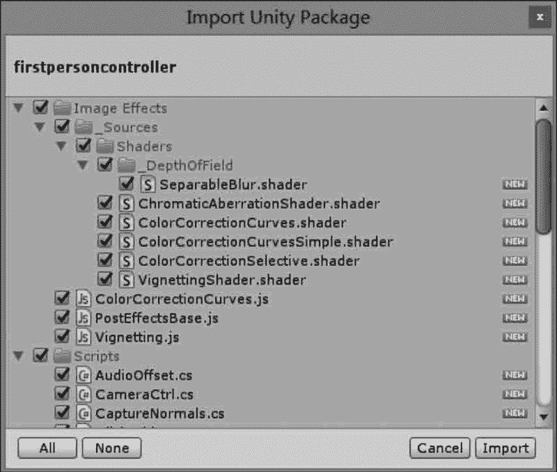
步骤 7)：在 Project 视图中搜索 first person controller，将其添加到 Hierarchy 视图中，并摆放到平面上合适的位置，如下图所示。

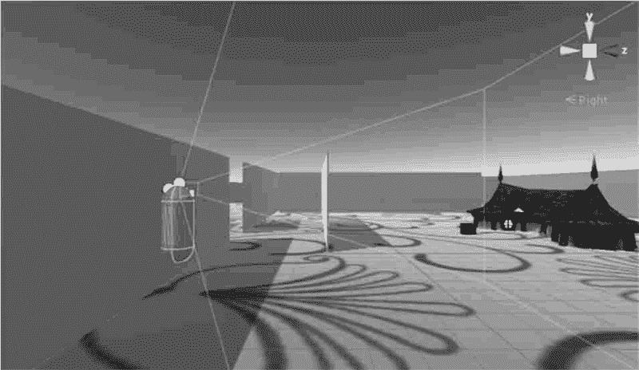
步骤 8)：因为第一人称资源自带摄像机，因此需要关掉场景中的摄像机。

#### 2) 添加触发器

步骤 9)：选中 treasure，为 treasure 对象添加 Box Collider，并勾选 Is Trigger 属性，如下图所示。

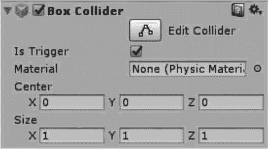
步骤 10)：编写脚本 Triggers.cs，代码如下。

```

using UnityEngine;
using System.Collections;
public class Triggers:MonoBehaviour{
    void OnTriggerEnter(Collider other){
        if(other.tag=="Pickup"){
            Destroy(other.gameObject);
        }
    }
}
```

步骤 11)：将 Triggers 脚本链接到 first person controller 上。

步骤 12)：为 treasure 添加标签 Pickup。

#### 3) 添加计数功能

步骤 13)：修改脚本。

```

using UnityEngine;
using System.Collections;
public class Triggers:MonoBehaviour{
    public static int temp_Num=0;
    void OnTriggerEnter(Collider other){
        if(other.tag=="Pickup"){
            temp_Num++;
            Destroy(other.gameObject);
        }
    }
    void OnGUI(){
        if(temp_Num==5)
        if(GUI.Button(new Rect(Screen.width/2f, Screen.height/2f, 100, 50),"play again")){
            temp_Num=0;
            Application.LoadLevel("migong");
        }
    }
}
```

步骤 14)：将场景添加到 Build Settings 中，如下图所示。

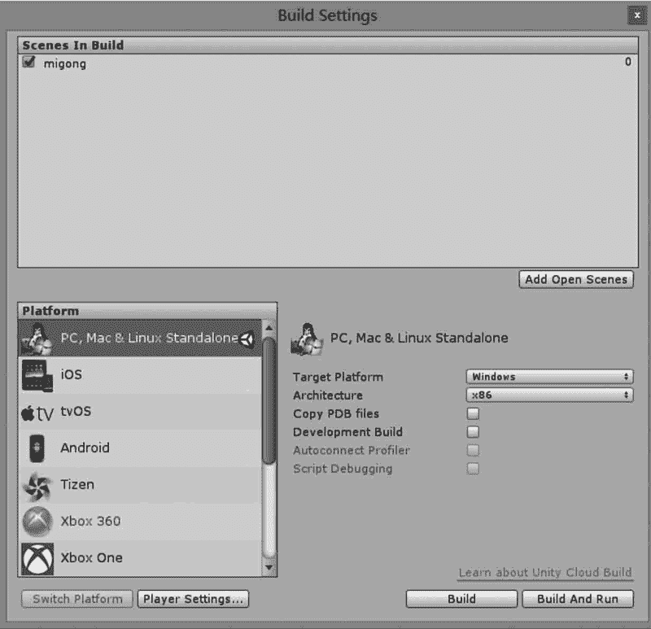

#### 4) 添加计时功能

步骤 15)：完善代码，如下所示。

```

using UnityEngine;
using System.Collections;
public class Triggers:MonoBehaviour{
    public static int temp_Num=0;
    public int parachuteNum;
    int timer;
    int time_T;
    bool isWin=false;
    bool isLose=false;
    void Start(){
        Time.timeScale=1;
        GameObject[]objs=GameObject.FindGameObjectsWithTag("Pickup");
        parachuteNum=objs.Length;
        time_T=(int)Time.time;
    }
    void Update(){
        timer=20-(int)Time.time+time_T;
        if(temp_Num==parachuteNum&&timer!=0){
            isWin=true;
        }
        if(timer==0&&temp_Num!=parachuteNum){
            isLose=true;
        }
    }
    void OnTriggerEnter(Collider other){
        if(other.tag=="Pickup"){
            temp_Num++;
            Destroy(other.gameObject);
        }
    }
    void OnGUI(){
        GUI.Label(new Rect(0, 0, 100, 50), timer.ToString());
        if(isWin==true||isLose==true){
            Time.timeScale=0;
            if(GUI.Button(new Rect(Screen.width/2f, Screen.height/2f, 100, 50), "play again")){
                isWin=false;
                isLose=false;
                temp_Num=0;
                Application.LoadLevel("migong");
            }
        }
    }
}
```

步骤 16)：单击 Play 按钮进行测试，效果如下图所示。

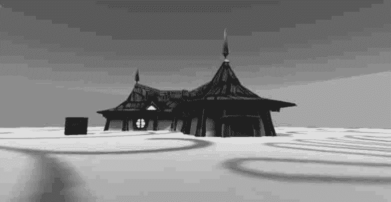
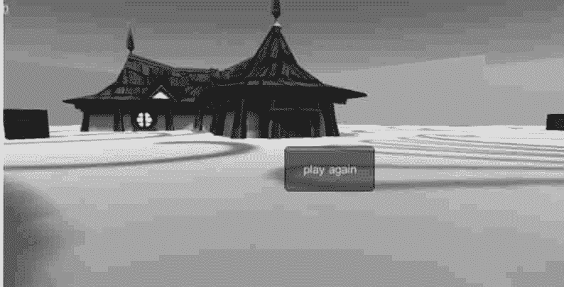