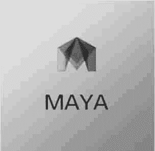
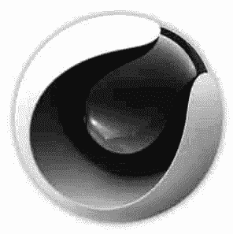

# Unity 3D 三维模型简介

> 原文：[`c.biancheng.net/view/2766.html`](http://c.biancheng.net/view/2766.html)

三维模型是用三维建模软件建造的立体模型，也是构成 Unity 3D 场景的基础元素。

Unity 3D 几乎支持所有主流格式的三维模型，如 FBX 文件和 OBJ 文件等。

开发者可以将三维建模软件导出的模型文件添加到项目资源文件夹中，Unity 3D 会将其显示在 Assets 面板中。

## 主流三维建模软件

首先介绍当今主流的三维建模软件，这些软件广泛应用于模型制作、工业设计、建筑设计、三维动画等领域，每款软件都有自己独特的功能和专有的文件格式。

正因为能够利用这些软件来完成建模工作，Unity 3D 才可以展现出丰富的游戏场景以及真实的角色动画。

下面介绍 3 种主流的三维建模软件。

#### 1) Autodesk 3D Studio Max

Autodesk 3D Studio Max 简称 3ds Max，是 Autodesk 公司开发的基于 PC 系统的三维动画渲染和制作软件。

3ds Max 可谓是最全面的三维建模，有着良好的技术支持和社区支持，是一款主流且功能全面的三维建模工具软件，如上图所示。

#### 2) Autodesk Maya

Autodesk Maya 是 Autodesk 公司旗下的著名三维建模和动画软件。

Maya 2008 可以大大提高电影、电视、游戏等领域开发、设计、创作的工作流效率，同时改善了多边形建模，通过新的算法提高了性能，多线程支持可以充分利用多核心处理器的优势。

新的 HLSL 着色工具和硬件着色 API 则可以大大增强新一代主机游戏的视觉效果，另外，它在角色建立和动画方面也更具弹性，如下图所示。

#### 3) Cinema 4D

Cinema 4D 的字面意思是 4D 电影，不过其本身还是 3D 的表现软件，由德国 Maxon Computer 公司开发，以极高的运算速度和强大的渲染插件著称，很多模块的功能代表同类软件中的科技进步成果，并且在用其描绘的各类电影中表现突出，随着其技术越来越成熟，Cinema 4D 受到越来越多的电影公司的重视，如下图所示。

