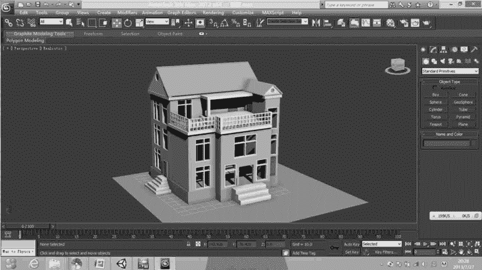
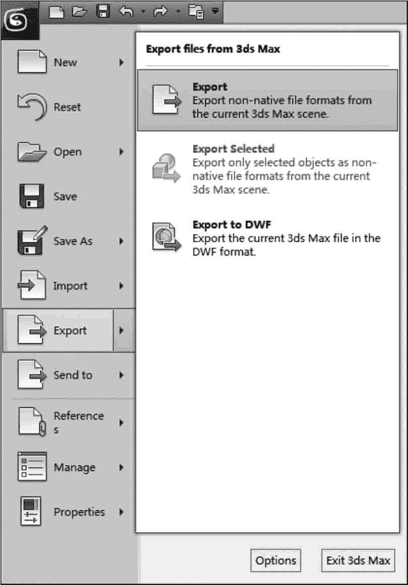
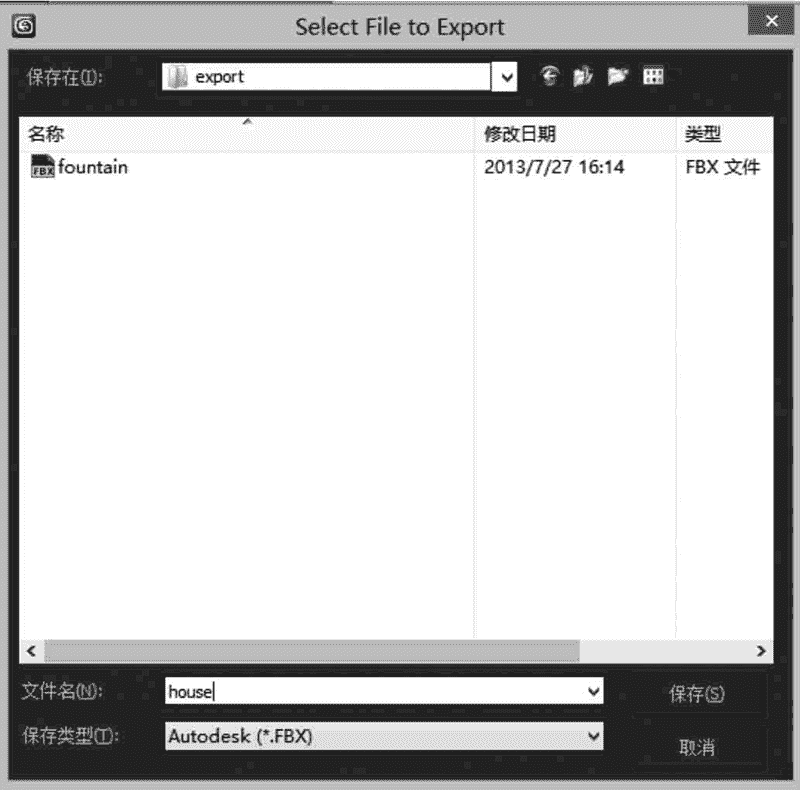
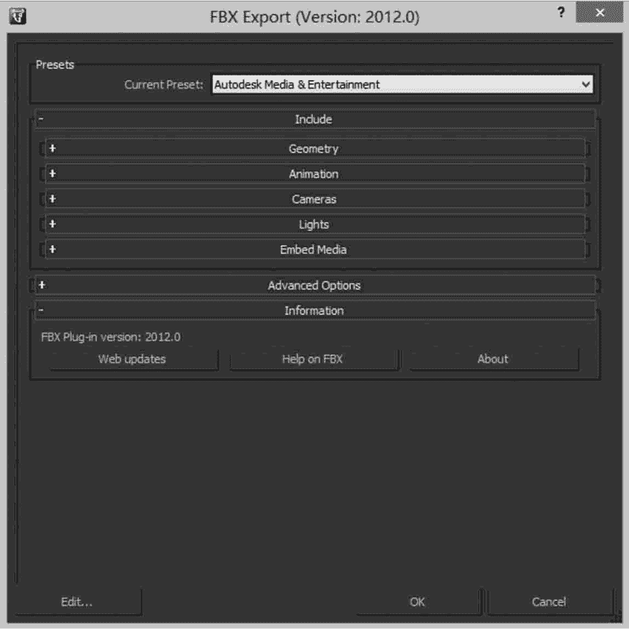
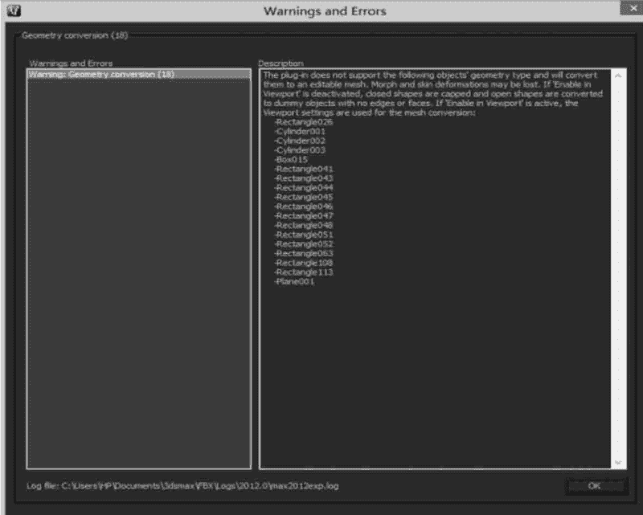
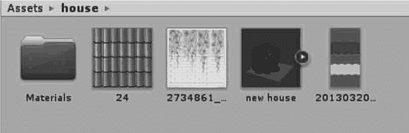
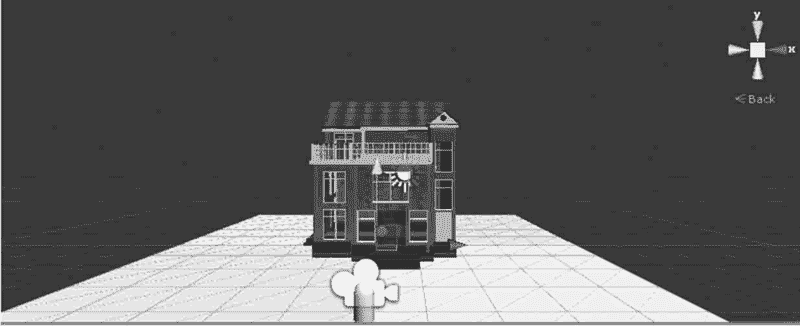
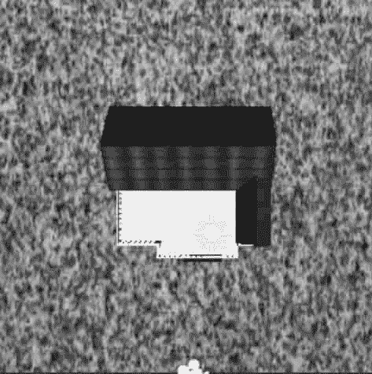
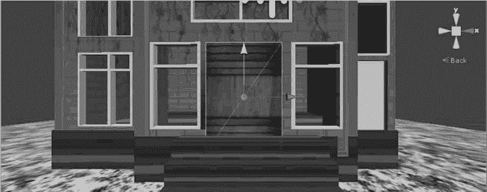

# Unity 3D 导入三维模型

> 原文：[`c.biancheng.net/view/2768.html`](http://c.biancheng.net/view/2768.html)

将三维模型导入 Unity 3D 是游戏开发的第一步。

下面以 3ds Max 为例，演示从三维建模软件中将模型导入 Unity 3D 的过程，具体步骤如下。

步骤 1)：在 3ds Max 中创建房子模型，如下图所示。

步骤 2)：执行 Export→Export 命令导出 fbx 模型，如下图所示。

步骤 3)：设置保存路径以及文件名，如下图所示。

步骤 4)：选择默认设置选项，单击 OK 按钮，如下图所示。

步骤 5)：再次单击 OK 按钮，即可生成 fbx 文件，如下图所示。

步骤 6)：创建一个 Unity 3D 新项目。

步骤 7)：将生成的 fbx 文件导入 Project 视图，如下图所示。

步骤 8)：将模型拖入 Scene 视图中，如下图所示。

步骤 9)：创建地面并为地面贴上大理石材质，如下图所示。

步骤 10)：创建一个开关门。执行 GameObject→3D Object→Cube 命令创建一个立方体，将其命名为 door。

步骤 11)：为门赋予材质，如下图所示。

