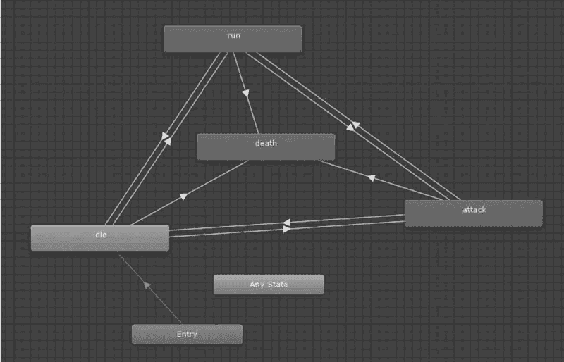

# Unity 3D 动画系统（Mecanim）

> 原文：[`c.biancheng.net/view/2769.html`](http://c.biancheng.net/view/2769.html)

Mecanim 动画系统是 Unity 公司推出的全新动画系统，具有重定向、可融合等诸多新特性，可以帮助程序设计人员通过和美工人员的配合快速设计出角色动画，其主界面如下图所示。

Unity 公司计划采用 Mecanim 动画系统逐步替换直至完全取代旧版动画系统。

Unity 5.x 版本针对 Mecanim 动画系统的底层代码进行了升级优化，提升了动画制作的效果。

Mecanim 动画系统提供了 5 个主要功能：

*   通过不同的逻辑连接方式控制不同的身体部位运动的能力。
*   将动画之间的复杂交互作用可视化地表现出来，是一个可视化的编程工具。
*   针对人形角色的简单工作流以及动画的创建能力进行制作。
*   具有能把动画从一个角色模型直接应用到另一个角色模型上的 Retargeting（动画重定向）功能。
*   具有针对 Animation Clips 动画片段的简单工作流，针对动画片段以及它们之间的过渡和交互过程的预览能力，从而使设计师在编写游戏逻辑代码前就可以预览动画效果，可以使设计师能更快、更独立地完成工作。