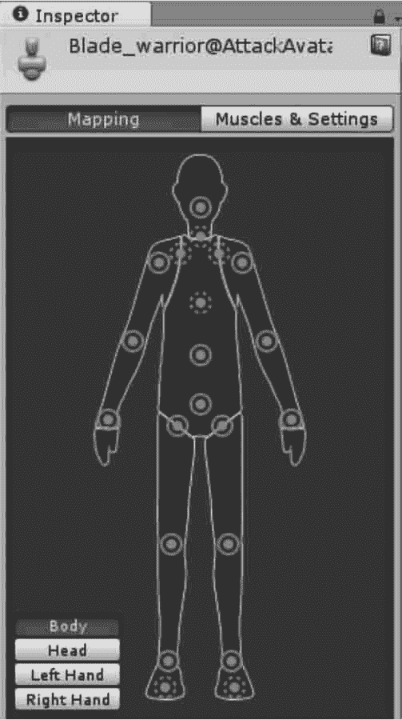
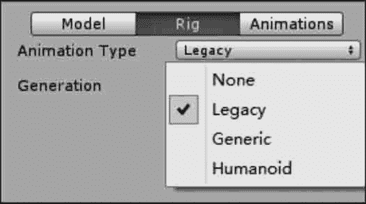
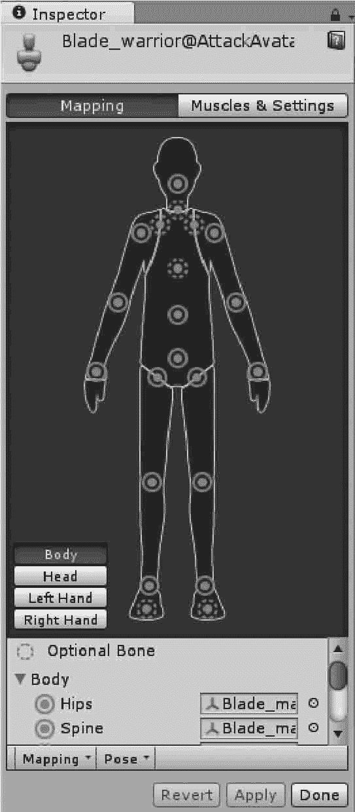
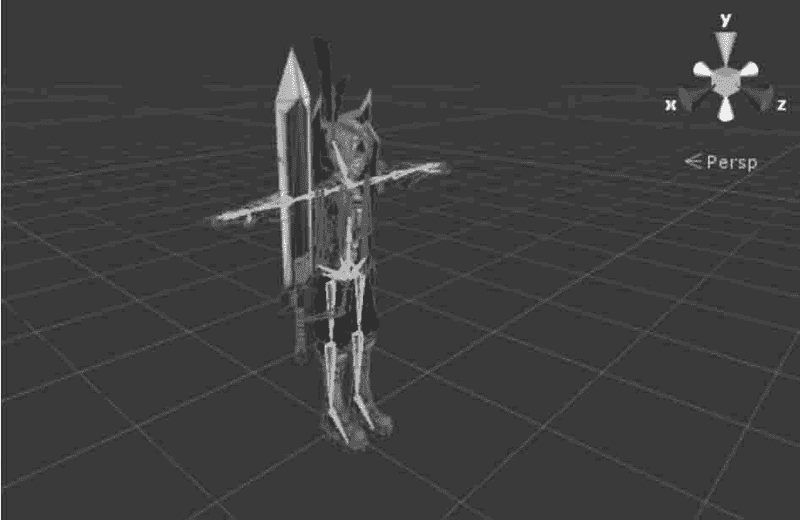

# Unity 3D 人形角色动画（Avatar）

> 原文：[`c.biancheng.net/view/2770.html`](http://c.biancheng.net/view/2770.html)

Mecanim 动画系统适合人形角色动画的制作，人形骨架是在游戏中普遍采用的一种骨架结构。

Unity 3D 为其提供了一个特殊的工作流和一整套扩展的工具集。

由于人形骨架在骨骼结构上的相似性，用户可以将动画效果从一个人形骨架映射到另一个人形骨架，从而实现动画重定向功能。

除了极少数情况之外，人物模型均具有相同的基本结构，即头部、躯干、四肢等。

Mecanim 动画系统正是利用这一点来简化骨架绑定和动画控制过程。

创建模型动画的一个基本步骤就是建立一个从 Mecanim 动画系统的简化人形骨架到用户实际提供的骨架的映射，这种映射关系称为 Avatar，如下图所示。

## 创建 Avatar

在导入一个角色动画模型之后，可以在 Import Settings 面板中的 Rig 选项下指定角色动画模型的动画类型，包括 Legacy、Generic 以及 Humanoid 3 种模式，如下图所示。

#### 1) Legacy 和 Generic

Unity 3D 的 Mecanim 动画系统为非人形动画提供了两个选项：Legacy（旧版动画类型）和 Generic（一般动画类型）。

旧版动画使用 Unity 4.0 版本文前推出的动画系统。一般动画仍可由 Mecanim 系统导入，但无法使用人形动画的专有功能。

非人形动画的使用方法是：在 Assets 文件夹中选中模型文件，在 Inspector 视图中的 Import Settings 属性面板中选择 Rig 标签页，单击 Animation Type 选项右侧的列表框，选择 Generic 或 Legacy 动画类型即可。

#### 2) Humanoid

要使用 Humanoid（人形动画），单击 Animation Type 右侧的下拉列表，选择 Humanoid，然后单击 Apply 按钮，Mecanim 动画系统会自动将用户所提供的骨架结构与系统内部自带的简易骨架进行匹配，如果匹配成功，Avatar Definition 下的 Configure 复选框会被选中，同时在 Assets 文件夹中，一个 Avatar 子资源会被添加到模型资源中。

## 配置 Avatar

Unity 3D 中的 Avatar 是 Mecanim 动画系统中极为重要的模块，正确地设置 Avatar 非常重要。

不管 Avatar 的自动创建过程是否成功，用户都需要到 Configure Avatar 界面中确认 Avatar 的有效性，即确认用户提供的骨骼结构与 Mecanim 预定义的骨骼结构已经正确地匹配起来，并已经处于 T 形姿态，如下图所示。

单击 Configure 按钮后，编辑器会要求保存当前场景，因为在 Configure 模式下，可以看到 Scene 视图（而不是 Game 视图）中显示出当前选中模型的骨骼、肌肉、动画信息以及相关参数。

在这个视图中，实线圆圈表示的是 Avatar 必须匹配的，而虚线圆圈表示的是可选匹配的。

## 人形动画重定向

在 Mecanim 动画系统中，人形动画的重定向功能是非常强大的，因为这意味着用户只要通过很简单的操作就可以将一组动画应用到各种各样的人形角色上。

由于动画重定向功能只能应用到人形模型上，所以为了保证应用后的动画效果，必须正确地配置 Avatar。动画重定向的最终效果如下图所示。

