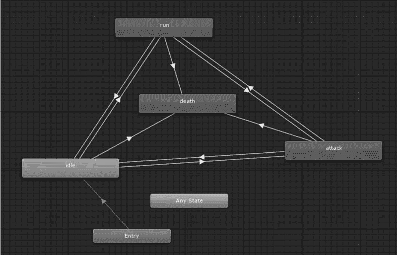
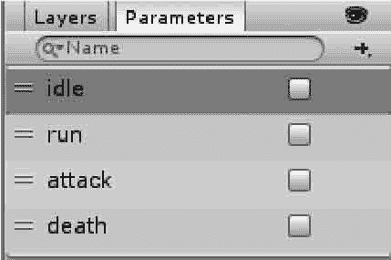
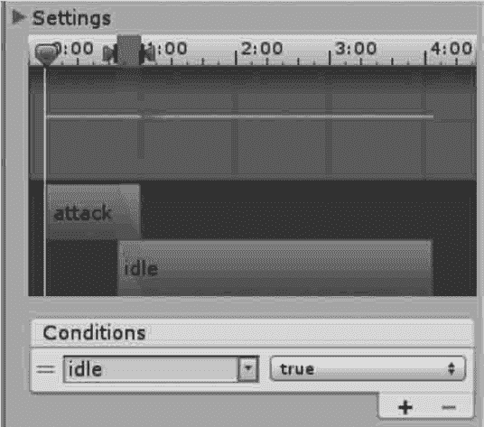
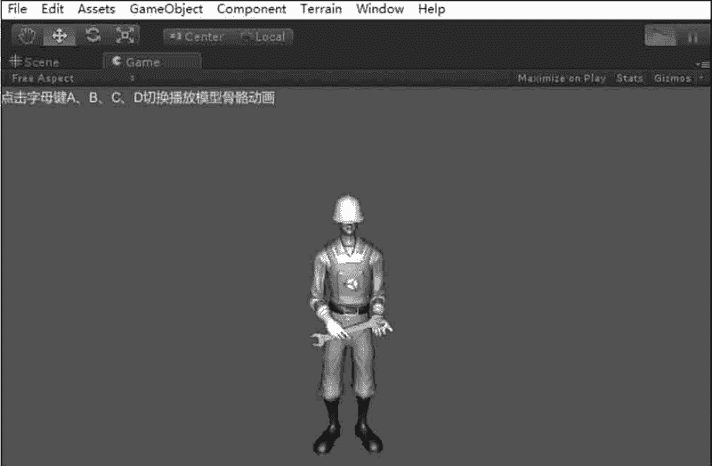
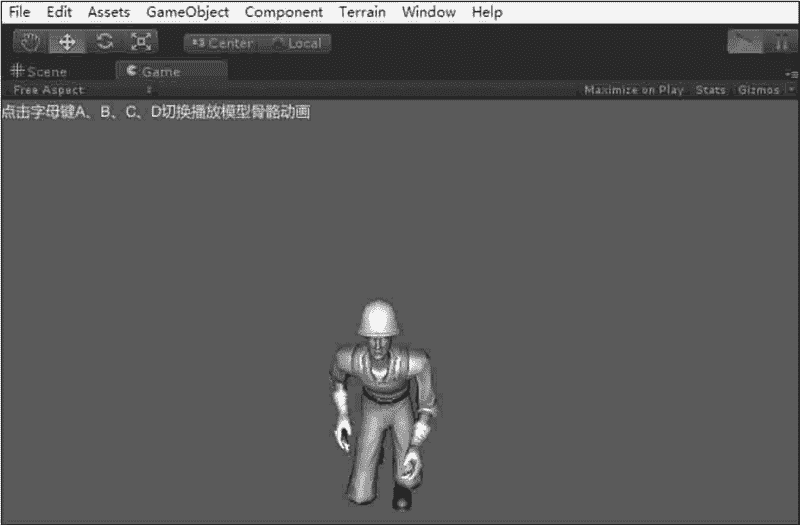
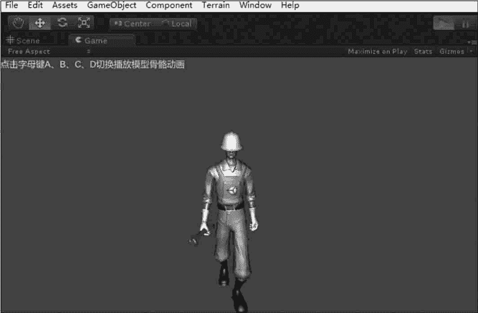
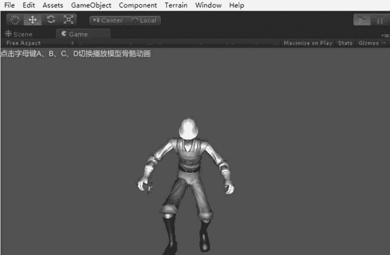
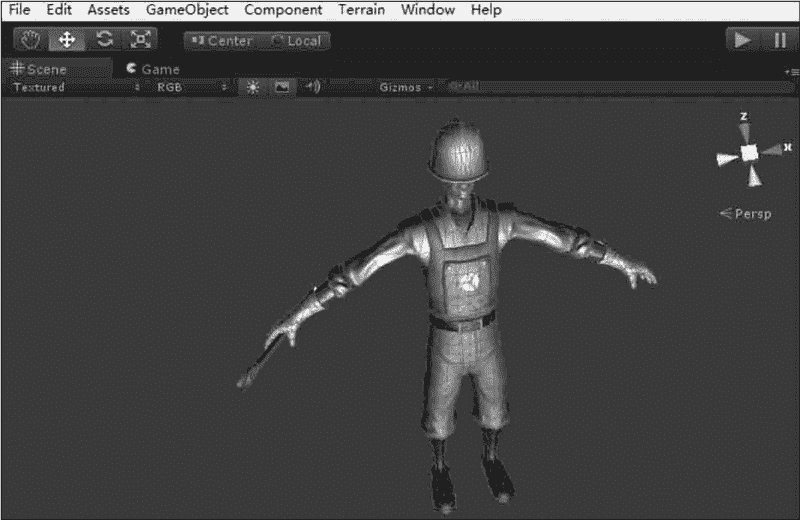
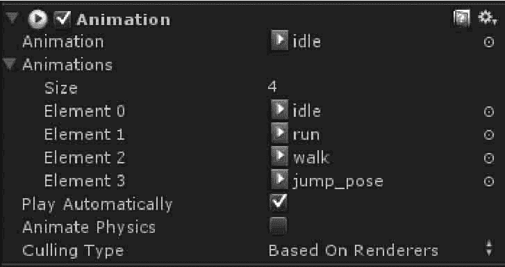

# Unity 3D 角色动画在游戏中的应用

> 原文：[`c.biancheng.net/view/2771.html`](http://c.biancheng.net/view/2771.html)

通过上一节《Unity 3D 人形角色动画》我们对人形动画有了一定的了解，接下来我们将介绍一下在游戏开发中人形角色动画的具体应用步骤。

## Animator 组件

Animator 组件是关联角色及其行为的纽带，每一个含有 Avatar 的角色动画模型都需要一个 Animator 组件。Animator 组件引用了 Animator Controller 用于为角色设置行为，具体参数如下表所示。

| 参 数 | 含 义 | 功 能 |
| Controller | 控制器 | 关联到角色的 Animator 控制器 |
| Avatar | 骨架结构的映射 | 定义 Mecanim 动画系统的简化人形骨架结构到该角 色的骨架结构的映射 |
| Apply Root Motion | 应用 Root Motion 选项 | 设置使用动画本身还是使用脚本来控制角色的位置 |
| Animate Physics | 动画的物理选项 | 设置动画是否与物理属性交互 |
| Culling Mode | 动画的裁剪模式 | 设置动画是否裁剪以及裁剪模式 |

## Animator Controller

Animator Controller 可以从 Project 视图创建一个动画控制器（执行 Create→Animator Controller 命令），同时会在 Assets 文件夹内生成一个后缀名为 .Controller 的文件。

当设置好运动状态机后，就可以在 Hierarchy 视图中将该 Animator Controller 拖入含有 Avatar 的角色模型 Animator 组件中。

通过动画控制器视图（执行 Window→Animator Controller 命令）可以查看和设置角色行为，值得注意的是，Animator Controller 窗口总是显示最近被选中的后缀为 .Controller 的资源的状态机，与当前载入的场景无关。

## Animator 动画状态机

一个角色常常拥有多个可以在游戏中不同状态下调用的不同动作。例如，一个角色可以在等待时呼吸或摇头，在得到命令时行走，从一个平台掉落时惊慌地伸手。

当这些动画回放时，使用脚本控制角色的动作是一个复杂的工作。Mecanim 动画系统借助动画状态机可以很简单地控制和序列化角色动画。

状态机对于动画的重要性在于它们可以很简单地通过较少的代码完成设计和更新。每个状态都有一个当前状态机在那个状态下将要播放的动作集合。这使动画师和设计师不必使用代码定义可能的角色动画和动作序列。

Mecanim 动画状态机提供了一种可以预览某个独立角色的所有相关动画剪辑集合的方式，并且允许在游戏中通过不同的事件触发不同的动作。

动画状态机可以通过动画状态机窗口进行设置，如下图所示。


动画状态机之间的箭头标示两个动画之间的连接，右击一个动画状态单元，在快捷菜单中执行 Make Transition 命令创建动画过渡条件，然后单击另一个动画状态单元，完成动画过渡条件的连接。

过渡条件用于实现各个动画片段之间的逻辑，开发人员通过控制过渡条件可以实现对动画的控制。

要对过渡条件进行控制，就需要设置过渡条件参数，Mecanim 动画系统支持的过渡条件参数有 Float、Int、Bool 和 Trigger 4 种。

下面介绍创建过渡条件参数的方法。

在动画状态机左侧的 Parameters 面板中单击右上方的“+”可选择添加合适的参数类型（Float、Int、Bool 和 Trigger 任选其一），然后输入想要添加的参数过渡条件（如 idle、run、attack、death 等），如下图所示。


最后在 Inspector 属性编辑器 Conditions 列表中单击“+”创建参数，并选择所需的参数即可，如下图所示。



## 实践案例：模型动画

#### 案例构思

模型动画是常见的游戏动画类型，玩家通过特定的操作对模型进行动作指定，从而完成交互功能。

本案例旨在通过模型动画的制作，让读者了解骨骼绑定后的 fbx 模型动画在 Unity 3D 软件中的使用方法。

#### 案例设计

本案例在 Unity 3D 内导入一个绑定好骨骼动画的第三人称人物模型，人物身上绑定了若干个动作，通过代码实现键盘与模型动画的交互功能，如下图所示。






#### 案例实施

步骤 1)：创建项目并保存场景。

步骤 2)：执行 Assets→Import Package→Characters 命令载入人物资源。

步骤 3)：将模型添加到 Scene 视图中，按 F2 键将其重新命名为 Constructor，调整好位置，如下图所示。


步骤 4)：在右侧的 Inspector 面板中设置动画动作，如下图所示。

其中有关的参数功能如下：

*   Animation：默认动画。
*   Size：动画数量。
*   Play Automatically：是否自动播放动画。
*   Animate Physics：是否接收物理碰撞。
*   Culling Type：动画裁剪模式。

步骤 5)：创建 JavaScript 脚本，并将其连接到摄像机上。

```

var obj:GameObject=null;
function Start(){
    obj=GameObject.Find("Constructor");
    obj.animation.wrapMode=WrapMode.Loop;
}                       //设置动画播放类型为循环
function Update(){
    if(Input.GetKeyDown(KeyCode.A))            //按键后播放不同动画
        {obj.animation.Play("idle");}
    if(Input.GetKeyDown(KeyCode.B))
        {obj.animation.Play("run");}
    if(Input.GetKeyDown(KeyCode.C))
        {obj.animation.Play("walk");}
    if(Input.GetKeyDown(KeyCode.D))
        {obj.animation.Play("jump pose");}
}
function OnGUI(){                                 //显示提示信息
    GUILayout.Label("按字母键 A、B、C、D 切换播放模型骨骼动画");
}
```

步骤 6)：单击 Play 按钮测试，可以通过键盘 A、B、C、D 键控制人物动作。