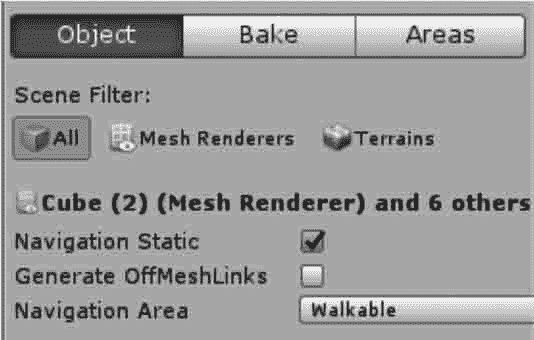

# Unity 3D 导航系统（Navigation）

> 原文：[`c.biancheng.net/view/2772.html`](http://c.biancheng.net/view/2772.html)

Unity 3D Navigation（导航）是用于实现动态物体自动寻路的一种技术，它将游戏场景中复杂的结构关系简化为带有一定信息的网格，并在这些网格的基础上通过一系列相应的计算来实现自动寻路。

本节主要讲解在创建好的三维场景中烘焙导航网格、创建导航代理以实现让角色绕过重重障碍最终到达终点的功能。

## 导航系统

过去，游戏开发者必须自己打造寻路系统，特别是在基于节点的寻路系统中，必须手动地在 AI 使用的点之间进行导航，因此基于节点系统的寻路非常烦琐。

Unity 3D 不仅具有导航功能，还使用了导航网格（navigation meshes），这比手动放置节点更有效率而且更流畅。

更重要的是，还可以一键重新计算整个导航网格，彻底摆脱了手动修改导航节点的复杂方法。

#### 1) 设置 NavMesh

NavMesh 的设置方法很简单，在 Hierarchy 视图中选中场景中除了目标和主角以外的游戏对象，在 Inspector 视图中单击 Static 下拉列表，在其中勾选 Navigation Static 即可，如下图所示。


#### 2) 烘焙

执行菜单 Window→Navation 命令，打开导航窗口，单击右下角的 Bake（烘焙）按钮即可，烘焙后的场景如下图所示。


接下来详细看看 Navigation 面板，它有 Object、Bake、Areas 这 3 个标签页。

其中，Object 标签页如下图所示，该标签页可以设置游戏对象的参数，如下表所示。当选取游戏对象后，可以在此标签页中设置导航相关参数。



| 参 数 | 功 能 |
| Navigation Static | 勾选后表示该对象参与导航网格的烘焙 |
| Generate OffMeshLinks | 勾选后可在导航网格中跳跃(Jump)和下落（Drop) |
| Navigation Area | 导航区域 |

Bake 标签页如下图所示，是 Navigation 面板最重要的标签页，在该标签页下可以设置导航代理相关参数以及烘焙相关参数，参数说明如下表所示。


| 参 数 | 功 能 |
| Agent Radius | 设置具有代表性的物体半径，半径越小，生成的网格面积越大 |
| Agent Height | 设置具有代表性的物体的高度 |
| Max Slope | 设置斜坡的坡度 |
| Step Height | 设置台阶高度 |
| Drop Height | 设置允许最大的下落距离 |
| Jump Distance | 设置允许最大的跳跃距离 |
| Manual Voxel Size | 设置是否手动调整烘焙尺寸 |
| Voxel Size | 设置烘焙的单元尺寸，控制烘焙的精度 |
| Min Region Area | 设置最小区域 |
| Height Mesh | 设置当地形有落差时是否生成精确而不是近似的烘焙效果 |

#### 3) 设置导航代理

导航代理（Navigation Agent）可以理解为去寻路的主体。

在导航网格生成之后，给游戏对象添加了一个 Nav Mesh Agent 组件，如下图所示。

Nav Mesh Agent 面板中各导航代理参数含义如下表所示。


| 属性分区 | 参 数 | 功 能 |
| Agent Size | Radius | 设置导航代理的半径 |
| Height | 设置导航代理的高度 |
| Base Offset | 设置圆柱体相对于本地坐标的偏移 |
| Steering | Speed | 设置最大移动速度 |
| Angular Speed | 设置最大角速度 |
| Acceleration | 设置最大加速度 |
| Stopping Distance | 设置离目标距离还有多远时停止 |
| Auto Braking | 激活时，到达目标位置前将减速 |
| Obstacle Avoidance | Quality | 设置躲避障碍物的质量，如果设置为 0 则不躲避其他导航 代理 |
| Priority | 设置自身的导航优先级，范围是 0〜99，值越小，优先级 越大 |
| Path Finding | Auto Traverse Off Mesh Link | 设置是否采用默认方式经过链接路径 |
| Auto Repath | 设置当现有的路径变为无效时是否尝试获取一个新的路径 |
| Area Mask | 设置此导航代理可以行走哪些区域类型 |

## 实践案例：自动寻路

#### 案例构思

使用 Unity 3D 开发游戏，自动寻路可以有很多种实现方式。A 星寻路是一种比较传统的人工智能算法，在游戏开发中比较常用。

另外，Unity 3D 官方内置的寻路插件 Navmesh 也可以实现自动寻路功能。

本案例旨在通过一个简单的三维场景漫游实现 Navmesh 自动寻路插件的使用。

#### 案例设计

本案例在 Unity 3D 内创建一个简单的三维场景，场景内有各种障碍，通过 Navmesh 插件可以自动寻找到目标位置。

#### 案例实施

步骤 1)：新建三维场景，将其命名为 Navigation。其中，胶囊体作为动态移动的对象，球体作为导航的目标，如下图所示。


步骤 2)：选中场景中所有除了 sphere、cylinder 摄像机以及直线光以外的所有物体，单击 Inspector 面板中右上角的 Navigation Static，使这些物体成为静态物体，并设置成 Navigation Static 类型，如下图所示。


步骤 3)：执行菜单栏中的 Window→Navigation 命令，Navigation 面板如下图所示。


步骤 4)：单击该面板右下角的 Bake 按钮，即可生成导航网格，下图为已生成的导航网格。


步骤 5)：下面就可以让一个胶囊体根据一个导航网格运动到目标 Sphere 位置。执行 Component→Navigation→Nav Mesh Agent 为该胶囊体挂载一个 Nav Mesh Agent，如下图所示。


步骤 6)：最后写一个脚本就可以实现自动寻路了。创建 C# 脚本，将其命名为 DemoNavigation，脚本如下：

```

using UnityEngine;
using System.Collections;
public class DemoNavigation:MonoBehaviour{
    public Transform target;
    void Start(){
        if(target!=null){
            this.gameObject.GetComponent<NavMeshAgent>().destination=target.position;
        }
    }
}
```

步骤 7)：脚本新建完成后挂载到胶囊体上，然后将 Sphere 赋予胶囊体的 Navigation 脚本，运行场景，如下图所示，胶囊体会运动到 Sphere 的位置。


