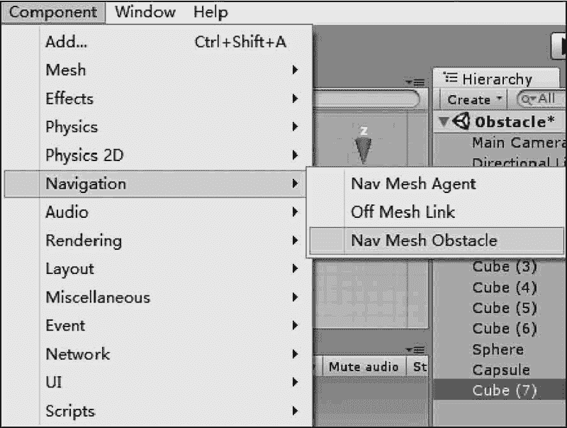

# Unity 3D 障碍物（Nav Mesh Obstacle）

> 原文：[`c.biancheng.net/view/2773.html`](http://c.biancheng.net/view/2773.html)

一般来说，不可攀爬的 Nav Mesh 都被视为障碍物（Nav Mesh Obstacle），也可以直接将物体设为障碍物，即可以为游戏对象添加 Nav Mesh Obstacle 组件。

有别于普通的 Nav Mesh，Nav Mesh Obstacle 是一种不需要烘焙的障碍物，形状可以选择为立方体或胶囊体。

## 实践案例：障碍物绕行

#### 案例构思

在自动寻路过程中，往往会遇到障碍物，在寻路过程中遇到障碍物要怎样解决呢？

Unity 官方内置的寻路插件 Navmesh 完美地解决了这个问题。

本案例通过一个简单的有障碍的场景，实现自动寻路中障碍物绕行功能。

#### 案例设计

本案例在 Unity 3D 内创建一个有障碍的场景，场景内有一个 Cube 用来充当障碍物，通过 Navmesh 插件实现主角遇到障碍物时自动绕行效果。

#### 案例实施

步骤 1)：执行 File→Save Scene as 命令，将 Navigation 场景另存为 Obstacle 场景，如下图所示。

步骤 2)：执行 GameObject→3D Object→Cube 命令新建一个障碍物，将其放置在主角的前方，并赋予黑色材质，如下图所示。

步骤 3)：执行 Component→Navigation→Nav Mesh Obstacle 命令添加 Nav Mesh Obstacle 组件，如下图所示。

步骤 4)：单击 Play 按钮进行测试，可以发现主角会绕过黑色立方体并到达终点，效果如下图所示。

