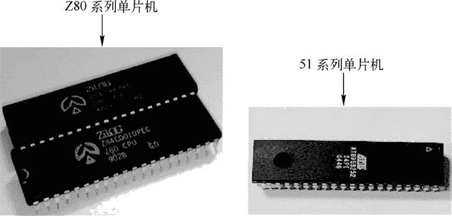
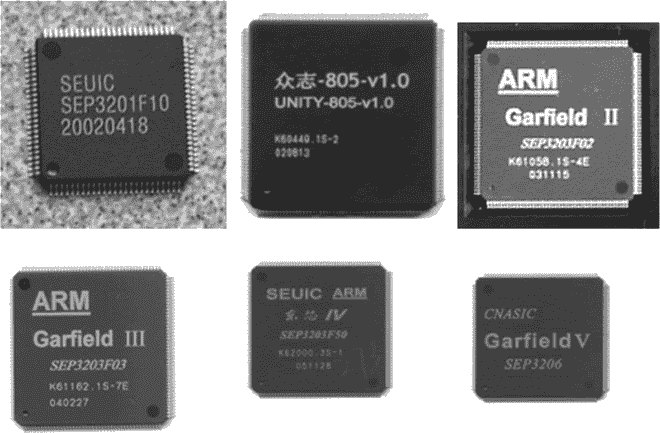
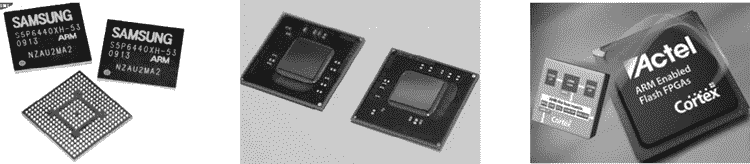

# 嵌入式系统的发展历史

> 原文：[`www.weixueyuan.net/a/128.html`](http://www.weixueyuan.net/a/128.html)

嵌入式系统（Embedded System）是一种“完全嵌入受控器件内部，为特定应用而设计的专用计算机系统”，根据英国电气工程师协会（U.K.Institution of Electrical Engineer）的定义，嵌入式系统为控制、监视或辅助设备、机器或用于工厂运作的设备。

与大型机、台式机、笔记本通用计算机系统不同，嵌入式系统通常执行的是带有特定要求的预先定义的任务。

嵌入式系统从 20 世纪 70 年代发展到如今已经迈过了 40 多个年头，随着电子和计算机技术的飞速发展，嵌入式系统也逐步得到了极大的成熟，总体来说其可以分为单片机时代、专用处理器时代和 ARM 时代三大阶段。

## 1\. 单片机时代

#### 1) 嵌入式系统出现硬件雏形

单片机时代起始于 1976 年，Intel 发布了世界上最早的单片机 8048；随后，Motorola 推出了 68HC05，Zilog 推出了 Z80 等一系列单片机。随着电子技术的发展，Intel 发布了著名的 MCS-51 单片机内核，ATMEL、NXP（前飞利浦）等公司在该内核的基础上生产了几百款不同的单片机产品，如图 1 所示是 Z80 和 51 系列单片机实物。

图 1：Z80 和 51 系列单片机实物
这些早期单片机系统的出现，使得汽车、家电、工业机器、通信装置及成千上万种产品可以通过内嵌电子装置来获得更佳的使用性能，而且更容易使用、处理速度更快、价格更便宜。正是由于电子装置是“内嵌式的”，因此也就使得“嵌入式系统”这个初级概念深入人心。

今天看来，当时这些装置已经初步具备了嵌入式的应用特点，但是这时的应用只是使用 8 位的芯片，硬件技术相对落后，如只能执行一些单线程的程序，还谈不上“多核”的概念。但是，它标志着“嵌入式系统”出现了硬件雏形，在开创嵌入式系统独立发展的道路上。

#### 2) 嵌入式系统真正出现

从 20 世纪 80 年代早期开始，嵌入式系统的程序员开始用商业级的“操作系统”编写嵌入式应用软件，这使得可以获得更短的开发周期、更少的开发资金和更高的开发效率，“嵌入式系统”真正出现了。

确切地说，这个时候的操作系统是一个实时核，这个实时核包含了许多传统操作系统的特征，包括任务管理、任务间通信、同步与相互排斥、中断支持、内存管理等功能。其中比较著名的有 Integrated System Incorporation（ISI）的 PSOS、Ready System 公司的 VRTX、IMG 的 VxWorks 和 QNX 公司的 QNX 等。

这些嵌入式操作系统都具有嵌入式的典型特征：

1.  它们的系统内核很小，具有可裁剪、可扩充和可移植性，可以移植到各种各样的处理器芯片上；
2.  它们均采用占先式的调度，响应时间很短，任务执行的时间可以确定；
3.  较强的实时性和可靠性，适合嵌入式应用；
4.  这些嵌入式实时多任务操作系统的出现，使得应用开发人员得以从小范围的开发中解放出来，同时也促使嵌入式有了更为广阔的应用空间。

从整体来说，单片机时代的软件都具有“无操作系统”直接运行在处理器上，根据实际用途编写，相对简单，及硬件耦合性极大而不便于移植的特点。

## 2\. 专用处理器时代

进入 20 世纪 90 年代以后，随着计算机技术、微电子技术、IC 设计和 EDA 工具的发展，嵌入式处理器开始向片上系统（System-on-Chip，SoC）发展，出现了包括 51 单片机、AVR 单片机、MSP430 单片机、DSP、CPLD/FPGA 在内的一系列处理器，如图 2 所示，而 ARM 处理器也在此时初露头角。

图 2：专用处理器时代的嵌入式处理器
此时出现了众多嵌入式操作系统，它们大多具有跨平台的移植技术，并且在同一个系统之下也可以通过选择开发工具来使用 Java、C 或汇编语言等开发者熟悉的语言来开发，该阶段比较常用的有 WinCE、Palm、WM、Linux、VxWorks、μC/OS-II，Symbian 等。

## 3\. ARM 时代

进入 21 世纪之后，随着相关电子工业技术的发展，嵌入式处理器相关技术得到了突飞猛进的发展，出现了 64 位嵌入式处理器（如 Cortex-A50 系列），其处理器内核也已经实现了 8 核（目前正计划实现 16 核）。

到目前为止，嵌入式处理器可以分为三个大类：以 MTK、高通、三星为代表支持的 ARM 架构处理器、以 Intel 为代表支持的 x86 架构处理器及其他以 FPGA 为代表的特殊/专用处理器，如图 3 所示。

图 3：进入 21 世纪以后的嵌入式处理器
随着嵌入式处理器的发展，嵌入式系统的硬件性能得到了极大的提升，此时嵌入式操作系统也开始出现一些新的面孔，Android 和 IOS 则是其中的典型代表，它们从 2007 年出现开始（Android 于 2007 年 11 月正式发布，IOS 则在 2007 年 1 月正式发布）就风卷残云般地占领了绝大多数嵌入式消费电子产品（主要是平板电脑、手机和数字播放器）的市场。

而微软公司（Microsoft Corporation）不甘落后，从 2010 年开始连续发布了 WP（Windows Phone）和 Windows RT（RunTime）操作系统，用于抢占消费电子产品市场。而在工业控制等领域上，嵌入式操作系统本着稳定可靠的原则，则依然是 winCE、VxWorks 和 Linux 当道。