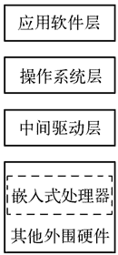

# 嵌入式系统的层次结构

> 原文：[`www.weixueyuan.net/a/129.html`](http://www.weixueyuan.net/a/129.html)

嵌入式系统的层次模型如图 1 所示，由包括嵌入式处理器在内的硬件系统层、中间驱动层、操作系统层和应用软件层组成。

图 1：嵌入式系统的结构

## 1\. 硬件系统层

硬件系统层主要包含了嵌入式系统中必要的硬件设备：嵌入式处理器和协处理器、存储器以及其他外围 I/O 设备。

#### 1) 处理器

是嵌入式系统硬件层的核心，主要负责对信息的运算处理，相当于通用计算机的中央处理器；协处理器则是协助处理器完成相应工作的部件辅助处理器。

#### 2) 存储器

其用来存储数据和代码，嵌入式系统的存储器一般包括嵌入式处理器内部和外部存储器，此外还有大容量存储器。

#### 3) 其他外围 I/O 设备

其用于提供嵌入式系统和其他系统的数据接口及一些特定的工作，如 RS-232 接口、CAN 总线接口、A/D 和 D/A 模块、电动机和继电器驱动等执行机构等，此外包括输入设备、显示设备等在内的人机交互部件也包含在内。

## 2\. 中间驱动层

中间驱动层为硬件层与系统软件层之间的部分，有时也称为硬件抽象层（Hardware Abstract Layer，HAL）或板级支持包（Board Support Package，BSP）。对于上层的操作系统，中间驱动层提供了操作和控制硬件的方法和规则。而对于底层硬件，中间驱动层主要负责相关硬件设备的驱动等。

中间驱动层将系统上层软件与底层硬件分离开来，使系统的底层驱动程序与硬件无关，上层软件开发人员无须关心底层硬件的具体情况，根据中间驱动层提供的接口即可进行开发。

中间驱动层主要包含以下几个功能：

*   底层硬件初始化操作按照自底而上、从硬件到软件的次序分为三个环节，依次是：片级初始化、板级初始化和系统级初始化。
*   硬件设备配置对相关系统的硬件参数进行合理的控制以正常工作。另一个主要功能是硬件相关的设备驱动。
*   硬件相关的设备驱动程序的初始化通常是一个从高到低的过程。尽管中间层中包含硬件相关的设备驱动程序，但是这些设备驱动程序通常不直接由中间层使用，而是在系统初始化过程中由中间层将它们与操作系统中通用的设备驱动程序关联起来，并在随后的应用中由通用的设备驱动程序调用，实现对硬件设备的操作。

## 3\. 操作系统层

操作系统层由实时多任务操作系统（Real-time Operation System，RTOS）及其实现辅助功能的文件系统、图形用户界面接口（Graphic User Interface，GUI）、网络系统及通用组件模块组成，其中实时多任务操作系统是整个嵌入式系统开发的软件基础和平台。

## 4\. 应用软件层

应用软件层是开发设计人员在系统软件层的基础之上，根据需要实现的功能，结合系统的硬件环境所开发的软件。