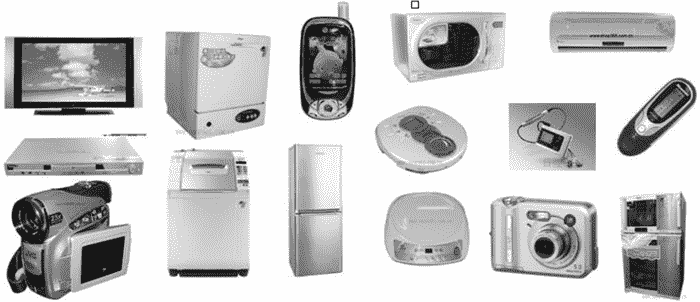

# 嵌入式系统的应用

> 原文：[`www.weixueyuan.net/a/333.html`](http://www.weixueyuan.net/a/333.html)

随着电子技术的发展，嵌入式系统已经从最开始偏重工业控制应用逐步向包括消费电子产品在内的日常生活用品普及，可以说嵌入式系统的应用已经深入了社会生活的方方面面，如图 1 所示是嵌入式系统的常见应用。

图 1：嵌入式系统的常见应用
常见的嵌入式系统应用列举如下：

*   银行业经常使用的自动柜员机（ATM）；
*   用于工业自动化和监测的可编程逻辑控制器（PLCs）；
*   航空电子，如惯性导航系统、飞行控制硬件和软件及其他飞机和导弹中的集成系统；
*   计算机网络设备，包括路由器、时间服务器和防火墙；
*   办公设备，包括打印机、复印机、传真机、多功能打印机（MFPs）；
*   磁盘驱动器（软盘驱动器和硬盘驱动器）；
*   汽车发动机控制器和防锁死刹车系统；
*   家庭自动化产品，如恒温器、冷气机、洒水装置和安全监视系统；
*   家用电器，包括微波炉、洗衣机、电视机、DVD 播放器和录制器；
*   医疗设备，如 X 光机、核磁共振成像仪；
*   测试设备，如数字存储示波器、逻辑分析仪、频谱分析仪；
*   智能手表和包括智能手环在内的各种可穿戴设备；
*   多媒体电器，互联网无线接收机、电视机顶盒、数字卫星接收器、网络播放器、智能电视等；
*   影像记录设备，如卡片相机、DV、单反；
*   平板电脑，如 iPad、kindle fire；
*   智能手机，如 HTC one、iphone；
*   固定游戏机和便携式游戏机，如 XBOX。