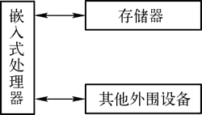
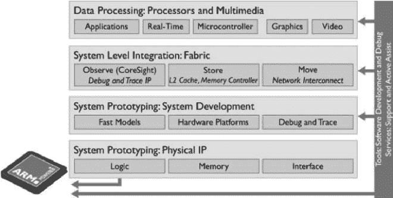

# ARM 处理器及其发展历史

> 原文：[`www.weixueyuan.net/a/133.html`](http://www.weixueyuan.net/a/133.html)

嵌入式系统的硬件架构是嵌入式系统硬件设计的基础，一个完整的嵌入式系统的硬件结构如图 1 所示，包括了嵌入式处理器、存储器和其他外围设备。

图 1：嵌入式系统的硬件结构
嵌入式系统中的处理器有多种类型，小到 51 单片机，大到 i7 处理器和某些基于可编程逻辑器件的专用芯片，都可以作为核心处理器，但是在实际应用尤其是消费数码产品和工业控制系统中，目前 ARM 一枝独秀，占据了半壁江山。

ARM 的优点是功耗低，缺点是计算能力较为低下且不能支持普通的 Windows 系统（Window 7、8 非 RT 系统）。ARM（Advanced RISC Machines）是 ARM（安谋国际科技）公司设计的处理器核心，是目前广为使用的嵌入式系统处理器。

ARM 公司是业界领先的微处理器技术提供商，其提供最广泛的微处理器内核，可满足几乎所有应用市场对性能、功耗及成本的要求。再加上一个富有活力的生态系统（拥有 1000 多家可提供芯片、开发工具和软件的合作伙伴），ARM 已售出超过 300 亿个处理器，每天的销量超过 1600 万，是真正意义上的 The Architecture for the Digital World（面向数字世界的体系结构）。

安谋国际科技公司前身为艾康电脑，于 1978 年在英国剑桥（Cambridge）创立，在 20 世纪 80 年代晚期，苹果电脑开始与艾康电脑合作开发新版的 ARM 核心。1985 年，艾康电脑研发出采用精简指令集的新处理器，名为 ARM（Acorn RISC Machine），又称 ARM 1。

因为艾康电脑的财务出现状况，1990 年 11 月 27 日，获得 Apple 与 VLSI 科技的资助，分割出安谋国际，成为独立子公司，其运作模式主要是涉及 IP 的设计和许可，并不进行生产和销售实际的半导体芯片，也就是说，其只提供一些对应的 ARM 核心架构，而由不同的半导体公司根据这些核心架构再加上其他外围部件来形成具体型号的芯片。

ARM 公司的特点如下：

*   全球领先的半导体 IP 公司；
*   成立于 1990 年；
*   目前为止已销售超过 200 亿个基于 ARM 的芯片；
*   向 250 多家公司出售了 800 个处理器许可证；
*   获得了所有基于 ARM 的芯片的版税；
*   赢得了长期成长型市场的市场份额；
*   ARM 的收益增速通常要比整个半导体行业快。

除了处理器内核之外，ARM 公司还提供了一系列用于优化片上系统设计的工具、物理和系统 IP，如图 2 所示。

图 2：ARM 公司提供的其他产品
安谋国际科技的发展里程碑如下，可以看到几乎每一年都有创新性产品推出。

*   1985 年：Acorn Computer Group 开发出全球第一款商业 RISC（Reduced Instruction Set Computer）处理器。
*   1987 年：Acorn 的 ARM 处理器作为低成本 PC 的第一款 RISC 处理器亮相。
*   1990 年：Advanced RISC Machines（ARM）无须 Acorn 和 Apple Computer 提供合作，即可独立制定新的微处理器标准章程，VLSI Technology 成为投资商和第一个授权使用方。
*   1991 年：ARM 推出第一款 RISC 核心，即 ARM6 解决方案。
*   1993 年：推出 ARM7 解决方案。
*   1995 年：发布 Thumb 架构扩展，以在 16 位系统成本的基础上提供 32 位的 RISC 性能，并且提供业界领先的代码；StrongARM 核心发布。
*   1996 年：推出 ARM810 微处理器；Windows CE 被扩展到 ARM 架构上。
*   1997 年：发布 ARM9TDMI 系列处理器；JavaOS 被扩展到 ARM 架构上。
*   1998 年：发布 ARM7TDMI 核心。
*   1999 年：发布提高了信号处理能力的 ARM9E 核心。
*   2000 年：发布 SecurCore 智能卡系列核心。
*   2001 年：发布 ARMv6 架构。
*   2002 年：发布 ARM11 微架构；发布 RealView 开发工具系列。
*   2003 年：发布针对多核心的 CoreSight 实时调试和跟踪解决方案；和 Nokia、STM、TI 成立 MIPI 联盟，为移动应用处理器指定开放性标准；发布为 ARM 核心提供了安全平台的 TrustZone 技术。
*   2004 年：发布了基于 ARMv7 架构的 ARM Cortex 系列处理器，并且发布了首款产品 Cortex-M3；发布了第一款集成多处理器 MPCore；发布了具有开创性的嵌入式信号处理核心 OptimeoDe。
*   2005 年：收购了 Keil Software 公司；发布了 Cortex-A8 处理器。
*   2007 年：推出了针对智能卡应用的 SecurCore SC300 处理器；推出了实现可扩展性和低功耗设计的 Cortex-A9 处理器。
*   2008 年：发布了全球第一个在 1080 HDTV 分辨率下符合 Khronos Open GL ES 2.0 标准的 Mali-200 GPU；同年，ARM 处理器销售量已经达到了 100 亿台。
*   2009 年：推出体积最小、功耗最低和能效最高的处理器 Cortex-M0；宣布实现具有 2GHz 频率的 Coretx-A9 双核处理器。
*   2010 年：推出符合 AMBA 4 协议的系统 IP Corelink 400 系列；推出 ARM Mali-T604 图形处理单元，同时 ARM Mali 成为被最广泛授权的嵌入式 GPU 价格；推出 Cortex-A15 MPCore 处理器；微软公司（Microsoft）成为 ARM 架构授权使用方；推出 Cortex-M4 处理器。
*   2011 年：和 Cadence、TSMC 合力推出第一款 20nm Cortex-A15 多核处理器；发布了嵌入式软件库 ESS；发布了 ARM Mali-T658 GPU；推出了 ARMv8 架构；发布了 Cortex-A7 处理器；微软公司提出了基于 ARM 的 Windows 产品 Windows RT。
*   2012 年：第一代 Windows RT 产品问世。