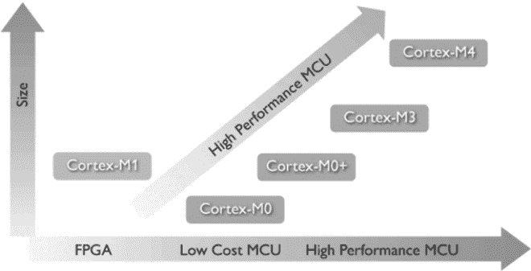

# ARM Cortex-M 系列处理器

> 原文：[`www.weixueyuan.net/a/336.html`](http://www.weixueyuan.net/a/336.html)

ARM Cortex-M 系列处理器包括 Cortex-M0、Cortex-M0+、Cortex-M1、Cortex-M3、Cortex-M4 共 5 个子系列，该系列主要针对成本和功耗敏感的应用，如智能测量、人机接口设备、汽车和工业控制系统、家用电器、消费性产品和医疗器械等。

整体来说，Cortex-M 系列处理器偏重于工业控制，其提供了更低的功耗和更长的电池寿命，提供了更少的代码和更高的性能，并且提供了兼容性的代码、统一的工具和操作系统支持，具有如下优点：

*   Cortex-M 系列处理器为 8 位和 16 位体系结构提供了极佳的代码密度，在具有对内存大小要求苛刻的应用中具有很大的优势；
*   Cortex-M 处理器完全可以通过 C 语言编程，并且附带了各种高级调试功能，能帮助定位软件中的问题，同时网上具有大量的应用实例可以参考；
*   Cortex-M 系列处理器提供了较大的能效优势，面对如 USB、蓝牙、WiFi 等连接及如加速计和触摸屏等复杂模拟传感器且成本日益降低的产品需求有极大地优势；
*   Cortex-M 系列处理器采用了 8 位和 16 位的数据传输，从而可以高效地利用数据内存，同时开发者可以使用其在面向 8/16 位系统的应用代码中的相同的数据类型；
*   Cortex-M 系列处理器虽然使用 32 位的指令，但是其使用了可提供极佳代码密度的 ARM Thumb-2 技术，也可以支持 16 位的 Thumb 指令，其对应的 C 编译器也会使用 16 位版本的指令，可以更加有效地执行运算。

表 3 给出了 Cortex-M 系列处理器的对比。

表 3：Cortex-M 系列处理器的对比

| Cortex-M0 | Cortex-M0+ | Cortex-M3 | Cortex-M4 |
| 8/16 位应用 | 8/16 位应用 | 16/32 位应用 | 32 位/DSC 应用 |
| 低成本和简单性 | 低成本，最佳性能 | 高性能，通用 | 有效的数字信号控制 |

Cortex-M 系列处理器的升级关系如图 1 所示，所有的 Cortex-M 系列处理器都是二进制向上兼容的，可以很方便地重用软件及从一个 Cortex 处理器无缝发展到另外一个。

图 1：Cortex-M 系列处理器的升级关系

## 1\. Cortex-M0

Cortex-M0 是最小的 ARM 处理器，体积极小、能耗很低且编程所需要的代码占用量极少，其具有低功耗（90LP 工艺的最低配置下门数低于 12KB 的时候能耗只有 16μW/MHz）、简单（只有 56 个指令且架构对 C 语言友好，提供了可供选择的具有完全确定性的指令和中断计时，使得计算响应时间十分容易）和优化的连接性（支持实现低能耗网络互连设备）等特点。

常见的 Cortex-M0 处理器有 NXP 的 LPC1100 系列、意法半导体的 STM32F0 系列。

## 2\. Cortex-M0+

Cortex-M0+ 是在 Cortex-M0 基础上开发的能效极高的处理器，其保留了 Cortex-M 的全部指令集和数据兼容性，同时进一步降低了能耗，其和 Cortex-M 一样，芯片面积很小、功耗极低，所需的代码量极少，使得开发人员可以直接跳过 16 位系统以接近 8 位系统的成本开销获取 32 位系统的性能。其具有一个只有 2 级的流水线，具有低功耗（90LP 工艺的最低配置下门数低于 12KB 的时候能耗只有 11.2μW/MHz）、简单（保留了 Cortex-M0 的 56 个指令）和多功能性（如内存保护单元、可重定位的矢量表、用于提高控制速度的单周期 I/O 接口和用于增强调试的 Micro Trace Buffer）等特点。

常见的 Cortex-M0+ 处理器有 NXP 的 LPC1100 系列和 Atmel 的 SAM D20 系列。

在当前的实际产品中基本都使用 Cortex-M0+ 来替代 Cortex-M0。

## 3\. Cortex-M1

Cortex-M1 类型的 ARM 处理器是为了在 FPGA 中应用而设计的，其支持包括 Actel、Altera 和 Xilinx 公司的 FPGA 设备，可以满足 FPGA 应用的高质量、标准处理器架构的需要，开发人员可以在受行业中最大体系支持的单个架构上进行标准设计以降低其硬件和软件工程成本，所以在通信、广播、汽车等行业得到了广泛应用。

Cortex-M1 可以实现常用高密度 Thumb-2 指令集的最新型三阶段 32 位 RISC 处理器，其可以使处理器和软件占用空间都满足最小 FPGA 设备的面积预算，同时保留与 ARM7TDMI 处理器上任何 ARM 处理器 Thumb 代码的兼容性，其可以提供 0.8DMIPS/MHz。

## 4\. Cortex-M3

Cortex-M3 处理器是行业领先的 32 位处理器，适用于具有较高确定性的实施应用，如汽车车身系统、工业控制系统、无线网络和传感器等，其具有出色的计算性能及对事件的优异系统响应能力。其具有较高的性能和较低的动态功耗，支持硬件除法、单周期乘法和位字段操作在内的 Thumb-2 指令集，最多可以提供 240 个具有单独优先级、动态重设优先级功能和集成系统时钟的系统中断。

Cortex-M3 相比 Cortex-M0 来说提供了更高的性能和更丰富的功能，于 2004 年推出，其将集成的睡眠模式与可选的状态保留功能相结合，具有较高的性能和较低的动态功耗，所以可以提供领先的能效。其提供了包括了硬件除法、单周期乘法和位字段操作在内的 Thumb-2 指令集以获取最佳的性能和代码大小；其还可以高效地处理多个 I/O 通道和类似 USB OTG 的协议标准。

常见的型号有 Atmel 的 SAM3N（无与伦比的性能和易用性）、SAM3S（低功耗和简化的 PCB 应用）、SAM3U（带高速 USB 接口）、SAM3A（CAN 总线应用）、SAM3X（增强型网络应用）；NXP 的 LPC1300 系列和 LPC1700 系列；德州仪器（TI）的 TMS470M 系列、Stellaris 系列、C2000 Concerto 28x 系列；意法半导体的 STM32F1 和 STM32F2 系列。

## 5\. Cortex-M4

Cortex-M4 是 Cortex-M3 的升级版，其提供了无可比拟的功能，将 32 位控制与领先的数字信号处理技术集成来满足需要很高能效级别的市场，曾经在 Elektra2010（European Electronics Industry Awards 2012）上获得了大奖。

主要实际应用型号包括 Atmel 的 SAM4L、SAM4S、德州仪器（TI）的 TM4C 系列和意法半导体的 STM32F3 系列。