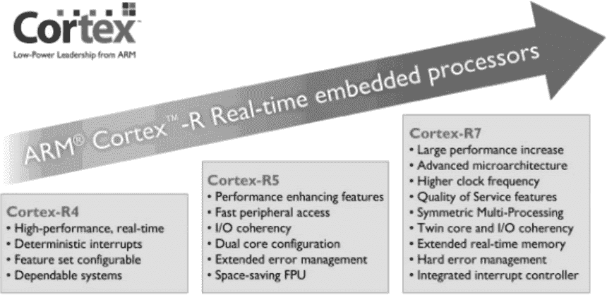

# ARM Cortex-R 系列处理器

> 原文：[`www.weixueyuan.net/a/337.html`](http://www.weixueyuan.net/a/337.html)

ARM Cortex-R 系列处理器包括 Cortex-R4、Cortex-R5、Cortex-R7 共 3 个子系列，其对低功耗、良好的中断行为、卓越性能及与现有平台的高兼容性这些需求进行了平衡考虑，具有高性能、实时、安全和经济实惠的特点，面向如汽车制动系统、动力传动解决方案、大容量存储控制器等深层嵌入式实时应用。

Cortex-R 系列处理器使用了深度流水化微架构及指令预取、分支预测和超标量执行等性能增强技术，提供了硬件除法、浮点单元（FPU）选项和硬件 SIM DSP，采用了可以在不牺牲性能的前提下实现高密度代码的带 Thumb-2 指令的 ARMv7-R 架构和带指令、指令 cache 控制器的哈佛架构，并且拥有获得快速响应代码和数据处理器本地的紧密耦合内存（TCM）和高性能 AMBA3 的 AXI 总线接口。 

Cortex-R 系列处理器具有如下特点：

#### 1) 高性能

可以快速地执行复杂代码和 DSP 功能，其使用了高性能、高时钟频率、深度流水化的微架构；使用了双核多处理（AMP/SMP）配置；使用了可以用于超高性能 DSP 和媒体功能的硬件 SIMD 指令。

#### 2) 实时性

可以保证响应速度和高吞吐量的确定性操作；其有快速、有界且确定性的中断响应；有用于获得快速响应代码/数据的处理器本地的紧密耦合内存（TCM）；有可加快终端进入速度的低延迟中断模式（LLIM）。

#### 3) 安全性

可以检测错误并保证可靠的系统运行，其具有内存保护单元（MPU）的用户和授权软件操作模式；有由于 1 级内存系统及总线的 ECC 和奇偶校验错误检测/更正；有双核锁步（DCLS）冗余内核配置。
经济实惠。

Cortex-R 系列处理器和 Cortex-M 和 Cortex-A 系列处理器都不同，其提供的性能比 Cortex-M 系列要高得多，可以作为 Classic 系列处理器中的 ARM9、ARM11 系列处理器的升级产品；但是其又不像 Cortex-A 系列处理器更偏重于面向必须使用虚拟内存管理技术的复杂软件操作系统，从图 2 中可以看出它们的升级关系。

图 2：Cortex-R 系列处理器的升级关系

## 1\. Cortex-R4

Cortex-R4 处理器是第一款基于 ARMv7-R 架构的深度嵌入式实时处理器，主要用于高产量、深入嵌入式的片上系统应用，如硬盘驱动控制器、无线基带处理器、消费类产品和汽车系统的电子控单元等；其能提供更高的性能、实时的响应速度、可靠性和高容错性。

Cortex-R4 在使用主流低功耗工艺技术（40nm LP）进行实现的时候，可以做到 600MHz 以上的最大时钟频率，性能可以达到 1.66 DMIPS/MHz，效率到达 24 DMIPS/mW 以上。

## 2\. Cortex-R5

Cortex-R5 处理器是在 Cortex-R4 基础上扩展功能集得到的，支持在可靠的实时系统中获得更高级别的系统性能、提高效率和可靠性并加强错误管理，提供了一种从 Cortex-R4 处理器向上迁移到更高性能的 Cortex-R7 处理器的简单迁移途径；通常用于市场上的实时应用提供高性能解决方案，包括移动基带、汽车、大容量存储、工业和医疗市场。

Cortex-R5 是为了实现高级芯片工艺而设计的，其重点是更高的能效、实时的响应速度、高级功能和简单的系统设计，其提供了高度灵活且有效的双周期本地内存接口，并且集成了包括 LLPP（低延迟外设端口）在内的许多高级系统级功能以帮助进行软件开发。

Cortex-R5 在使用主流低功耗工艺技术（40nm LP）进行实现的时候，可以做到 600MHz 以上的最大时钟频率，性能可以达到 1.66 DMIPS/MHz，效率达到 24 DMIPS/mW 以上。

## 3\. Cortex-R7

Cortex-R7 同样是为实现高级芯片工艺而设计的，其重点是更高的能效、实时的响应速度、高级功能和简单的系统设计，提供了支持紧耦合内存（TCM）本地共享内存和外设端口的灵活本地内存系统，使 SoC 设计人员可以在受到限制的芯片资源内达到高标准的硬实时要求。

Cortex-R7 在使用主流高性能移动工艺技术（28nm HPM）进行实现的时候，可以做到 1GHz 以上的最大时钟频率，性能可以达到 2.5 DMIPS/MHz，效率达到 27 DMIPS/mW 以上。