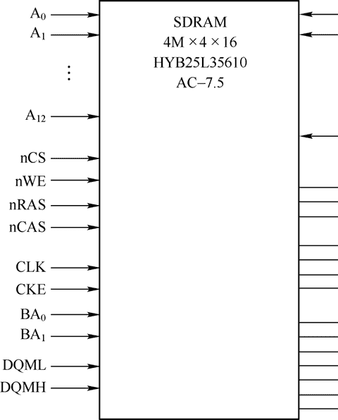
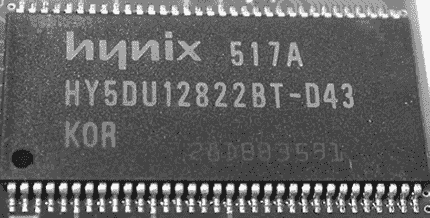
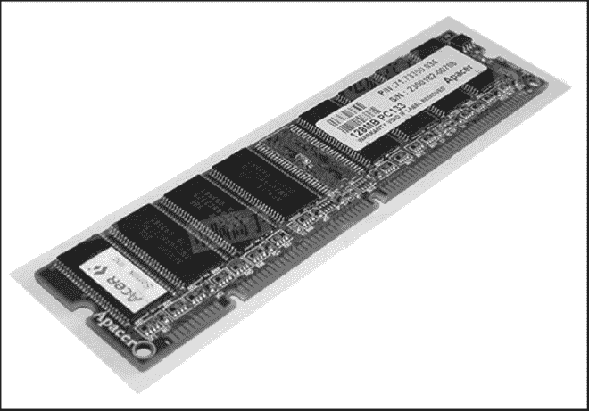

# SDRAM 存储器详解

> 原文：[`www.weixueyuan.net/a/136.html`](http://www.weixueyuan.net/a/136.html)

SDRAM 是同步动态随机存储器 Synchronous Dynamic Random Access Memory，通常作为嵌入式系统的内存，等同于普通 PC 的内存。SDRAM 从发展到现在已经经历了 4 代，分别为 SDR SDRAM、DDR SDRAM、DDR2 SDRAM 和 DDR3 SDRAM。

第 1 代 SDR SDRAM 采用单端 Single-Ended 时钟信号，而从第 2 代～第 4 代则由于工作频率比较快，所以采用了可降低干扰的差分时钟信号作为时钟信号，该时钟信号即为数据存储的频率。

第 1 代 SDRAM 采用时钟频率来命名，如 PC100、PC133 则表示时钟频率为 100MHz/133MHz，数据读/写速率也为 100MHz/133MHz。从第 2 代开始的 DDR SDRAM 则采用数据读/写速率命名，并且在前面加上表示其 DDR 代数编码的数字，如 PC2700 是 DDR333，其工作频率是 333MHz/2 = 160MHz，2700 则表示带宽为 2.7GB。

DDR 的读/写频率为 DDR200～DDR400；DDR2 从 DDR2-400～DDR2-800；DDR3 从 DDR3-800～DDR3-1600。

DDR4 内存规范已经完成，其对应的服务器、消费级产品已经逐步普及，而 DDR4 SO-DIMM 笔记本内存也已经开始产品化（如美光的 Crucial）。

## 1\. SDRAM 的主要参数

SDRAM 的两个主要参数说明如下：

*   容量：SDRAM 的容量通常用“存储单元×体×每个存储单元的位数”来表示，例如，某 SDRAM 芯片的容量为 4M×4×8bit，则表明该存储器芯片的容量为 16MB（字节），或者 128Mb。
*   时钟周期：SDRAM 能运行的最大频率，如对应 PC100 的 SDRAM 则表示其时钟周期为 10ns，工作频率则为 100MHz。

此外，SDRAM 还有存取时间、CAS 延迟时间、综合性能评价等参数，在此不再赘述。

在 SDRAM 中有两个很重要的概念：物理 Bank 和芯片位宽。参数说明如下：

*   物理 Bank：处理器和 SDRAM 进行数据交互所需要的数据总线的位宽。
*   芯片位宽：SDRAM 芯片的数据总线的位宽。

通常来说，物理 Bank 会大于等于芯片的位宽，在这个时候 SDRAM 就需要将多块芯片组合到一起以满足物理 Bank 的需求。

## 2\. SDRAM 的分类特点

SDRAM 的分类和特点如表 1 所示。

表 1：SDRAM 的分类和特点

| 参数 | SDR SDRAM | DDR SDRAM | DDR2 SDRAM | DDR3 SDRAM |
| 核心频率（MHz） | 66~166 | 100~200 | 100~200 | 100~250 |
| 时钟频率（MHz） | 66~166 | 100~200 | 200~400 | 400~1000 |
| 数据传输率（Mbps） | 66~166 | 200~400 | 400~800 | 800~2000 |
| 预取设计 | 1bit | 2bit | 4bit | 8bit |
| 突发长度 | 1/2/4/8full page | 2/4/8 | 4/8 | 8 |
| CL 值 | 2/3 | 2/2.5/3 | 3/4/5/6 | 5/6/7/8/9 |
| Bank 数量 | 2/4 | 2/4 | 4/8 | 8 |
| 工作电压 | 3.3V | 2.5/2.6V | 1.8V | 1.5V |
| 封装 | TSOP Ⅱ-54 | TSOP Ⅱ-54/66 | FBGA60/68/84 | FBGA78/96 |
| 生产工艺（nm） | 90/110/150 | 沿用 SDR 生产线 70/80/90 | 53/65/70/90 | 45/50/65 |
| 容量标准（Byte） | 2M~32M | 8M~128M | 32M~512M | 64M~1G |
| 新增特性 |   | 查分时钟，DOS | ODT、OCD、AL、POS-TED CAS | 异步重置 Reset |
| 优点 | 制造工艺简单，TSOP 封装焊接拆卸方便，成品率高。 | 数据传输率有所提高，生产设备简单。 | 数据传输速率高、更好的电器性能与散热性、体积小、功耗大、无需上拉终结电阻、成本相对较低。 | 工作频率进一步提高，功耗和发热量更小，容量更大。 |
| 缺点 | 速度快、焊盘与 PCB 接触面积小、散热差、高频阻抗和寄生电容影响稳定性和频率提升。 | 容量受限、高频时稳定性和散热性差、需要大量终结电阻。 | CL 延迟增加、成品率较低。 | 价格较高 |

## 3\. SDRAM 的典型芯片

SDRAM 的典型结构如图 1 所示：

图 1：SDRAM 的典型结构
这是一块 4M×4×8bit 的 HYB25L35610，可以看到其共有 54 个引脚，可以分为如下的几大部分：

*   地址输入引脚：执行 ACTIVE 命令和 READ/WRITE 命令时用于决定使用的 bank。
*   时钟输入引脚：高电平有效，当该引脚处于低电平期间，提供给所有 bank 预充电和刷新的操作。
*   片选信号引脚：在多存储芯片架构中选择进行存取的芯片。
*   行地址选通和列地址选通引脚。
*   bank 地址输入信号引脚：决定使用激活的 bank，如果引脚数目为 n，2n 则为 bank 的数量。
*   输入/输出屏蔽引脚。
*   电源相关引脚。

单个 SDRAM 芯片如图 2 所示，这是一片 HY5DU 12822BT-D43。

图 2：单个 SDRAM 芯片
常见的 SDRAM 实体都是以模组形式存在的，即内存条，如图 3 所示。

图 3：常见的 SDARM 实体
而在嵌入式系统中，最常用的是 Hynix（海力士，原现代）、Micron（美光）、Spectek（镁光）、Elpida（必尔达）生产的 8 位 /16 位数据宽度、工作在 3.3V 电压下的单个 SDRAM 芯片，它们的典型产品如表 2 所示。

表 2：典型的 SDRAM 产品

| 厂商 | SDRAM | DDR SDRAM | DDR2 SDRAM |
| Hynix | HY57V64820HGT-H（8M×8 PC133）、HY57V561620FTP-H-A（16M×16 PC133）、HY5S7B2ALFP-6E-C（16M×16 PC133） | HY5DU281622FTP-D43-C（8M×16 PC400）、HY5DU12822CTP-J-C（64M×8 PC333）、HY5DU12822CTP-D43（64M×8 PC400） | HY5PS12821EFP-Y5（64M×8 PC667）、HY5PS1G1631CFP-Y5-C（64M×16 PC667）、HY5PS12821CFP-S5（64M×8 PC800）、HY5PS1G831CFP-S6（128M×8 PC800） |
| Micron | MT48LC16M16A2P-7（16M×16 PC143）、MT48LC4M32B2P-6（4M×32 PC166） | MT46V64M8P-5B（64M×8 PC400）、MT46V128M4P-5B（128M×8 PC400） | MT47H32M16HQ-25（32M×16 PC800）、MT47H128M8HQ-25:E（32M×8 PC800）、MT47H64M16HR-3:E（64M×16 PC667） |
| Spectek | S16008LK6TKF-75A（8M×16 PC133）、S16004LK6TKF-75A（4M×16 PC133） | — | — |
| Elpida | EDS2516CDTA-75-E（16M×16 PC133）、EDS6432AFTA-6B-E（2M×32 PC166） | EDD5108ADTA-5C（64M×8 PC400）、EDD5108AGTA-5B-E（64M×8 PC533） | EDE5108ABSE-5C-E（64M×8 PC533）、EDE5104AESK-4A-E（128×4 PC400） |