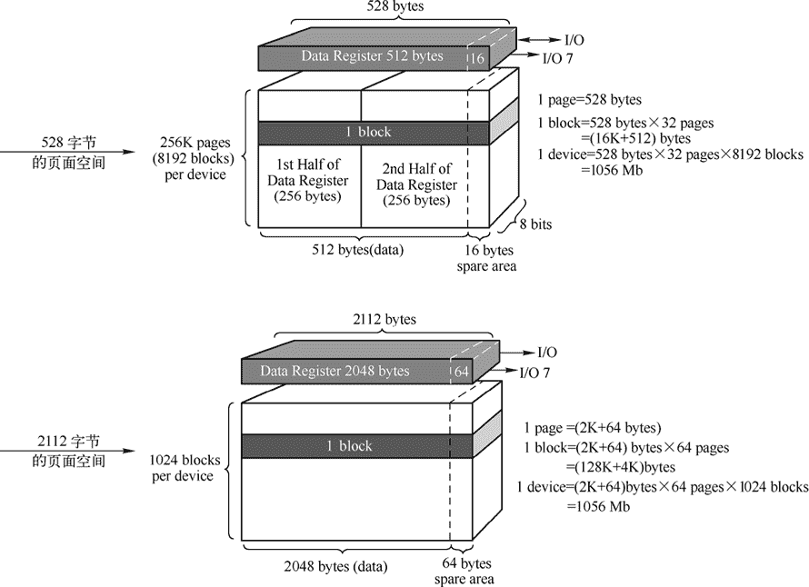
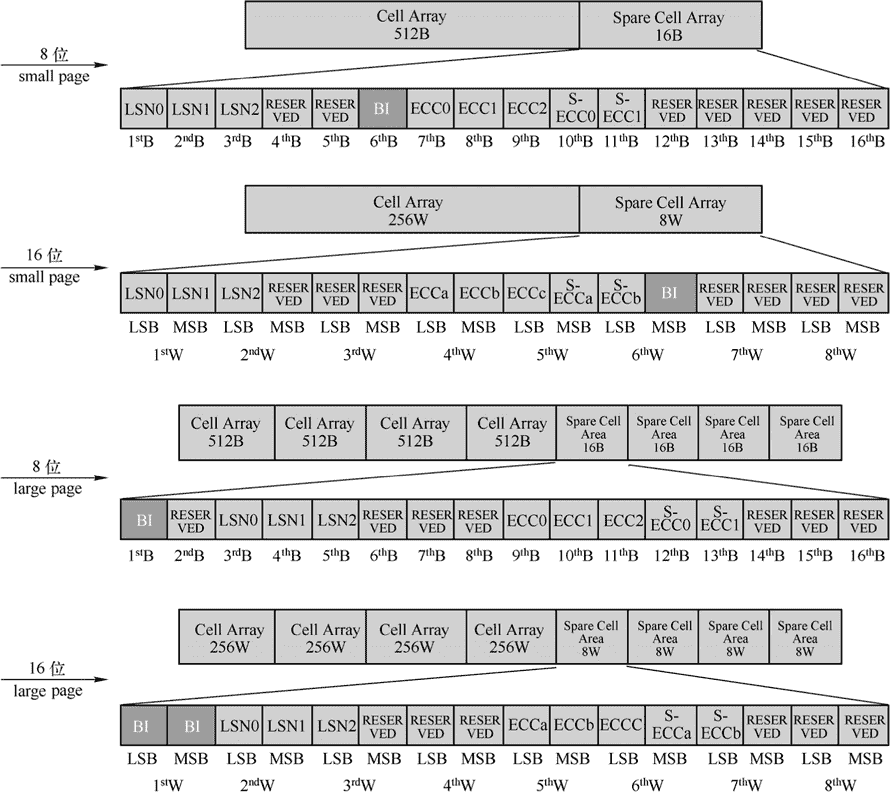

# FLASH 存储器详解

> 原文：[`www.weixueyuan.net/a/137.html`](http://www.weixueyuan.net/a/137.html)

SDRAM 是嵌入式系统的内存，而 FLASH 则可以看作嵌入式系统的硬盘，主要用于存放嵌入式系统运行所必需的数据，如操作系统和应用程序等。

## 1\. FLASH 的分类

目前市场上的 FLASH 可以分为由 Intel 公司在 1988 年发布的 NOR 和东芝公司在 1989 年发布的 NAND 两大类，它们因为其内部结构分别与“或非门”和“与非门”相似而得名，它们的内部结构、外部特性和应用均有较大差异。

#### 1) Intel 公司发布的 NOR FLASH

通常来说，NOR FLASH 的容量不大，常见的只有几 MB，可以重复擦写的次数较多，可以达到 10 万次～100 万次，遵循 CFI 标准可以通过 CFI 命令查询制造商、型号、容量、内部扇区布局等参数，从而通过软件实现自动配置，并且其可以保证无坏块，每个数据位都是有效的，并且其寻址采用了线性的完整数据和地址线编码。

因此，NOR FLASH 通常用于充当嵌入式系统的启动存储器、刻录 U-BOOT 等。NOR FLASH 支持芯片内执行（eXecute In Place，XIP），程序可以直接在 NOR FLASH 中执行，其使用方法和普通的 SDRAM 几乎没有区别。

#### 2) 东芝公司发布的 NAND FLASH

NAND FLASH 则可以做得很大，从几十 MB～几 GB，其可重复擦写的次数不如 NOR FLASH，但是也可以达到 10 万次，其没有数据线和地址线概念，只有复用的 I/O 引脚和控制引脚，所以必须通过特定的逻辑来操作，不能作为嵌入式系统的启动 ROM（某些在内部固化了对 NADN FLASH 支持代码的处理器例外，如 AT91SAM926x）。NAND FLASH 在出厂时候除了内部第一块外允许有坏块的存在并且可以进行相应的标记处理。

目前 NOR FLASH 和 NAND FLASH 都出现了使用 SPI 接口的串行接口产品，其可以显著地减小电路板的设计难度和面积，容量也和普通的芯片相当，只是有可能不能充当启动 ROM。

NOR FLASH 和 NAND FLASH 的比较如表 1 所示。

表 1：NOR FLASH 和 NAND FLASH 的比较

| 特点 | NOR FLASH | NAND FLASH |
| 传输速率 | 很高 | 较低 |
| 写入和擦除速度 | 较低 | 较高 |
| 读速度 | 较高 | 较低 |
| 写入/擦除操作速度 | 以 64~128KB 的块进行，时间为 5s | 8~32KB 的块，只需要 4ms |
| 外部接口 | 带有 SRAM 接口，有足够的地址引脚，可以对内部每个字节进行寻址操作。 | 使用复杂的 I/O 引脚来串行的存取数据 |
| 价格 | 较高 | 较低 |
| 单片容量 | 1~16MB | 8~128MB |
| 用途 | 代码存储 | 数据存储，如 CF 卡、MMC 卡等 |
| 写操作 | 以字节或字为单位 | 以页面为基础单位 |

## 2\. NAND FLASH 的内部结构

NAND FLASH 由 BLOCK（块）构成，块的基本组成单元是 PAGE（页），一个块通常由 16、32 或 64 个页组成。页的大小有两种，其中 small page 的大小为 528 字节，包含了 512 字节的数据存储区和 16 字节的备用区域；对应的 large page 的页则由 2048 字节的数据存储区（Data area）和 64 字节的备用区域（Spare area）组成，图 1 给出了两种页面组成的 NAND FLASH 结构示意。

图 1：NAND FALSH 结构示意
NAND FLASH 有三种基本操作，页面读、页面写和块擦除：

*   在页面读操作中，该页内的数据首先被读入数据寄存器，然后输出；
*   在页面写操作中，该页内的数据首先被写入数据寄存器，然后写入存储空间中；
*   在块擦除操作中，一组连续的页在单独操作下被擦除。

备用区域（Spare Area）可以用于标识 NAND FLASH 中的坏块（BAD BLOCK），也可以用于和数据存储区（Data Area）一样存储数据，其使用方法可以参考图 2，这是三星公司提出的一种标准，包括 8 位的 small page、16 位的 small page、8 位的 large page 和 16 位的 large page 四种格式。

图 2：NAND FLASH 的备用区域使用标准

## 3\. 常见的 FLASH 芯片型号

常见的 NOR FLASH 芯片如表 2 所示。

表 2：常见 NOR FLASH 型号

| 厂商 | 型号 | 容量（B） | 结构 | 电压 |
| ST | M29F512B | 512K | 8 位 | 5V |
| M29F010B | 1M |
| M29F002B | 2M |
| M29F040B | 4M |
| M29080A | 8M |
| M29F016B | 16M |
| M29F100B M29F102B | 1M | 8 位/ 16 位 |
| M29F200B | 2M |
| M29F400B | 4M |
| M29F800B | 8M |
| M29F160B | 16M |
| M29W512B | 512K | 8 位 | 3V |
| M29W010B | 1M |
| M29W002B M29W022B | 2M |
| M29W040B M29W004B | 4M |
| M29W008A | 8M |
| M29W116B | 16M |
| M29W102B | 1M | 8 位/ 16 位 |
| M29W200B | 2M |
| M29W400B | 4M |
| M29W800A | 8M |
| M29W160B | 16M |
| ATMEL | AT49F512 AT29C512
AT29C010A | 512K | 8 位 | 5V |
| AT49F010 AT49HF010A
AT49F001 | 1M |
| AT29C020 AT49F020
AT49F002 | 2M |
| AT29C040 AT49F040 | 4M |
| AT49C008 AT49F080 | 8M |
| AT29F1614 AT49F1614T | 16M |
| AT29C1024 AT49F102A
AT49F1045 | 1M | 8 位/ 16 位 | 5V |
| AT49F2048 | 2M |
| AT49F4096A | 4M |
| AT49F8192 | 8M |
| AT49F1604 AT49F1604T | 16M |
| AT49BV512 AT29LV512 | 512K | 8 位 | 3V |
| AT29BV010A AT49BV010
AT49HBV010
AT49BV001 | 1M |
| AT29BV020 AT29LV020
AT49BV020
AT49BV002
AT49LV020
AT49LV002 | 2M |
| AT29BV040A AT29LV040A
AT49BV040
AT49LV040 | 4M |
| AT49BV080 AT49LV080 | 8M |
| AT29LV1204 | 1M | 8 位/ 16 位 | 3V |
| AT29BV2048 AT49LV2048 | 2M |
| AT49BV4096A AT49LV4096A | 4M |
| AT49BV8192 AT49LV8192 | 8M |
| hynix | HY29F002T/C | 2M | 8 位 | 5V |
| HY29F040 HY29F040A | 4M |
| HY29F080T/C | 8M |
| HY29F400T/G | 4M | 8 位/ 16 位 | 5V |
| HY29F800T/G | 8M |

注意：此外 SST、Intel、AMD、Micron 等公司也都有对应的产品，用户可以自行查阅相应的手册，从表 2 中可以看到常用的 NOR FLASH 最大容量也就是 16MB。

常见的 NAND FLASH 芯片如表 3 所示。

表 3：常见 NAND FLASH 型号介绍

| 厂商 | 型号 | 容量 | 备注 |
| Samsung | K9F2808 | 16M |   |
| K9F5608 | 32M |   |
| K9F1208 | 64M |   |
| K9K1G08 | 128M |   |
| K9E2G08 | 256M |   |
| K9W4G08 | 512M |   |
| K9K8G08 | 1G |   |
| K9WAG08 | 2G |   |
| K9NBG08 | 4G |   |
| K9NCG08 | 8G |   |
| K9MDG08 | 16G |   |
| K9PFG08 | 32G |   |
| Micron | MT29F1G08 | 128M | 1.8V |
| MT29F2G08 | 256M |   |
| MT29F4G08 | 512M |   |
| MT29F8G08 | 1G |   |
| MT29F8G08A | 1G | 3.3V |
| MT29F16G08 | 2G |   |
| MT29F32G08 | 4G |   |
| MT29F64G08 | 8G |   |
| MT29F128G08 | 16G |   |
| Intel | JS29F04G08 | 512M |   |
| JS29F08G08 | 1G |   |
| JS29F16G08 | 2G |   |
| JS29F32G08 | 4G |   |
| JS29F64G08 | 8G |   |
| JS29F16B08 | 16G |   |
| JS29F32B08 | 32G |   |
| Hynix | HY27US08281A | 16M |   |
| HY27US08561M | 32M |   |
| HY27US08121M | 64M |   |
| HY27UA081G4M | 128M |   |
| HY27UF082G2M | 256M |   |
| HY27UG084G2M | 512M |   |
| HY27UG088G5M | 1G |   |
| HY27UH08AG5B | 2G |   |
| HY27UK08BGFB | 4G |   |
| HY27UW08CGFM | 8G |   |
| H27UAG8M2MYR | 16G |   |

注意：此外 Spectek、Renesas、ST、Toshiba、SanDisk 等公司也都有相应的产品，用户可以自行查阅相应的手册，从表 3 中可以看到常用的 NAND FLASH 的容量通常在 16MB～32GB 之间。