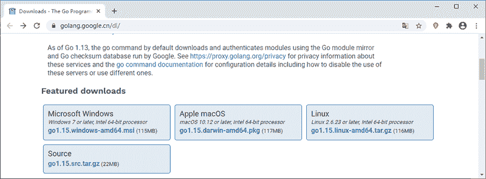
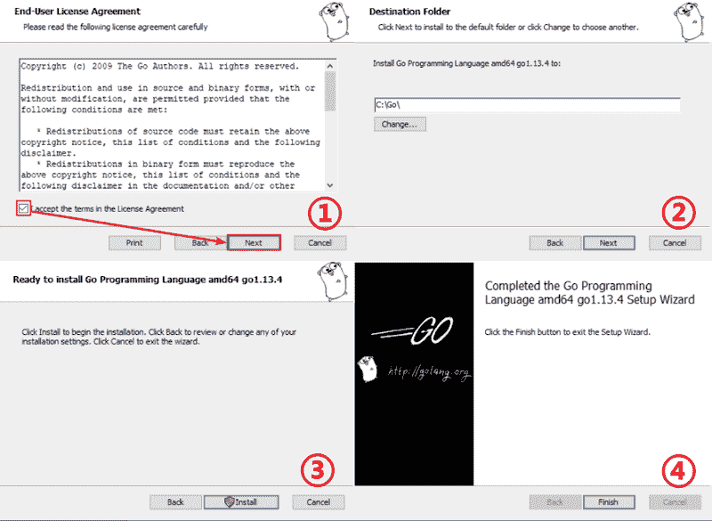
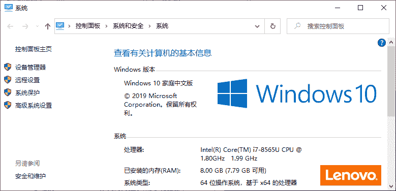
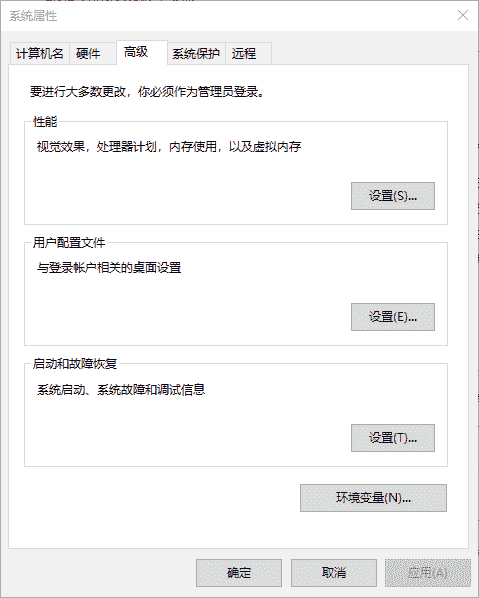
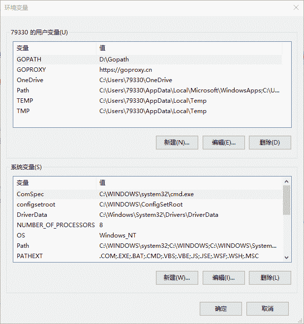
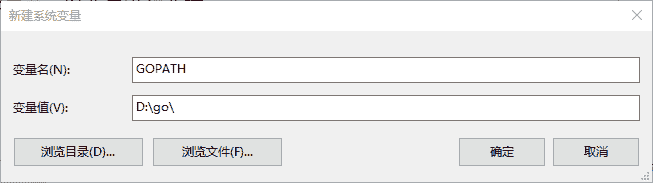
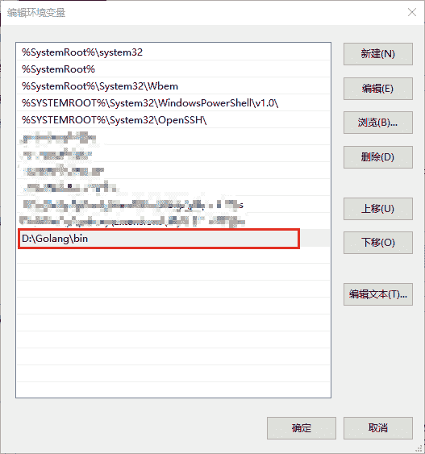

# Windows 系统下安装和配置 Go 语言

> 原文：[`www.weixueyuan.net/a/391.html`](http://www.weixueyuan.net/a/391.html)

在 Windows 环境下（以 Windows10 为例）安装 Go 语言，首先需要在 Go 语言官网（[`golang.google.cn/dl/`](https://golang.google.cn/dl/)）下载格式为 MSI 的安装程序，如下图所示：

图：下载 Go 语言安装程序

## 1、安装 Go 语言

双击启动刚刚下载的安装程序并根据提示选择合适的安装位置，例如：D:\Golang，如下图所示：

图：安装 Go 语言

## 2、配置环境变量

安装完成后还需要我们手动来配置一些环境变量。

1) 右键单击【此电脑】，选择【属性】选项，进入如下图所示的系统窗口。

图：属性窗口
2) 单击【高级系统设置】，打开【系统属性】窗口，如下图所示。

图：系统属性窗口
3) 单击【环境变量】按钮，打开【环境变量】窗口，如下图所示。

图：环境变量窗口
4) 在【用户变量】区域，单击【新建】按钮，打开【新建系统变量】窗口，并添加名为 GOPATH 的用户变量，变量的值可以是任意目录（建议选择一个空目录，例如 D:\go\），如下图所示。

图：添加 GOPATH 环境变量
5) 在【系统变量】区域，找到名为 Path 的系统变量，双击将其打开，单击【新建】，在其中填充 Go 语言安装目录下的 bin 目录，例如：D:\Golang\bin，如下图所示。

图：编辑 Path 环境变量
然后还需要把前面 GOPATH 环境变量设置的目录也添加到 Path 环境变量中，否则自行下载的第三方 Go 语言工具将无法使用。

GOPATH 环境变量中配置的目录可以看作是工作目录，用来存放开发者的代码，编译源代码所生成的文件都会放到此目录下。改目录下主要包含三个目录，分别是 bin、pkg 和 src。bin 目录主要存放可执行文件；pkg 目录主要存放编译好的库文件，如 *.a 文件；src 目录主要存放 Go 语言的源文件。

完成上述操作后就可以来查看我们的配置是否成功了，使用快捷键 Win+R，在弹出的窗口中输入 cmd 打开命令行提示符窗口，在命令行窗口中输入 `go env`，然后回车来查看配置信息，根据配置的不同显示结果也会略有差异，如下所示：

C:\Users>go env
set GO111MODULE=
set GOARCH=amd64
set GOBIN=
set GOCACHE=C:\Users\79330\AppData\Local\go-build
set GOENV=C:\Users\79330\AppData\Roaming\go\env
set GOEXE=.exe
set GOFLAGS=
set GOHOSTARCH=amd64
set GOHOSTOS=windows
set GONOPROXY=
set GONOSUMDB=
set GOOS=windows
set GOPATH=D:\Gopath
set GOPRIVATE=
set GOPROXY=https://goproxy.cn
set GOROOT=D:\install\Go
set GOSUMDB=sum.golang.org
set GOTMPDIR=
set GOTOOLDIR=D:\install\Go\pkg\tool\windows_amd64
set GCCGO=gccgo
set AR=ar
set CC=gcc
set CXX=g++
set CGO_ENABLED=1
set GOMOD=
set CGO_CFLAGS=-g -O2
set CGO_CPPFLAGS=
set CGO_CXXFLAGS=-g -O2
set CGO_FFLAGS=-g -O2
set CGO_LDFLAGS=-g -O2
set PKG_CONFIG=pkg-config
set GOGCCFLAGS=-m64 -mthreads -fmessage-length=0 -fdebug-prefix-map=C:\Users\79330\AppData\Local\Temp\go-build955186486=/tmp/go-build -gno-record-gcc-switches

输入 `go version` 可以查看 Go 语言的版本号，如下图所示。

C:\Users>go version
go version go1.13.6 windows/amd64