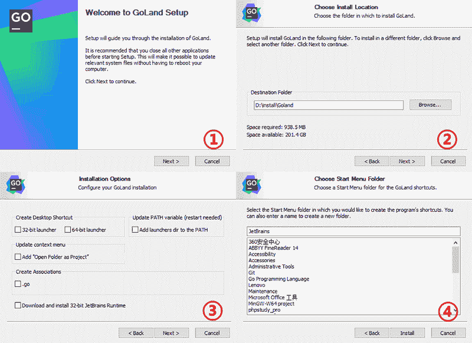

# Goland 下载和安装教程

> 原文：[`www.weixueyuan.net/a/395.html`](http://www.weixueyuan.net/a/395.html)

GoLand 是由 JetBrains 公司推出，旨在为 Go 开发者提供一个符合人体工程学的商业集成开发环境（Integrated Development Environment，IDE），它的特点如下所示：

*   拥有编码辅助功能；
*   符合人体工程学的设计；
*   工具的集成；
*   完善的 IntelliJ 插件生态系统。

## GoLand 的下载和安装

首先打开 GoLand 官方网站（[`www.jetbrains.com/zh-cn/go/download/`](https://www.jetbrains.com/zh-cn/go/download/)）下载适合我们操作系统的安装程序，如下图所示。

图：Goland 官网
在上图所示的页面中选择我们当前的操作系统，并单击【下载】按钮即可开始下载最新版本的安装程序。

下载完成后，双击运行刚刚得到的安装程序。单击【Next】按钮，选择要安装的路径，然后单击【Next】；这时会出现一些安装选项，可以根据计算机的型号，勾选对应的选项，继续单击【Next】按钮；接下来的操作保持默认即可，单击【Install】进行安装。整个安装过程很快，几乎一路【Next】到底，如下图所示：

图：安装 Goland