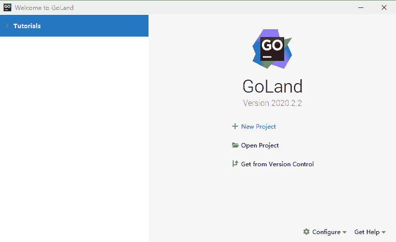
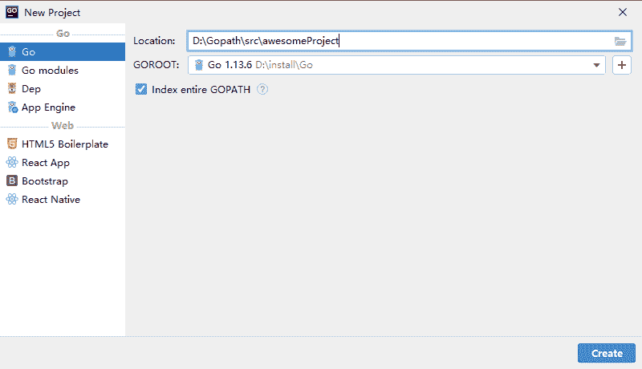

# Goland 使用教程

> 原文：[`www.weixueyuan.net/a/401.html`](http://www.weixueyuan.net/a/401.html)

前面介绍了 Goland 的下载和安装，本节我们来介绍一下怎么使用 Goland 来创建一个项目。

1) 打开 GoLand 工具，如下图所示。

图：运行 Goland
2) 单击【New Project】按钮来创建一个新的项目，然后编辑项目信息，其中 “Location”为项目所在的目录，“GOROOT”为 Go 语言的安装目录，最后点击【Create】来完成创建，如下图所示。

图：使用 Goland 新建一个项目