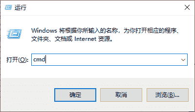
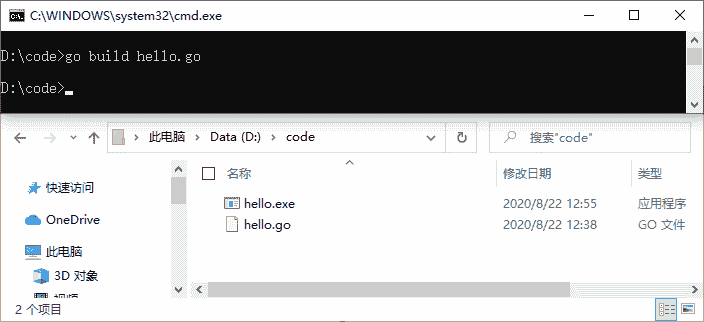
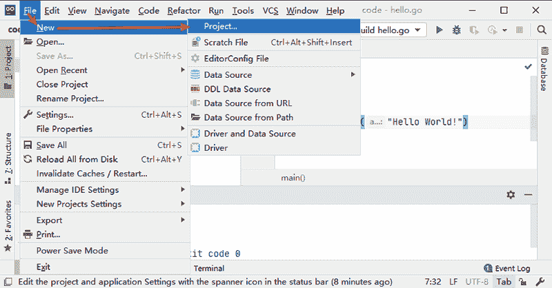
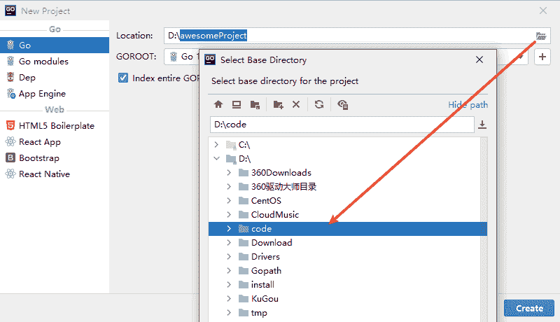
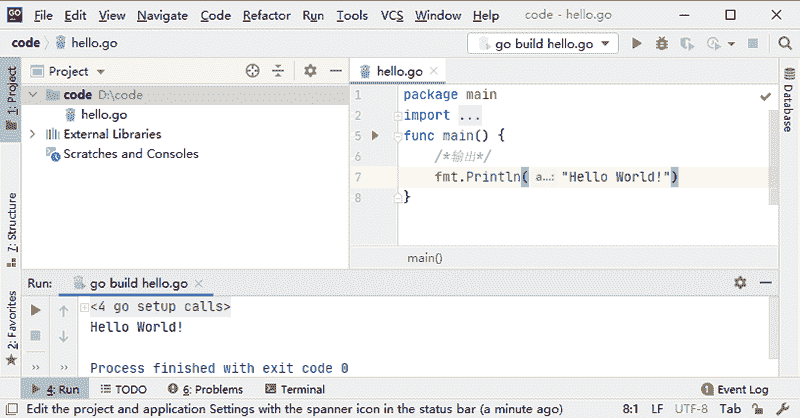

# 第一个 Go 语言程序

> 原文：[`www.weixueyuan.net/a/406.html`](http://www.weixueyuan.net/a/406.html)

本节来带领大家编写第一个 Go 语言程序—在控制台输出“Hello World！”。

首先在任意目录下新建一个文本文档，通常文本文档的默认名为“新建文本文档.txt”。这里我们需要将这个文件改为后缀以“.go”结尾的文件名，例如 hello.go，然后输入以下内容。

```

package main
import  "fmt"
func main() {
    /*输出*/
    fmt.Println("Hello World!")
}
```

编辑完成后就可以尝试执行 Go 语言程序了，执行 Go 语言程序有很多种，下面就来分别介绍。

## 1、使用 go run 命令

1) 使用快捷键“Win+R”，然后输入 `cmd` 打开命令行提示符窗口，如下图所示。


图：运行命令行提示符窗口
2) 使用 `cd` 命令进入 hello.go 所在的目录，如下所示。

C:\Users\79330>D:
D:\>cd code
D:\code>

3) 输入 `go run hello.go` 命令即可执行 Go 语言程序并观察执行结果，如下所示。

D:\code>go run hello.go
Hello World!

## 2、使用 go build 命令

1) 同上面一样，使用快捷键“Win+R”，输入 `cmd` 打开命令行提示符窗口，然后使用 `cd` 命令进入 hello.go 所在的目录。

2) 在命令行提示符窗口中输入 `go build hello.go` 命令进行编译，这时并不会有任何输出结果，但是会生成一个同名的 hello.exe 文件，如下图所示。


图：执行 go build hello.go 命令
3) 在命令行提示符窗口输入刚刚编译得到的 hello.exe，即可输出执行结果，如下所示。

D:\code>hello.exe
Hello World!

## 3、使用 GoLand

1) 想要使用 Goland 运行 hello.go 程序，首先需要创建一个项目，如下图所示。


图：创建一个项目
2) 将“Location”选项设置为 hello.go 所在的目录，如下图所示。


图：设置项目参数
3) 双击打开项目中的 hello.go 文件，单击 main() 函数左侧绿色小箭头即可运行这个程序，如下图所示。


图：运行 hello.go