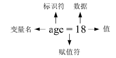

# 什么是变量

> 原文：[`www.weixueyuan.net/a/431.html`](http://www.weixueyuan.net/a/431.html)

变量是计算机语言中储存数据的基本单元，它的功能是存储数据。变量可通过变量名（也叫标识符）访问，例如：小千的年龄是 18 岁，可以使用一个变量来引用 18，如下图所示。

图：变量
变量的本质是计算机分配的一小块内存，专门用于存放指定的数据，在程序运行过程中该数值可以发生改变；变量的存储往往具有瞬时性，或者说是临时存储，当程序运行结束，存放该数据的内存就会释放，该变量就会随着内存的释放而消失。就像日常生活中存放水的水杯，当水杯损坏的时候，装在里面的水也会流失掉。

变量又分为局部变量和全局变量。

*   局部变量，是定义在大括号 `{}` 内部的变量，大括号的内部也是局部变量的作用域；
*   全局变量，是定义在函数和大括号 `{}` 外部的变量。

Go 语言的变量名由字母、数字和下画线组成，但是首个字符不能为数字。Go 语言的语法规定，定义的局部变量若没有被调用会发生编译错误，编译报错的内容如下所示：

age declared and not used

表达式是值和操作符的组合，它们可以通过求值成为单个值。“数据类型”是一类值，每个值都只属于一种数据类型。