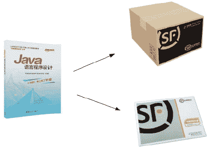

# Go 语言整型（整数类型）

> 原文：[`www.weixueyuan.net/a/443.html`](http://www.weixueyuan.net/a/443.html)

在计算机中，操作的对象是数据，那么大家来思考一下，如何选择合适的容器来存放数据才不至于浪费空间？先来看一个生活中的例子，某公司要快递一本书，文件袋和纸箱都可以装载，但是，如果使用纸箱装一本书，显然有点大材小用，浪费纸箱的空间，如下图所示。

图：书、纸箱和快递袋
生活中的容器不仅仅有容量大小的差别，还有类型上的区别，比如纸箱不能直接用来装液体。在 Go 语言中，有以下几种数据类型。其中基本数据类型（原生数据类型）分为整型、浮点型、复数型、布尔型、字符串、字符（byte、rune）；复合数据类型（派生数据类型）包括数组（array）、切片（slice）、映射（map）、函数（function）、结构体（struct）、通道（channel）、接口（interface）、指针（pointer）。

本节我们主要介绍一下 Go 语言中的整数类型。

在 Go 语言中整型分两大类：

*   有符号整型：int8、int16、int32、int64、int；
*   无符号整型：uint8、uint16、uint32、uint64、uint。

其中 uint8 就是 byte 型，int16 对应 C 语言的 short 型，int64 对应 C 语言的 long 型。

对整型的详细描述，如下表所示：

表：Go 语言中的整型

| 类型 | 字节数 | 取值范围 | 说明 |
| int8 | 1 | -128~127 | 有符号 8 位整型 |
| uint8 | 1 | 0~255 | 无符号 8 位整型 |
| int16 | 2 | -32768~32767 | 有符号 16 位整型 |
| uint16 | 2 | 0~65535 | 无符号 16 位整型 |
| int32 | 4 | -2147483648~2147483647 | 有符号 32 位整型 |
| uint32 | 4 | 0~4294967295  | 无符号 32 位整型 |
| int64 | 8 | -9223372036854775808~9223372036854775807 | 有符号 64 位整型 |
| uint64 | 8 | 0~18446744073709551615 | 无符号 64 位整型 |
| int | 4 或 8 | 取决于平台 | 有符号 32 或 64 位整型 |
| uint | 4 或 8  | 取决于平台 | 无符号 32 或 64 位整型 |
| uintptr | 4 或 8 | 取决于平台 | 用于存放一个指针 |

声明方式如下所示：

var a int8   // 声明有符号 8 位整型
var b uint8  // 声明无符号 8 位整型