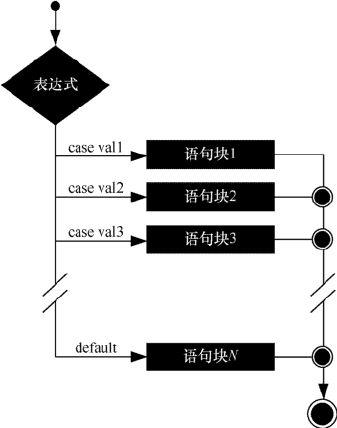

# Go 语言 switch 条件分支语句

> 原文：[`www.weixueyuan.net/a/506.html`](http://www.weixueyuan.net/a/506.html)

Go 语言提供了以下几种条件分支语句，如下表所示。

表：条件分支语句

| 语句 | 描述 |
| switch 语句 | switch 语句用于基于不同条件执行不同动作 |
| select 语句 | select 语句类似于 switch 语句，但是 select 会随机执行一个可运行的 case。如果没有 case 可运行，它将阻塞，直到有 case 可运行 |

## 1、语法结构

Go 语言中 switch 语句的语法如下所示。

switch var1 {
    case val1:
        ...
    case val2:
        ...
    default:
        ...
}

switch 语句的执行流程如下图所示。


图：switch 细节
switch 语句执行的过程是自上而下的，直到找到 case 匹配项，匹配项中无须使用 break，因为 Go 语言中的 switch 默认给每个 case 自带 break。因此匹配成功后不会向下执行其他的 case 分支，而是跳出整个 switch。可以添加 fallthrough（中文含义是：贯穿），强制执行后面的 case 分支。fallthrough 必须放在 case 分支的最后一行。如果它出现在中间的某个地方，编译器就会报错。

变量 var1 可以是任何类型，而 val1 和 val2 则可以是同类型的任意值。类型不局限于常量或整数，但必须是相同类型或最终结果为相同类型的表达式。

case 后的值不能重复，但可以同时测试多个符合条件的值，也就是说 case 后可以有多个值，这些值之间使用逗号分隔，例如：case val1, val2, val3。

switch 后的表达式可以省略，默认是 switch true。

【示例】使用 switch 语句判断学生的成绩。

```

package main

import "fmt"

func main() {
    /*定义局部变量*/
    grade := ""
    score := 78.5
    switch { //switch 后面省略不写，默认相当于：switch true
    case score >= 90:
        grade = "A"
    case score >= 80:
        grade = "B"
    case score >= 70:
        grade = "C"
    case score >= 60:
        grade = "D"
    default:
        grade = "E"
    }
    fmt.Printf("你的等级是：%s\n", grade)
    fmt.Print("最终评价是：")
    switch grade {
    case "A":
        fmt.Printf("优秀！\n")
    case "B":
        fmt.Printf("良好\n")
    case "C":
        fmt.Printf("中等\n")
    case "D":
        fmt.Printf("及格\n")
    default:
        fmt.Printf("差\n")
    }
}
```

运行结果如下：

你的等级是：C
最终评价是：中等

【示例】使用 switch 语句判断某年某月的天数。

```

package main

import "fmt"

func main() {
    /*定义局部变量：年、月、日*/
    year := 2008
    month := 2
    days := 0
    switch month {
    case 1, 3, 5, 7, 8, 10, 12:
        days = 31
    case 4, 6, 9, 11:
        days = 30
    case 2:
        if (year%4 == 0 && year%100 != 0) || year%400 == 0 {
            days = 29
        } else {
            days = 28
        }
    default:
        days = -1
    }
    fmt.Printf("%d 年 %d 月的天数为：%d\n", year, month, days)
}
```

运行结果如下：

2008 年 2 月的天数为：29

## 2、类型转换

switch 语句还可以被用于 type switch（类型转换）来判断某个 interface 变量中实际存储的变量类型。关于 interface 变量的知识将在后续的章节中介绍。下面演示一下 type switch 的语法。其语法结构如下所示。

switch x.(type){
    case type:
        statement(s);
    case type:
        statement(s);
    /* 你可以定义任意个数的 case */
    default: /* 可选 */
        statement(s);
}

【示例】判断 interface 变量中存储的变量类型。

```

package main

import "fmt"

func main() {
    var x interface{}
    switch i := x.(type) {
        case nil:
            fmt.Printf("x 的类型：%T", i)
        case int:
            fmt.Printf("x 是 int 型")
        case float64:
            fmt.Printf("x 是 float64 型")
        case func(int) float64:
            fmt.Printf("x 是 func(int) 型")
        case bool, string:
            fmt.Printf("x 是 bool 或 string 型")
        default:
            fmt.Printf("未知型")
    }
}
```

运行结果如下：

x 的类型：<nil>