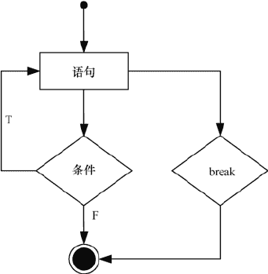

# Go 语言 break 语句（跳出循环）

> 原文：[`www.weixueyuan.net/a/510.html`](http://www.weixueyuan.net/a/510.html)

Go 语言中 break 语句用来跳出循环体，终止当前正在执行的 for 循环，并开始执行循环之后的语句，流程如下图所示。


图：break 执行流程
【示例】使用 break 语句跳出正在执行的循环。

```

package main

import "fmt"

func main() {
    for i := 1; i <= 10; i++ {
        if i > 5 {
            break // 如果 i > 5，则循环终止
        }
        fmt.Printf("%d ", i)
    }
    fmt.Printf("\nline after for loop")
}
```

运行结果如下：

1 2 3 4 5
line after for loop