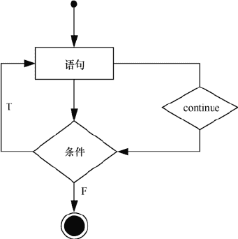

# Go 语言 continue 语句

> 原文：[`www.weixueyuan.net/a/511.html`](http://www.weixueyuan.net/a/511.html)

Go 语言的 continue 语句有点像 break 语句。但是 continue 不是跳出循环，而是跳过当前循环，执行下一次循环语句。for 循环中，执行 continue 语句会触发 for 增量语句的执行。换言之，continue 语句用于跳过 for 循环的当前迭代，循环将继续到下一个迭代。流程如下图所示。


图：continue 执行流程
【示例】continue 使用示例，输出 1 ~ 10 之间的所有奇数。

```

package main

import "fmt"

func main() {
    for i := 1; i <= 10; i++ {
        if i%2 == 0 {
            continue
        }
        fmt.Printf("%d ", i)
    }
}
```

运行结果如下：

1 3 5 7 9

break 与 continue 的区别如下。

*   break 语句无条件跳出并结束当前的循环，然后执行循环体后的语句；
*   continue 语句跳过当前的循环，而开始执行下一次循环。