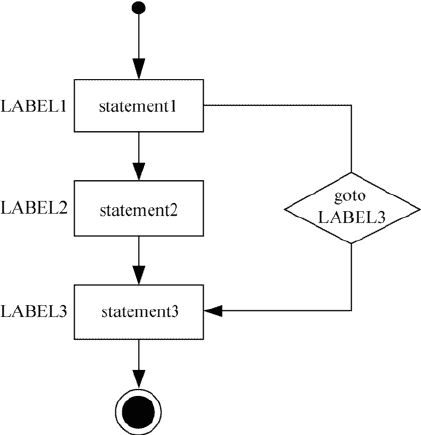

# Go 语言 goto 语句

> 原文：[`www.weixueyuan.net/a/513.html`](http://www.weixueyuan.net/a/513.html)

Go 语言的 goto 语句可以无条件地转移到程序指定的行，通常与条件语句配合使用。可用来实现条件转移、构成循环、跳出循环体等功能。但是，在结构化程序设计中一般不建议使用 goto 语句，以免造成程序流程的混乱，使理解和调试程序都产生困难。

goto 语句的执行流程如下图所示。


图：goto 语句执行流程
goto 语句的语法格式如下所示。

LABEL: statement
goto LABEL

【示例】借助 goto 跳转来输出 1～50 之间的素数。

```

package main

import "fmt"

func main() {
    var C, c int // 声明变量
    C = 1        // 这里不写入 for 循环是因为 for 语句执行之初会将 C 的值变为 1，当 goto A 时 for 语句会重新执行（不是重新一轮循环）
LOOP:
    for C < 50 {
        C++
        for c = 2; c < C; c++ {
            if C%c == 0 {
                goto LOOP // 若发现因子则不是素数
            }
        }
        fmt.Printf("%d ", C)
    }
}
```

运行结果如下：

2 3 5 7 11 13 17 19 23 29 31 37 41 43 47