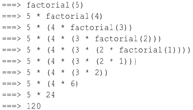

# Go 语言递归函数

> 原文：[`www.weixueyuan.net/a/538.html`](http://www.weixueyuan.net/a/538.html)

在函数内部，可以调用其他函数。如果一个函数在内部调用自身，那么这个函数就是递归函数。递归函数必须满足以下两个条件。

*   在每一次调用自己时，必须是（在某种意义上）更接近于解；
*   必须有一个终止处理或计算的准则。

下面通过案例来理解递归函数的作用。

【示例】计算阶乘 n! = 1 × 2 × 3 × ... × n，用函数 fact(n) 表示，可以看出：fact(n) = n! = 1 × 2 × 3 × ... ×(n-1)×n = (n-1)! × n = fact(n-1) × n。所以，fact(n) 可以表示为 n × fact(n-1)，只有 n=1 时需要特殊处理。如例下所示。

```

package main
import "fmt"
func main() {
    fmt.Println(factorial(5))
    fmt.Println(getMultiple(5))
}
//通过递归实现阶乘
func factorial(n int) int {
    if n == 0 {
        return 1
    }
    return n * factorial(n-1)
}
//通过循环实现阶乘
func getMultiple(num int) (result int) {
    result = 1
    for i := 1; i <= num; i++ {
        result *= i
    }
    return
}
```

运行结果如下：

120
120

递归的计算过程如下图所示。


图：递归的执行过程
使用递归需要注意如下事项：

*   递归函数的优点是定义简单，逻辑清晰。理论上，所有的递归函数都可以用循环的方式实现，但循环的逻辑不如递归清晰；
*   使用递归函数需要注意防止栈溢出。在计算机中，函数调用是通过栈（stack）这种数据结构实现的，每当进入一个函数调用，栈就会加一层，每当函数返回，栈就会减一层。由于栈的大小不是无限的，所以，递归调用的次数过多，会导致栈溢出；
*   使用递归函数的优点是逻辑简单清晰，缺点是过深的调用会导致栈溢出。