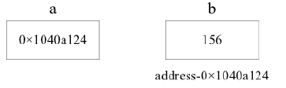

# Go 语言指针详解

> 原文：[`www.weixueyuan.net/a/540.html`](http://www.weixueyuan.net/a/540.html)

指针是存储另一个变量的内存地址的变量。变量是一种使用方便的占位符，变量都指向计算机的内存地址。一个指针变量可以指向任何一个值的内存地址。

例如：变量 b 的值为 156，存储在内存地址 0x1040a124。变量 a 持有变量 b 的地址，则变量 a 被认为指向变量 b。如下图所示。


图：指针变量
在 Go 语言中使用取地址符（＆）来获取变量的地址，一个变量前使用＆，会返回该变量的内存地址，示例代码如下所示。

```

package main
import "fmt"
func main() {
    a := 10
    fmt.Printf("变量的地址为：%x \n", &a)
}
```

运行结果如下：

变量的地址为：c00000c198

注意：在不同的环境下输出结果可能不同。

Go 语言指针的特点如下：

*   Go 语言指针的最大特点是：指针不能运算（不同于 C 语言）；
*   在 Go 语言中如果对指针进行运算会报错，如下所示。
*   nvalid operation: p++ (non-numeric type *int)

## 1、声明指针

声明指针，*T 是指针变量的类型，它指向 T 类型的值，语法格式如下。

var 指针变量名 *指针类型

其中，`*` 用于指定变量是一个指针。

var ip *int            // 指向整型的指针
var fp *float32     // 指向浮点型的指针

指针使用流程如下。

*   定义指针变量；
*   为指针变量赋值；
*   访问指针变量中指向地址的值。

获取指针指向的变量值，只需要在指针类型的变量前加上 * 号（前缀），如 *a。示例代码如下所示。

```

package main
import "fmt"
func main() {
    //声明实际变量
    var a int = 120
    //声明指针变量
    var ip *int
    //给指针变量赋值，将变量 a 的地址赋值给 ip
    ip = &a
    // 打印 a 的类型和值
    fmt.Printf("a 的类型是：%T，值是：%v \n", a, a)
    // 打印 &a 的类型和值
    fmt.Printf("&a 的类型是：%T，值是：%v \n", &a, &a)
    // 打印 ip 的类型和值
    fmt.Printf("ip 的类型是：%T，值是：%v \n", ip, ip)
    // 打印 *ip 的类型和值
    fmt.Printf("*ip 的类型是：%T，值是：%v \n", *ip, *ip)
    // 打印变量 *&a 的类型和值
    fmt.Printf("*&a 的类型是：%T，值是：%v \n", *&a, *&a)
    fmt.Println(a, &a, *&a)
    fmt.Println(ip, &ip, *ip, *(&ip), &(*ip))
}
```

运行结果如下：

a 的类型是：int，值是：120
&a 的类型是：*int，值是：0xc00000c198
ip 的类型是：*int，值是：0xc00000c198
*ip 的类型是：int，值是：120
*&a 的类型是：int，值是：120
120 0xc00000c198 120
0xc00000c198 0xc000006028 120 0xc00000c198 0xc00000c198

下面再通过一个示例来演示指针的使用。

```

package main
import "fmt"
type Student struct {
    name    string
    age     int
    married bool
    sex     int8
}
func main() {
    var s1 = Student{"Steven", 35, true, 1}
    var s2 = Student{"Sunny", 20, false, 0}
    var a *Student = &s1 //将 s1 的内存地址赋值给 student 指针变量 a
    var b *Student = &s2 //将 s2 的内存地址赋值给 student 指针变量 b
    fmt.Printf("s1 类型为 %T, 值为 %s \n", s1, s1)
    fmt.Printf("s2 类型为 %T, 值为 %v \n", s2, s2)
    fmt.Printf("a 类型为 %T, 值为 %v \n", a, a)
    fmt.Printf("b 类型为 %T, 值为 %v \n", b, b)
    fmt.Printf("*a 类型为 %T, 值为 %v \n", *a, *a)
    fmt.Printf("*b 类型为 %T, 值为 %v \n", *b, *b)
    fmt.Println(s1.name, s1.age, s1.married, s1.sex)
    fmt.Println(a.name, a.age, a.married, a.sex)
    fmt.Println(s2.name, s2.age, s2.married, s2.sex)
    fmt.Println(b.name, b.age, b.married, b.sex)
    fmt.Println((*a).name, (*a).age, (*a).married, (*a).sex)
    fmt.Println((*b).name, (*b).age, (*b).married, (*b).sex)
    fmt.Printf("&a 类型为 %T, 值为 %v \n", &a, &a)
    fmt.Printf("&b 类型为 %T, 值为 %v \n", &b, &b)
    fmt.Println(&a.name, &a.age, &a.married, &a.sex)
    fmt.Println(&b.name, &b.age, &b.married, &b.sex)
}
```

运行结果如下：

s1 类型为 main.Student, 值为 {Steven %!s(int=35) %!s(bool=true) %!s(int8=1)}
s2 类型为 main.Student, 值为 {Sunny 20 false 0}
a 类型为 *main.Student, 值为 &{Steven 35 true 1}
b 类型为 *main.Student, 值为 &{Sunny 20 false 0}
*a 类型为 main.Student, 值为 {Steven 35 true 1}
*b 类型为 main.Student, 值为 {Sunny 20 false 0}
Steven 35 true 1
Steven 35 true 1
Sunny 20 false 0
Sunny 20 false 0
Steven 35 true 1
Sunny 20 false 0
&a 类型为 **main.Student, 值为 0xc000006028
&b 类型为 **main.Student, 值为 0xc000006030
0xc0000044a0 0xc0000044b0 0xc0000044b8 0xc0000044b9
0xc0000044c0 0xc0000044d0 0xc0000044d8 0xc0000044d9

## 2、空指针

在 Go 语言中，当一个指针被定义后没有分配到任何变量时，它的值为 nil。nil 指针也称为空指针。nil 在概念上和其他语言的 null、None、NULL 一样，都指代零值或空值。

假设指针变量命名为 ptr。空指针判断如下。

if(ptr != nil)  //ptr 不是空指针
if(ptr == nil)  //ptr 是空指针

## 3、指针的使用

【示例】通过指针修改变量的数值

```

package main
import "fmt"
func main(){
    b := 3158
    a := &b
    fmt.Println("b 的地址：", a)
    fmt.Println("*a 的值：", *a)
    *a++
    fmt.Println("b 的新值：", b)
}
```

运行结果如下：

b 的地址： 0xc00000e0a8
*a 的值： 3158
b 的新值： 3159

【示例】使用指针作为函数的参数

```

package main
import "fmt"
func main(){
    a := 58
    fmt.Println("函数调用之前 a 的值：", a)
    fmt.Printf("%T \n", a)
    fmt.Printf("%x \n", &a)
    //b :=&a
    var b *int = &a
    change(b)
    fmt.Println("函数调用之后 a 的值：", a)
}
func change(val *int){
    *val = 15
}
```

运行结果如下：

函数调用之前 a 的值： 58
int
c00000e0a8
函数调用之后 a 的值： 15

将基本数据类型的指针作为函数的参数，可以实现对传入数据的修改，这是因为指针作为函数的参数只是复制了一个指针，指针指向的内存没有发生改变。