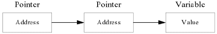

# Go 语言指针的指针

> 原文：[`www.weixueyuan.net/a/543.html`](http://www.weixueyuan.net/a/543.html)

如果一个指针变量存放的又是另一个指针变量的地址，则称这个指针变量为指向指针的指针变量。当定义一个指向指针的指针变量时，第一个指针存放第二个指针的地址，第二个指针存放变量的地址，如下图所示。


图：指针的指针
指向指针的指针变量声明格式如下。

var ptr **int

以上指向指针的指针变量为整型。

访问指向指针的指针变量值需要使用两个 `*` 号，示例代码如下所示。

```

package main
import "fmt"
func main(){
    var a int
    var ptr *int
    var pptr **int
    a = 1234
    /*指针 ptr 地址*/
    ptr = &a
    fmt.Println("ptr", ptr)
    /*指向指针 ptr 地址*/
    pptr = &ptr
    fmt.Println("pptr", ptr)
    /*获取 pptr 的值*/
    fmt.Printf("变量 a = %d\n", a)
    fmt.Printf("指针变量 *ptr = %d\n", *ptr)
    fmt.Printf("指向指针的指针变量 **pptr =%d\n", **pptr)
}
```

运行结果如下：

ptr 0xc00000e0a8
pptr 0xc00000e0a8
变量 a = 1234
指针变量 *ptr = 1234
指向指针的指针变量 **pptr =1234