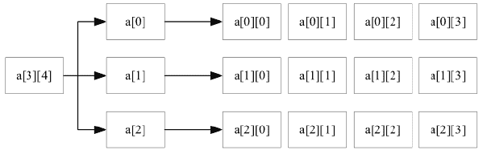

# Go 语言多维数组

> 原文：[`www.weixueyuan.net/a/553.html`](http://www.weixueyuan.net/a/553.html)

由于数据的复杂程度不一样，数组可能有多个下标。一般将数组元素下标的个数称为维数，根据维数，可将数组分为一维数组、二维数组、三维数组、四维数组等。二维及以上的数组可称为多维数组。

Go 语言的多维数组声明方式如下所示：

var variable_name [SIZE1] [SIZE2]...[SIZEn] variable_type

## 1、二维数组

在实际的工作中，仅仅使用一维数组是远远不够的，例如，一个学习小组有 10 个人，每个人有 3 门课的考试成绩，如果使用一维数组解决是很麻烦的。这时，可以使用二维数组。

二维数组是最简单的多维数组，二维数组的本质也是一个一维数组，只是数组成员由基本数据类型变成了构造数据类型（一维数组）。

二维数组的定义方式如下。

var arrayName [x][y] variable_type

二维数组初始化，语法格式如下。

a := [3][4]int{
    {0, 1, 2, 3}, /* 第一行索引为 0 */
    {4, 5, 6, 7}, /* 第二行索引为 1 */
    {8, 9, 10, 11}/* 第三行索引为 2 */
}

上述定义的二维数组共包含 3×4 个元素，即 12 个元素。接下来，我们通过一张图来描述二维数组 a 的元素分布情况，如下图所示。


图：二维数组
二维数组元素通过指定坐标来访问，如数组中的行索引与列索引，语法格式如下。

int val = a[2][3]

以上代码访问了二维数组 val 第 3 行的第 4 个元素。

二维数组可以使用循环嵌套来输出元素，具体语法通过案例演示，如下所示。

```

package main
import "fmt"
func main(){
    /*数组 - 5 行 2 列*/
    var a = [5][2]int{{0, 0}, {1, 2}, {2, 4}, {3, 6}, {4, 8}}
    fmt.Println(len(a))
    fmt.Println(len(a[0]))
    /*输出数组元素*/
    for i := 0; i < len(a); i++ {
        for j := 0; j < len(a[0]); j++ {
            fmt.Printf("a[%d][%d] = %d \n", i, j, a[i][j])
        }
    }
}
```

运行结果如下：

5
2
a[0][0] = 0
a[0][1] = 0
a[1][0] = 1
a[1][1] = 2
a[2][0] = 2
a[2][1] = 4
a[3][0] = 3
a[3][1] = 6
a[4][0] = 4
a[4][1] = 8

## 2、三维数组

三维数组的本质也是一个一维数组，只是数组成员由基本数据类型变成了构造数据类型（二维数组），如同阅兵仪式的多个方阵。

定义三维数组的语法格式如下。

var threedim [5][10][4]int

多维数组在实际的工作中极少使用，并且使用方法与二维数组相似，这里不再做详细的讲解，有兴趣的读者可以自己学习。