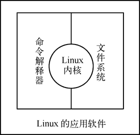
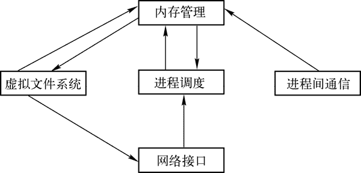

# Linux 系统的构成

> 原文：[`www.weixueyuan.net/a/145.html`](http://www.weixueyuan.net/a/145.html)

Linux 既是一个操作系统的名称，也是一个操作系统内核的名称。一个完整的 Linux 操作系统由 Linux 内核、命令解释器、文件系统和实用工具组成，如图 1 所示。

图 1：Linux 的组织结构

## 1\. Linux 内核

内核（Kernel）是 Linux 操作系统的心脏，是运行程序和管理像磁盘和打印机等硬件设备的核心程序，其从用户那里接受命令并把命令送给内核去执行。

Linux 内核主要由五个子系统组成：进程调度、内存管理、虚拟文件系统、网络接口和进程间通信，如图 2 所示。

图 2：Linux 的内核结构

#### 1) 进程调度

进程调度（SCHED）控制进程对处理器的访问。当需要选择下一个进程运行时，由调度程序选择最值得运行的进程。可运行进程实际上是仅等待处理器资源的进程，如果某个进程在等待其他资源，则该进程是不可运行进程。Linux 使用了比较简单的基于优先级的进程调度算法选择新的进程。

#### 2) 内存管理

内存管理（MM）允许多个进程安全地共享主内存区域。Linux 的内存管理支持虚拟内存，即在计算机中运行的程序，其代码、数据、堆栈的总量可以超过实际内存的大小，操作系统只是把当前使用的程序块保留在内存中，其余的程序块则保留在磁盘中。必要时，操作系统负责在磁盘和内存间交换程序块。

内存管理从逻辑上分为硬件无关部分和硬件有关部分。硬件无关部分提供了进程的映射和逻辑内存的对换；硬件相关部分为内存管理硬件提供了虚拟接口。

#### 3) 虚拟文件系统

虚拟文件系统（Virtual File System，VFS）隐藏了各种硬件的具体细节，为所有的设备提供了统一的接口，VFS 提供了多达数十种不同的文件系统。虚拟文件系统可以分为逻辑文件系统和设备驱动程序。逻辑文件系统指 Linux 所支持的文件系统，如 ext2、Fat 等，设备驱动程序指为每一种硬件控制器所编写的设备驱动程序模块。

#### 4) 网络接口

网络接口（NET）提供了对各种网络标准的存取和各种网络硬件的支持。网络接口可分为网络协议和网络驱动程序。网络协议部分负责实现每一种可能的网络传输协议。网络设备驱动程序负责与硬件设备通信，每一种可能的硬件设备都有相应的设备驱动程序。

#### 5) 进程间通信

进程间通信（IPC）支持进程间的各种通信机制。处于中心位置的进程调度，所有其他的子系统都依赖它，因为每个子系统都需要挂起或恢复进程。一般情况下，当一个进程等待硬件操作完成时，它被挂起；当操作真正完成时，进程被恢复执行。

例如，当一个进程通过网络发送一条消息时，网络接口需要挂起发送进程，直到硬件成功地完成消息的发送，当消息被成功发送出去以后，网络接口给进程返回一个代码，表示操作的成功或失败。其他子系统以相似的理由依赖于进程调度。

## 2\. 命令解释器

命令解释器（Shell）是系统的用户界面，其提供了用户与内核进行交互操作的一种接口。它接收用户输入的命令并把它送入内核去执行。

不仅如此，Shell 有自己的编程语言用于对命令的编辑，它允许用户编写由 Shell 命令组成的程序。Shell 编程语言具有普通编程语言的很多特点，如它也有循环结构和分支控制结构等，用这种编程语言编写的 Shell 程序与其他应用程序具有同样的效果。

除了 Shell，Linux 同样提供了像 Windows 那样的可视的命令输入界面——X Window 的图形用户界面（GUI）。它提供了很多窗口管理器，其操作就像 Windows 一样，有窗口、图标和菜单，所有的管理都是通过鼠标控制的。现在比较流行的窗口管理器是 KDE 和 GNOME。

X Window 其实质是 Linux 实用工具的一种。

每个 Linux 系统的用户可以拥有他自己的用户界面或 Shell，用以满足他们自己专门的 Shell 需要。

同 Linux 本身一样，Shell 也有多种不同的版本，目前主流的 Shell 说明如下：

*   Bourne Shell：是贝尔实验室开发的。
*   BASH：是 GNU 的 Bourne Again Shell，是 GNU 操作系统上默认的 shell。
*   Korn Shell：是对 Bourne SHell 的发展，在大部分内容上与 Bourne Shell 兼容。
*   C Shell：是 SUN 公司 Shell 的 BSD 版本。

## 3\. 文件系统

文件系统（File System）是文件存放在磁盘等存储设备上的组织方法，其主要体现在对文件和目录的组织上。

目录提供了管理文件的一个方便而有效的途径，用户可以从一个目录切换到另一个目录，而且可以设置目录和文件的权限，设置文件的共享程度。在 Linux 系统下，用户可以设置目录和文件的权限，以便允许或拒绝其他人对其进行访问。Linux 目录采用多级树形结构，用户可以浏览整个系统，可以进入任何一个已授权进入的目录，访问那里的文件。

文件结构的相互关联性使共享数据变得容易，几个用户可以访问同一个文件。Linux 是一个多用户系统，系统本身的驻留程序存放在以根目录开始的专用目录中，有时被指定为系统目录。

## 4\. 实用工具

Linux 操作系统通常都提供一系列叫作实用工具的应用程序，这些实用工具包括和用户进行人机交互的 X Window、计算器、浏览器等，主要用于增加系统可用性，和 Windows 把这些工具（主要是 X Windows）集合到一起不能分离不同，Linux 的实用工具都可以让用户自定义。

整体来说，Linux 的实用工具可分为如下三类：

#### 1) 编辑器

编辑器：用于编辑文件，Linux 常见的编辑器主要有 Ed、Ex、Vi 和 Emacs。Ed 和 Ex 是行编辑器，Vi 和 Emacs 是全屏幕编辑器。

#### 2) 过滤器

过滤器：用于接收数据并过滤数据，Linux 的过滤器（Filter）读取从用户文件或其他地方的输入，检查和处理数据，然后输出结果。从这个意义上说，它们过滤了经过它们的数据。

Linux 有不同类型的过滤器：一些过滤器用行编辑命令输出一个被编辑的文件，另外一些过滤器是按模式寻找文件并以这种模式输出部分数据，还有一些执行字处理操作，检测一个文件中的格式，输出一个格式化的文件。

过滤器的输入可以是一个文件，也可以是用户从键盘输入的数据，还可以是另一个过滤器的输出。过滤器可以相互连接，因此，一个过滤器的输出可能是另一个过滤器的输入。在有些情况下，用户可以编写自己的过滤器程序。

#### 3) 交互程序

交互程序：允许用户发送信息或接收来自其他用户的信息，交互程序是用户与机器的信息接口。Linux 是一个多用户系统，它必须和所有用户保持联系。信息可以由系统上的不同用户发送或接收。信息的发送有两种方式：一种方式是与其他用户一对一地链接进行对话；另一种方式是一个用户对多个用户同时链接进行通信，即所谓广播式通信。