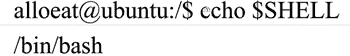
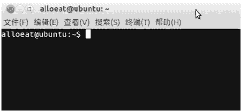

# Shell 是什么？

> 原文：[`www.weixueyuan.net/a/340.html`](http://www.weixueyuan.net/a/340.html)

在 Linux 中，除了图形界面，另外一种更常用的用户交互方式是 Shell，它是一种类似 DOS 的命令行输入反馈界面

Shell 俗称壳（用来区别于核），是指“提供使用者使用界面”的软件（命令解析器），其类似于 DOS 下的 command.com。

Shell 是一种命令语言，又是一种程序设计语言。作为命令语言，它交互式解释和执行用户输入的命令或自动地解释和执行预先设定好的一连串命令；作为程序设计语言，它定义了各种变量和参数，并提供了许多在高阶语言中才具有的控制结构，包括循环和分支。

Shell 并不是 Linux 独有的，Windows 下也同样有。Shell 也不仅仅是以命令行形式出现的，其实 X Windows 也是 Shell 的一种，不过在本小节中所特指的 Shell 是在 Linux 下以命令行形式提供的。

Shell 基本上是一个命令解释器，其接收用户命令，然后调用相应的应用程序来执行这些命令。

## 常见的 Shell

常见的 Shell 包括 ash、bash、ksh、csh 和 zsh 五种，其简单的介绍如下：

#### 1) ash

ash Shell 是由 Kenneth Almquist 编写的，是 Linux 中占用系统资源最少的一个小 Shell，它只包含 24 个内部命令，因而使用起来很不方便。

#### 2) bash

bash 是 Linux 系统默认使用的 Shell，它由 Brian Fox 和 Chet Ramey 共同完成，是 Bourne Again Shell 的缩写，内部命令一共有 40 个。

Linux 使用它作为默认的 Shell 是因为它有以下的特色：

*   可以使用类似 DOS 下面的 doskey 的功能，用上下方向键查阅和快速输入并修改命令；
*   自动通过查找匹配的方式，给出以某字串开头的命令；
*   包含了自身的帮助功能，只要在提示符下面输入 help 就可以得到相关的帮助。

#### 3) ksh

是 Korn Shell 的缩写，由 Eric Gisin 编写，共有 42 条内部命令。该 Shell 最大的优点是几乎和商业发行版的 ksh 完全相容，这样就可以在不用花钱购买商业版本的情况下尝试商业版本的性能了。

#### 4) csh

其是在 Linux 操作系统中应用比较多的 Shell，它由以 William Joy 为代表的共 47 位作者编成，共有 52 个内部命令，该 Shell 其实是指向 /bin/tcsh 这样的一个 Shell，也就是说，csh 其实就是 tcsh。

#### 5) zch

这是 Linux 最大的 Shell 之一，由 Paul Falstad 完成，共有 84 个内部命令。如果只是一般的用途，是没有必要安装这样的 Shell 的。

可以在终端下使用相应的命令来查看当前 Linux 操作系统中使用的 Shell，ubuntu 中默认使用的 Shell 是 bash。（见图 1）

图 1：查看当前 Linux 操作系统中使用的 Shell

## Shell 和终端

和 Linux 内核类似，Shell 仅提供了一个计算机和用户进行交互的内核，而其具体的命令行输入输出交流要通过终端来完成，Linux 操作系统中用户也可以自定义终端来完成相应的工作，如 Ubuntu 12.04 发行版自带的终端是 Terminal，其运行界面如图 2 所示。

图 2：终端运行界面

## Shell 的工作方式

Shell 既可以作为命令行提供给用户控制内核完成相应的任务，也可以作为一种编程语言供开发者使用。

#### 1) 命令行工作方式

在命令行工作方式下，Shell 识别并且对用户的输入字符串进行响应以完成相应的工作，这种工作方式通常也称为“交互式”的工作方式，当用户有输入的时候 Shell 才对其做出相应的响应。

#### 2) 编程语言工作方式

Shell 同样可以用作编程语言。在 Linux 中存在一种特殊的可执行文件，其内容是一系列由各种命令组成的纯文本文件（脚本文件），其通常用于完成某些步骤比较多的复杂工作或重复性比较强的工作，Shell 可以对这些文件进行识别，并且按照设定自动执行相应的动作，这种工作方式通常也称为“非交互式”的工作方式，不需要用户输入，Shell 会自动做出相应的动作。

注意：Shell 还可以对用户的环境进行配置，这通常会在 Shell 的初始化文件中完成，这些配置包括设置窗口属性、快捷键等。

## Shell 的启动

Shell 在启动的时候，先读取 /etc/bash.bashrc 文件对整个 Linux 操作系统进行配置，然后读取 $HOME/.bashrc 文件对当前用户进行配置，如果这两个文件有冲突，则以后者为准，这些文件包括以下方面的内容：

*   .bash_profile 文件：该文件只被登录用户对应的 Shell 所读取，而操作系统内未登录的 Shell 只读取 .bashrc 文件。
*   .bashrc 文件：该文件被启动的所有 Shell 所读取。
*   .bash_logout 文件：bash 退出时候执行该文件。

如果用户安装了多个 Shell，则可以在用户管理的相关目录文件中进行设置。

图 2 所示的终端实际上是一个虚拟终端，其是在 X Window 中运行的，如果想要进入完整的“真实终端”，可以使用“Ctrl+Alt+Fn”（Fn=F1～F6）。