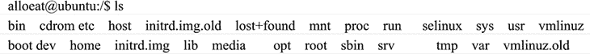

# Shell 命令的标准格式

> 原文：[`www.weixueyuan.net/a/147.html`](http://www.weixueyuan.net/a/147.html)

Shell 和用户交互是以字符串形式存在的命令和命令输出反馈存在的，在 Linux 命令行中输入的第一个字必须是一个命令的名字，第二个字是命令的选项或参数，命令行中的每个字必须由空格或 Tab 隔开，格式如下：

$ 命令 选项 参数

或者：

# 命令 选项 参数

提示符`$`和`＃`区分了用户的不同权限，$ 表示普通用户权限，而＃代表的是 root 用户（超级用户）权限；`选项`是包括一个或多个字母的代码，它前面有一个减号（减号是必要的，Linux 用它来区别选项和参数），选项可用于改变命令执行的动作的类型。

注意：在 Ubuntu 操作系统中，用户不能直接使用 root 权限，只能通过 sudo 命令来暂时获得 root 权限。

命令行实际上是一个可以编辑的文本缓冲区，在按回车键之前，可以对输入的文本进行编辑。例如利用`BackSpace`键可以删除刚输入的字符，可以进行整行删除，还可以插入字符，使得用户在输入命令（尤其是复杂命令）时，若出现输入错误，无须重新输入整个命令，只要利用编辑操作即可改正错误。

利用上箭头可以重新显示刚执行的命令，利用这一功能可以重复执行以前执行过的命令，而无须重新输入该命令。

一个标准的 Shell 命令和命令的反馈输出如下，这是一个“ls”查看当前文件夹下文件列表的命令：

#### Shell 中的注释符

在 Shell 编程或 Linux 的配置文档中，经常要对某些正文行进行注释，以增强程序的可读性。在 Shell 中以字符`＃`开头的正文行表示注释行。