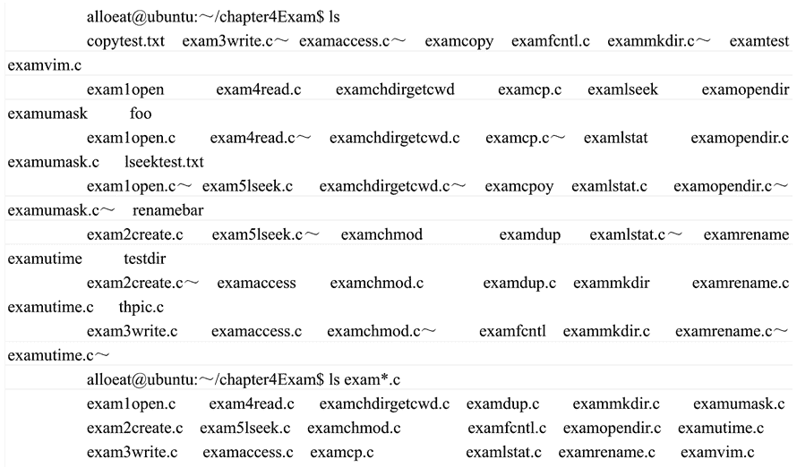

# Shell 通配符的使用

> 原文：[`www.weixueyuan.net/a/341.html`](http://www.weixueyuan.net/a/341.html)

在 Shell 中除使用普通字符外，还可以使用一些具有特殊含义和功能的字符，称为通配符，在使用它们时应注意其特殊的含义和作用范围。 

Shell 的通配符主要用于模式匹配，如文件名匹配、路径名搜索、字串查找等。常用的通配符有`*`、`?`和括在`[ ]`中的字符序列等，用户可以在作为命令参数的文件名中包含这些通配符，构成一个所谓的“模式串”，以在执行过程中进行模式匹配。这三个通配符的含义如下：

#### 1) *

`*`匹配任意长度的字串，如`L*`匹配以 L 开头的任意字串。但应注意，文件名中的圆点`.`和路径名中的斜线`/`必须是显式的，即不能用通配符替代它们。例如`*`不能匹配`.c`，而`.*`才可以匹配`.c`。

#### 2) ?

`?`匹配任何单个字符。

#### 3) [ ]

`[ ]`匹配任何包含在方括号内的单字符，它指定了模式串匹配的字符范围，只要文件名中`[ ]`处的字符在指定的范围之内，那么这个文件名就与该模式串匹配。方括号中的字符范围可以由字符串组成，也可以由表示限定范围的起始字符、终止字符及中间连字符`-`组成。例如，`f[a-d]`与`f[abcd]`的作用相同。

Shell 将把与命令行中指定的模式串相匹配的所有文件名都作为命令的参数，形成最终的命令，然后执行这个命令。如果目录中没有与指定的模式串相匹配的文件名，那么 Shell 将使用此模式串本身作为参数传给命令（这正是命令中出现特殊字符的原因所在）。

表 1 列举了这些通配符的具体实例及含义。

表 1：Shell 的通配符

| 模式串举例 | 含义 |
| * | 当前目录下所有文件的名称 |
| *Text* | 当前目录下所有文件名中含有 Text 字串的文件的名称 |
| [ab-dm]* | 当前目录下所有以 a,b,c,d,m 开头的文件的名称 |
| [ab-dm]? | 当前目录下所有以 a,b,c,d,m 开头且后面只跟一个字符的文件的名称 |
| /usr/bin/?? | 目录 /usr/bin/ 下所有名称长度为 2 个字符的文件的名称 |

需要注意的是，中间连字符`-`仅在方括号内有效，表示字符范围，若在方括号外面，就成为普通字符了。而`*`和`?`则只在方括号外有效，若出现在方括号之内，它们也失去通配符的能力，成为普通字符了。例如，模式`L[*?]abc`中只有一对方括号是通配符，而`*`和`?`均为普通字符，因此，它匹配的字串只能是`L*abc`和`L?abc`。

以下是一个使用`*`通配符来让`ls`命令只显示当前文件夹中带`exam`的`.c`文件的命令和对应输出。

