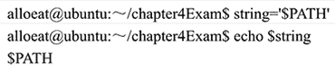
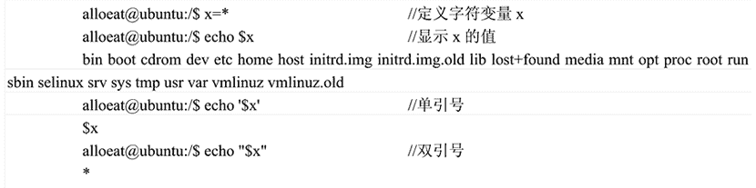
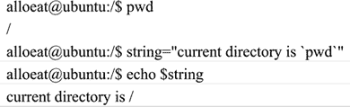
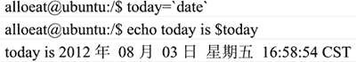

# Shell 引号（单引号、双引号和反引号）

> 原文：[`www.weixueyuan.net/a/342.html`](http://www.weixueyuan.net/a/342.html)

在 Shell 中可以使用的引号包括单引号、双引号和反引号三种。

## 1. 单引号

由单引号括起来的字符都作为普通字符出现。特殊字符用单引号括起来以后，也会失去原有意义，而只作为普通字符解释。例如下面的一系列命令：


可见，单引号中的`$`保持了其本身的含义，作为普通字符出现。而在一般情形下，`$`符号的含义是引用变量的值，PATH 本身是一个 Linux 下的环境变量，其值是一系列的目录，当用户运行某个程序时，Linux 在这些目录下进行搜寻。

可以使用下面的命令查看变量 PATH 的值：

#echo $PATH

## 2\. 双引号

双引号的作用与单引号类似，区别在于它没有那么严格。单引号告诉 Shell 忽略所有的特殊字符，而双引号只要求忽略大多数字符。具体来说，括在双引号中的三种特殊字符不被忽略：`$`，`\`和```，即双引号会解释字符串的特别意义，而单引号则直接使用字符串。

如果使用双引号将字符串赋给变量并反馈它，实际上与直接反馈变量并无差别。如果要查询包含空格的字符串，经常会用到双引号。


从以上实例中可以清楚地看出无引号、单引号和双引号之间的区别：

*   第一种情况，无引号，显示变量 x 的值。由于 x 的值，即字符 * 匹配了当前目录（root 目录）下的所有文件名，故显示变量 x 的值时，即显示了当前目录的所有文件名。
*   第二种情况，使用了单引号。单引号中的字符保持其本身的含义，这种情况最简单。
*   最后一种情况，使用了双引号。双引号告诉 Shell 在引号内照样进行变量名替换，所以 Shell 把`$x`替换为`*`，因为双引号中不做文件名替换（忽略掉了非特殊字符），所以就把*作为要显示的值传递给 echo 命令，作为 echo 命令的参数。

另外，从该实例中还可以看到 Shell 赋值的先后次序：Shell 先作变量替换，然后作文件名替换，最后把这些替换值作为参数传递给命令。

## 3\. 反引号

反引号```字符所对应的键一般位于键盘的左上角，不要将其同单引号`'`混淆。

反引号括起来的字串被 Shell 解释为命令行，在执行时，Shell 首先执行该命令行，并以它的标准输出结果取代整个反引号（包括两个反引号）部分。例如：


Shell 执行 echo 命令时，首先执行``pwd``中的命令 pwd，并将输出结果`/`取代``pwd``部分，最后输出替换后的整个结果。

利用反引号的这种功能可以进行命令置换，即把反引号括起来的执行结果赋值给指定变量。例如：


另外，反引号还可以嵌套使用。需要注意的是，嵌套使用时内层的反引号必须用反斜线（\）转义。