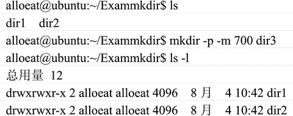

# Linux 创建和删除目录

> 原文：[`www.weixueyuan.net/a/148.html`](http://www.weixueyuan.net/a/148.html)

Linux 系统以文件目录的方式来组织和管理系统中的所有文件。所谓文件目录就是将所有文件的说明信息采用树形结构组织起来，即常说的目录。

## 创建目录命令（mkdir）

在 Linux 系统中建立新目录的命令是 mkdir。该命令的使用方式如下：

mkdir [选项] 目录

mkdir 命令选项说明如表 1 所示。

表 1：mkdir 命令选项说明

| 选 项 | 说 明 |
| -m | 在建立目录时把按模式指定设置为目录权限。该目录的权限分为：目录所有者的权限、组中其他人对目录的权限和系统中其他人对目录的权限。这三个权限分别用三个数字之和来表示：对目录的读权限是 4、写权限是 2、执行权限是 1。 |
| -p | 可以是一个路径名称。此时若路径中的某些目录尚不存在，加上此选项后，系统将自动建立好那些尚不存在的目录，即一次可以建立多个目录。 |

如下是一个使用 mkdir 命令在当前目录中建立一个 dir3 目录并且将其权限设置为只有文件拥有者才能读写和执行。

## 删除目录命令（rmdir）

与创建目录对应的是删除目录，rmdir 命令用来删除目录，一般情况下要删除的目录必须为空目录，如果所给的目录不为空，系统会报告错误。该命令的使用方式如下：

rmdir [选项] 目录列表

rmdir 命令选项说明如表 2 所示。

表 2：rmdir 命令选项说明

| 选项 | 说明 |
| -p | 在删除目录表指定的目录后，若父目录为空，则 rmdir 也删除父目录。状态信息显示什么被删除、什么没被删除。 |