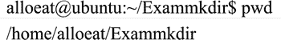

# Linux cd 命令：修改当前工作目录

> 原文：[`www.weixueyuan.net/a/343.html`](http://www.weixueyuan.net/a/343.html)

改变当前工作目录在 Linux 系统中使用的是 cd 命令。该命令的使用方式如下：

cd [directory]

该命令将当前目录改变至 directory 所指定的目录。若没有指定 directory，则回到用户的主目录。如果使用`..`，则表示上级目录。

为了改变到指定目录，用户必须拥有对指定目录的执行和读权限。该命令可以使用通配符。

如下是一个使用 cd 命令在多个目录路径下切换的应用实例：

#### 显示当前工作目录命令（pwd）

显示当前工作目录的命令是 pwd 命令，该命令的使用方式如下：

pwd

如下是一个使用 pwd 命令来显示当前工作目录的应用实例：

