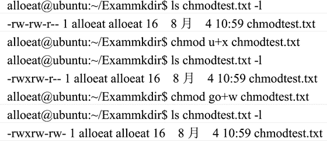

# Linux chmod 命令：改变目录权限

> 原文：[`www.weixueyuan.net/a/344.html`](http://www.weixueyuan.net/a/344.html)

在 Linux 系统中，用户设定文件权限控制其他用户不能访问、修改。但在系统应用中，有时需要让其他用户使用某个原来其不能访问的文件或目录，这时就需要重新设置文件的权限，使用的命令是 chmod 命令。

并不是谁都可改变文件和目录的访问权限，只有文件和目录的所有者才有权限修改其权限，另外，超级用户可对所有文件或目录进行权限设置。

chmod 命令的使用方式如下：

chmod [who] [+|-|=] [mode] 文件名

chmod 命令中的操作对象 who 可以是表 3 字母中的任一个或它们的组合。

表 3：chmod 命令 who 选项说明

| 选项 | 说明 |
| u | 表示“用户（user）”，即文件或目录的所有者。 |
| g | 表示“同组（group）用户”，即与文件属主有相同组 ID 的所有用户。 |
| o | 表示“其他（others）用户” |
| a | 表示“所有（all）用户”，它是系统默认值。 |

chmod 命令操作符号说明如表 4 所示。

表 4：chmod 命令操作符号说明

| 选项 | 说明 |
| + | 添加某个权限 |
| - | 取消某个权限 |
| = | 赋予给定权限并取消其他所有权限（如果有的话） |

mode 所表示的权限可以是表 5 中字母的任意组合。

表 5：chmod 命令 mode 选项说明

| 选项 | 说明 |
| --- | --- |
| r | 可读 |
| w | 可写 |
| x | 可执行 |
| X | 只有目标文件对某些用户是可执行的或该目标文件是目录时才追加 x 属性 |
| s | 在文件执行时把进程的属主或组 ID 置为该文件的文件属主。方式“u+s”设置文件的用户 ID 位，“g+s”设置组 ID 位。 |
| t | 保存程序的文本到交换设备上 |
| u | 与文件属主拥有一样的权限 |
| g | 与和文件属主同组的用户拥有一样的权限 |
| o | 与其他用户拥有一样的权限   |

在一个命令行中可给出多个权限方式，其间用逗号隔开。例如 chmod g+r，o+r example，这个命令将使同组和其他用户对文件 example 有读权限。

文件和目录的权限还可用八进制数字模式来表示。首先了解用数字表示的属性的含义：0 表示没有权限，1 表示可执行权限，2 表示可写权限，4 表示可读权限，然后将其相加。所以数字属性的格式应为 3 个从 0 到 7 的八进制数，其顺序是（u）（g）（o）。例如，如果想让某个文件的属主有“读/写”两种权限，需要把 4（可读）+2（可写）=6（读/写）。

数字设定法的一般形式为：

chmod [mod] 文件名

如下是一个使用 chmod 命令来修改文件 chmodtest.txt 的权限的实例，在其中设定文件 chmodtest.txt 的属性为：文件属主（u）增加执行权限，与文件属主同组用户（g）和其他用户（o）增加读权限。

