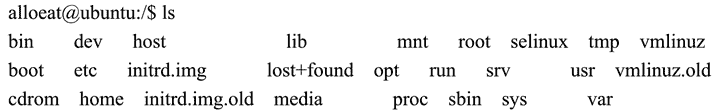

# Linux ls 命令：显示文件

> 原文：[`www.weixueyuan.net/a/149.html`](http://www.weixueyuan.net/a/149.html)

Linux ls 命令用于显示指定工作目录中所包含的文件，该命令的使用方法如下：

ls [选项] [文件目录列表]

ls 命令中的常用选项如表 1 所示。

表 1：ls 命令选项说明

| 选项 | 说明 |
| --- | --- |
| -a | 列出目录下的所以文件，包括以“.”开头的隐含文件。 |
| -b | 把文件名中不可输出的字符用反斜杠加字符编号（就像在 C 语言里一样）的形式列出 |
| -c | 输出文件的 i 节点的修改时间，并以此排序。 |
| -d | 将目录像文件一样显示，而不是显示其下的文件 |
| -e | 输出时间的全部信息，而不是输出简略信息 |
| -f-U | 对输出的文件不排序 |
| -i | 输出文件的 i 节点的索引信息 |
| -k | 以 k 字节的形式表示文件的大小 |
| -l | 列出文件的详细信息 |
| -m | 横向输出文件名，并以“.”作为分隔符 |
| -n | 用数字的 UID,GID 代替名称 |
| -o | 显示文件的除组信息外的详细信息 |
| -p-F | 在每个文件名后附上一个字符以说明该文件的类型，“*”表示可执行的普通文件；“/”表示 目录；“@”表示符号链接；“&#124;”表示 FIFOs；“=”表示套接字（sockets） |
| -q | 用 ？ 代替不可输出的字符 |
| -r | 对目录反向排序 |
| -s | 在每个文件名后输出该文件的大小 |
| -t | 以时间排序 |
| -u | 以文件上次被访问的时间排序 |
| -x | 按列输出，横向排序 |
| -A | 显示除“.”和“..”外的所有文件 |
| -B | 不输出以“~”结尾的备份文件 |
| -C | 按列输出，纵向排序 |
| -G | 输出文件的组的信息 |
| -L | 列出链接文件名而不是链接到的文件 |
| -N | 不限制文件长度 |
| -Q | 把输出的文件名用双引号括起来 |
| -R | 列出所有子目录下的文件 |
| -S | 以文件大小排序 |
| -X | 以文件的扩展名（最后一个“.”后的字符）排序 |
| -1 | 一行只输出一个文件 |
| --color=no | 不显示彩色文件名   |

由于 Linux 支持多种文件类型，每一类用一个字符来表示，其说明如表 2 所示。

表 2：Linux 的文件类型说明

| 文件类型 | 说明 |
| --- | --- |
| - | 常规文件 |
| d | 目录 |
| b | 块特殊设备 |
| c | 字符特殊设备 |
| p | 有名管道 |
| s | 信号灯 |
| m | 共享存储器 |

文件类型的字符表示文件的权限，权限由三个字符串组成，这三个字符串分别表示：该文件所有者的权限、组中其他人的权限和系统中其他人的权限；每个字符串又由三个字符组成，依次表示对文件的读（用字符 r 表示）、写（用字符 W 表示）和执行权限（用字符 x 表示）。当用户没有相应的权限时，该权限的对应位置用短线“-”来表示。

例如`drwxr-x---`表示的含义是：

*   d 表示该文件是目录；
*   目录拥有者的权限是 rwx（表示有读、写和执行权限）；
*   组中其他人对该目录的权限是 r-x（表示有读和执行权限，没有写权限）；
*   系统中其他人对该目录的权限是-（表示读、写和执行权限都没有）。

如下是一个使用`ls`命令来显示当前根目录下文件列表的应用实例：

