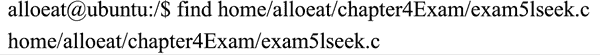
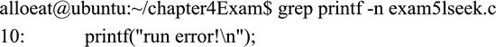

# Linux 文件查找命令

> 原文：[`www.weixueyuan.net/a/346.html`](http://www.weixueyuan.net/a/346.html)

Linux 支持在目录中查找某个文件，也支持在文件中查找内容。

## 在目录中查找（find 命令）

在 Linux 系统中，可以使用 find 命令来查找文件，其标准使用格式如下：

find [目录列表] [匹配标准]

find 命令有两个目录列表和匹配标准两个参数，其说明如下：

1.  目录列表：希望查询文件或文件集的目录列表，目录间用空格分隔。
2.  匹配标准：希望查询文件的匹配标准或说明，其详细说明如表 3 所示。

表 3：find 命令的匹配标准参数说明

| 选项 | 说明 |
| --- | --- |
| -amin n | 查找系统中最后 n 分钟访问的文件 |
| -atime n | 查找系统中最后 n*24 小时访问的文件 |
| -cmin n | 查找系统中最后 n 分钟被改变状态的文件 |
| -ctime n | 查找系统中最后 n*24 小时被改变状态的文件 |
| -empty | 查找系统中空白的文件，或空白的文件目录，或目录中没有子目录的文件夹 |
| -false | 查找系统中总是错误的文件 |
| -fstype type | 查找系统中存在于指定文件系统的文件，如 ext2 |
| -gid n | 查找系统中文件数字组 ID 为 n 的文件 |
| -group gname | 查找系统中文件属于 gnam 文件组，并且指定组合 ID 的文件 |
| -daystart | 测试系统从今天开始 24 小时以内的文件，用法类似 -amin |
| -depth | 使用深度级别的查找过程方式，在某层指定目录中优先查找文件内容 |
| -follow | 遵循通配符链接方式查找；另外，也可忽略通配符链接方式查询 |
| -maxdepth levels | 在某个层次的目录中按照递减方法查找 |
| -mount | 不在文件系统目录中查找 |

如下是在目录“home/alloeat/chapter4Exam/”下查找 exam5lseek.c 文件的命令和对应的响应输出：

## 查找文件内容（gerp 命令）

查找文件内容的命令是 grep 命令。该命令的使用方式如下：

grep [选项] [查找模式] [文件名 1,文件名 2,……]

grep 命令选项说明如表 4 所示。

表 4：grep 命令选项说明

| 选项 | 说明 |
| --- | --- |
| -E | 每个模式作为一个扩展的正则表达式对待 |
| -F | 每个模式作为一组固定字符串对待（以新行分隔），而不作为正则表达式 |
| -b | 在输出的每一行前显示包含匹配字符串的行在文件中的字节偏移量 |
| -c | 只显示匹配行的数量 |
| -i | 比较时不区分大小写 |
| -h | 在查找多个文件时，指示 grep 不要将文件名加入到输出之前。 |
| -l | 显示首次匹配串所在的文件名并用换行符将其隔开。当在某文件中多次出现匹配串时，不重复显示此文件名。 |
| -n | 在输出前加上匹配串所在行的行号（文件首行行号为 1） |
| -v | 只显示不包含匹配串的行 |
| -x | 只显示整行严格匹配的行 |
| -e expression | 指定检索使用的模式。用于防止以“-”开头的模式被解释为命令选项 |
| -f expfile | 以 expfile 文件中获取要搜索的模式，一个模式占一行。 |

如下是在一个 C 语言文件中查找 printf 字符串的实例：

